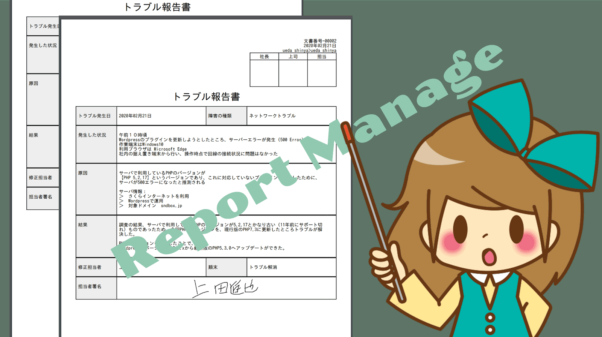
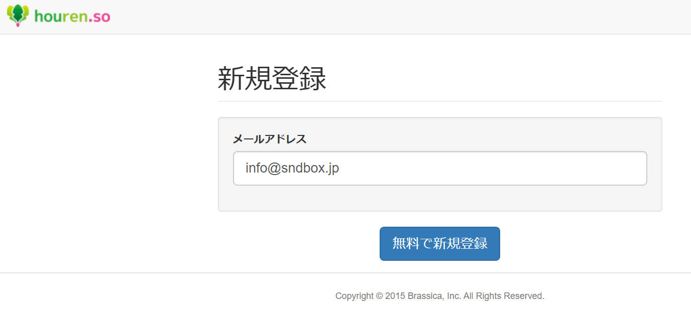
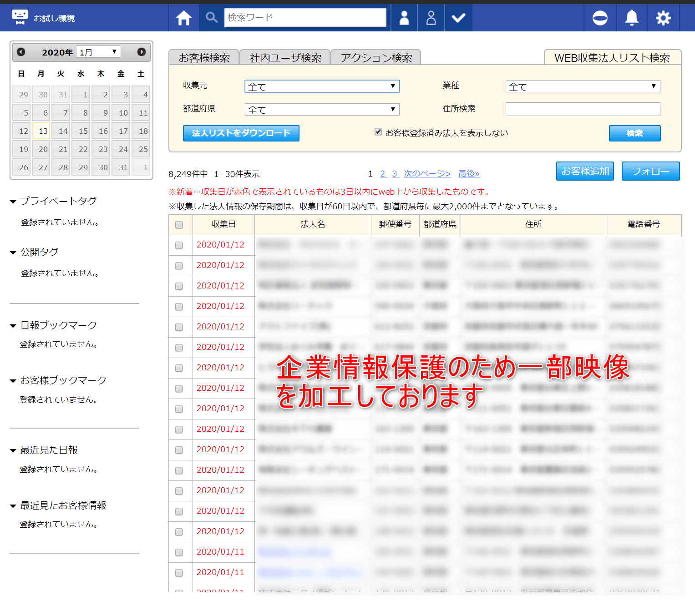
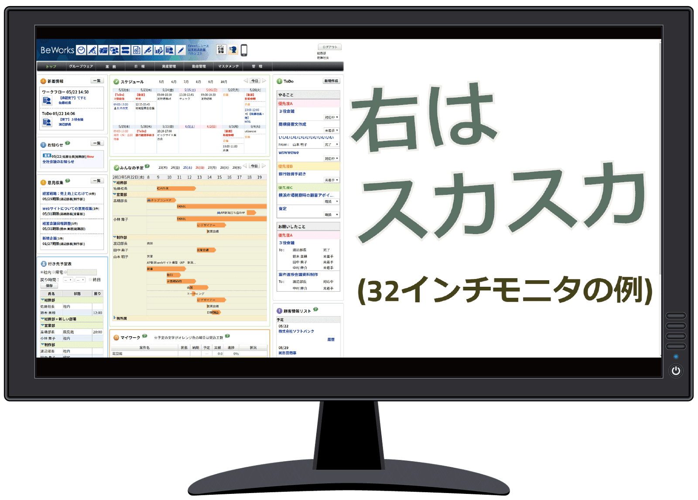
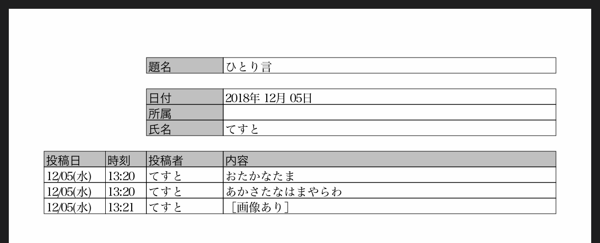
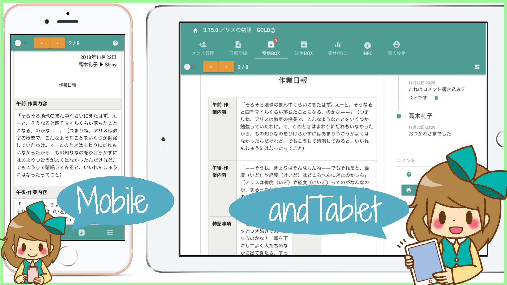
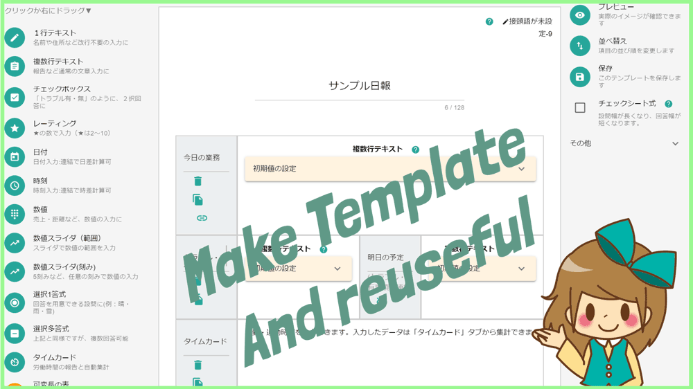

# 日報アプリの比較5選と導入時に検討すべき2つの課題

[[toc]]

## 日報アプリって何？
日報アプリは会社の日報をシステム化して、日報の提出や閲覧を効率よく行えるようにするソフトウェアのことです。基本的な機能として、[日報の作成](/manual/report/write)と[日報の閲覧](/manual/res/res)があります。  
日報アプリはさまざまな会社からリリースされており、機能も、料金も全然違います。日報は「報告書」の1種だと思いますが、「日報アプリ」ではなく「報告書アプリ」と検索すると全然違うアプリが顔を出すもの面白いですね。

## 【課題1】日報アプリで抱えている問題が解決するかを見極める
日報アプリを検索しているということは、現在利用している日報アプリに不満があるか、現在までに日報アプリ（システム）を利用しておらず、新規に始めようとしている方と推測します。  
現状に不満があるため日報アプリを探しているのですから、当然その「現状の不満」を解決できる日報アプリを見つけなければなりません。  
まずは何を改善したいのかを考えてみましょう。3つほど例を用意してみました。

### 例1.日報を会社に戻らないと作成できない！外出先から日報の作成ができるようにしたい
例えば日報のテンプレートが社内のサーバにしか保存されていなかったり、提出先が社内サーバの特定フォルダに指定されている場合など、オフィスに戻らなければそもそも日報が書けないという現状の不満を抱えている方は、クラウド型の日報アプリを検討しましょう。  
ノートPCから使うのであれば、スマートフォン対応は不要です。しかし携帯性の高いスマートフォンやタブレットから日報を書きたい場合は、スマートフォン・タブレットに対応した日報アプリを選ぶ必要があります  
外出先から使えるものは、スマホ・タブレット対応が基準です。このあたりが条件にマッチします

* [Nipo(スマホから日報提出)](/idea/smartphone)
* [FieldPlus](https://www.fieldplus.net/)
* [gamba!(スマホアプリ)](https://play.google.com/store/apps/details?id=com.rikkeisoft.gamba)
* [LINK Pro(スマホアプリ)](https://play.google.com/store/apps/details?id=jp.co.lumitec.link.pro)

### 例2.スタッフ間のコミュニケーションをより活性化したい！日報を通じて意思疎通を図る
日報を通じて従業員同士のモチベーション維持やノウハウの共有、情報交換をしたいという意見を耳にします。人間であれば誰しも、多かれ少なかれ承認欲求をもっており、自身の書いた日報に返信などのレスポンスがあるとちょっとうれしく感じるのは、自然の理です。

日報を上司-部下の間だけでやり取りするのではなく、同僚や同じチーム内で共有し、互いに切磋琢磨しあうことを目指したい場合は、「コミュニケーション」に特化した日報アプリを検討するといいでしょう。

そもそも情報の共有を目指すのであれば、[Slack](https://slack.com/intl/ja-jp/signin)などのビジネス向けチャットアプリが適している場合もあります。

例えばこのあたりが条件にマッチします

* [Nipo](/manual/res/comment)
* [gamba!](https://www.getgamba.com/guide/archives/6437/)
* [Beworks](http://beworks.net/products-int.html)
* [nanoty](http://www.nanotybp.jp/)

### 例3.手書きのレポートを事務所へ戻ってExcelへ再入力！？このムダを無くしたい
現地へ赴き、バインダーに挟んだ紙に走り書きをし、その紙を持って帰って今度はそれをエクセルへ打ち込む作業が大変です。このバインダーがタブレットで、直接入力した結果が電子化させるには、点検シートのようにテンプレートを自由に設計できる日報アプリを検討しましょう。入力したデータも取り出せなければ意味がないので、蓄積した報告書のデータをCSVやSQLファイルでダウンロードできることも見極める必要があります。

例えばこのあたりが条件にマッチします

* [Nipo(Excelへ出力)](/manual/utility/analyze)
* [Platio](https://plat.io/ja/)
* [FieldPlus](https://www.fieldplus.net/)

## 【課題2】日報アプリを導入するための費用を考える
様々な日報アプリがあることは前述のとおりですが、料金設定についても様々です。無料で使えるものもあれば、月1万円を超える製品まで様々です。  
多くの日報アプリでは、15日〜30日程度の無料お試しコースも用意しており、実際に製品を手にとって使った上で検討できます。  
最低利用期間・最低利用人数などが設定されている場合もあります。「1名単価に均すと安いが、**最低利用人数が20名からだった**」といったケースもあります。  

### 目に見えない「学習コスト」も掛かる
これらは目に見えるコストですが、もう1つ見えない「学習コスト」がかかります。見えないコストとは例えば

- 新しい日報アプリを比較する時間（今このサイトを見ている時間も含む）
- 操作方法を覚える時間
- スタッフに使い方を周知する時間

などです。  
できるだけこれらのコストを抑えるためには、シンプルで使いやすいアプリを選択したほうがいいです。シンプルすぎてやりたいことができないのも困るので、まずは「解決したい課題」がそのアプリで解決できるのかを見極めて下さい。

### 各種日報アプリの問合せ窓口

比較の時間がもったいないと感じる場合は、各日報アプリ制作会社に直球で質問するのが最も効率的です。

**「現状抱えている課題をこのアプリで解決できるか？」**

と問合せてみましょう。文章はコピーペーストでOKです。これぞ究極の時短テクニックです

* [Nipo問合せ窓口](https://sndbox.jp/inquery)
* [nanoty問合せ窓口](http://www.nanotybp.jp/form/)（nanotyの問合せは暗号化されておりません。注意）
* [Platio問合せ窓口](https://asteria.com/pmng/feedback/input/)
* [FieldPlus問合せ窓口](https://www.fieldplus.net/contact/)
* [gamba問合せ窓口](https://www.getgamba.com/contact/)
* [BeWorks問合せ窓口](http://beworks.net/contact.html)（フォームではなくE-mailで問合せになります）
* [houren.so問合せ窓口](https://www.houren.so/inquiry)
* [未来日報問合せ窓口](https://www.exmart.co.jp/contact/index.html)（株式会社エクスマートが運営のため株式会社エクスマートへのリンクです）
* [トーク・日報アプリLINK問合せ窓口](https://www.lumitec.co.jp/link/#support)

## 日報アプリを徹底比較！無料で使える範囲で実際に操作してみた
ここからは実際にいくつかの日報アプリを題材に挙げて、比較した記事です。  
「手軽に、無料で体験できる」ことがテストの条件です。  
無料体験するために10分以上かかったり、必要以上の個人情報を要求するサービスは今回の比較から除外しています。具体的には電話番号を要求する時点で除外しています。（正式な登録時に要求するケースも同様）  
比較記事は便利ですが、筆者の恣意的な意見が含まれることもあるため、あくまでも参考程度に留めて下さい。実際に自分の目で見るまで本当の姿は見えません。  

<Alice label="ところで、なんで検索すると「比較サイト」が上位に来るかご存知ですか？これはGoogleが「比較記事のほうが有益」と判断するためです。" />

### houren.so
写真に重きを置いた日報アプリです。アプリの画面はとってもシンプルで、何をすべきかがすぐ理解できました。
画像にはタグや分類をセットすることで、あとから簡単に探し出せるように工夫されています。資料についても同様の扱いです。

::: tip Good
画像だけじゃなくて、もちろん普通の日報を作成することも可能です
:::

グループという単位で情報共有されます。グループはかんたんに切り替え可能です。
日報はグループ全体に共有されるため、日報の提出先を選択する手間がありません。

::: tip Point
見せたくない日報はグループを分けて運用します
:::
GPSの情報が使えるのもhouren.soの大きな特徴です。houren.soでは地図に[openstreetmap](https://openstreetmap.jp/)を利用していました。
日報とGPSを組み合わせることで、外回りの人が日報を書く際に大きな手助けになるでしょう。

::: tip
SNSによくみられる「いいね」ボタンは見飽きました。
しかしhousen.soでは「いいね」ボタンではなく「HOU」ボタンがありました。
ちょっと心が癒された瞬間です。最近では[Qiitaという情報サイトでも「いいね」ではなく異なる名称に](https://blog.qiita.com/like-to-lgtm/)変わりましたね
:::

シンプルは素晴らしいことだと思います。アカウント作成画面のシンプルさは、PCが苦手な人でも決して間違えることが無いほどにシンプルな画面でした

[hourenso](https://www.houren.so/)

### 未来日報
未来日報の最大の特徴は、日報に顧客管理システムを組み込んだ点です。  
実際に使ってみたところ、「アクション」と呼ばれるカードを作成して重ねていきます。日報を提出すると、これらの「アクション」カードが提出済みとなります。  
アクションカードには関連する会社を紐づけることができ、これが蓄積して顧客と日報の管理につながります。  
アクションカードはTODOリストと解釈することもでき、TODOリストと日報のハイブリッドのような印象を受けます。  
画面はhouren.soほどシンプルではありませんが、わかりやすい方です。  
ただ、コンセプトが「アクションカード」を軸とした運用のため、アクションシートになれるまでは若干の使いにくさを払しょくできません。

::: tip
慣れるまで癖がありますが、やることはシンプルです
:::

もう一つの大きな特徴は、Web収集法人リストがダウンロード可能な点です。  
Web上から収集された会社の情報が、都道府県ごとに最大2000件保存されています。ダウンロードすることで、簡単なDMリストが作れちゃいます。  

<Alice label="便利ですが勝手に収集される側の企業側はどう思うのでしょう？" icon="question" />

これは販路拡大に顧客リストが必要な方は恩恵を受けられるかもしれません  
新しい顧客を積極的に広げる、販路拡大スタイルとしての管理に向いています。  
例えば新規のテレアポなどに向いています。与えられた法人リストもそろっているので、あとは架電するだけ！お膳立ては全て済んでいます。

[未来日報](http://www.mirairepo.net/)

::: danger 毎朝のメール通知が個人的にはいらない
未来日報は毎朝、メールで本日の予定を通知してくれます。設定で無効にできないのが残念なポイントです。  
メール通知は必要な人だけが受け取ればいいと思っています。無駄なメールはノイズでしかありません。
:::

### Beworks
Beworksをこの比較記事に載せることに若干の抵抗がありました。
日報機能のほか、見積書や請求書作成、スケジュール管理、工数管理、社内届け出管理などあまりにも多機能だからです。
日報アプリというより「**グループウェア**」と呼ぶべきかもしれません

そんなBeworks。日報だけに目を向けると、日報の作成画面は非常にわかりやすかったです。
全体報告と個別報告の２つのセクションに分かれており、個別報告では
作業内容をガントチャートのように作成して報告できます。
日報だけではなく、会社の様々な情報をクラウドで一元管理したいという場合、有力な選択になるはずです。
Beworksのホームページでは、「日報」というフレーズが大きく書かれていたため、「日報アプリ」として紹介しました。

残念な点としては、レスポンシブに対応していないなど、若干システムの老朽化を感じました。

::: tip
部長や平社員など、それぞれの立場から見た体験機能があります。アカウントの作成をしなくてもすぐに試せるのは非常にありがたいですね
:::
[http://beworks.net/](http://beworks.net/)

### Link
**「トーク・日報アプリ」**

という見出しが非常に興味をそそられました。  
PCからの利用はできず、スマートフォン・タブレットに特化しているのが大きな特徴です。  
そのため、利用にはアプリをダウンロードすることから始まります。アカウントの作成も含めて、全てスマートフォンアプリ上で行うことになります。  
機能は至ってシンプル。一般的なチャットアプリと同じ感覚で操作可能です。スマートフォンに慣れていれば操作に迷うことはないでしょう。  
ここまでだと、ただのチャットアプリですが、Linkの特徴は、投稿したチャット内容をCSVやPDFに変換して保存できる点です。  
PDFにすると、時系列につぶやいた内容が表として表示されるため、チャットがそのまま報告用レポートに早変わりします。  

実際にPDFに出力した結果は上のようになります。

PDFに出力したファイルは、スマートフォンからPCへメールで送ることで扱いやすくなります。CSVについても同様です。  
スタッフに対する負担は一番少ないイメージでした。そのくらい簡単です。  
ただ、チャット感覚で雑談をすると全部PDF上に残ることになるので、その線引が難しいですね。（メッセージを削除することはできませんでした）  

[トーク・日報アプリ](https://www.lumitec.co.jp/link/)

### Nipo
テンプレートを持ち、決まった項目を入力することができます。テンプレートのおかげで記入漏れのようなヒューマンエラーを最小限に抑えることができます。  
日報の印刷や、様式の設計など、日報のデザインを重視しています。「見たままに入力し、出力できる」ことをコンセプトとしています。  
テンプレートは自由にカスタマイズできます。この1点は、他の日報アプリには無く、Nipoらしさを主張できるポイントだと思います。  
[Nipo](/)

## 結局何がいいの？Nipoだよ（Nipoのサイトだから当然です）

<Alice label="ここからずっとNipoのターン" icon="here" />
自分が作ったアプリを卑下するつもりはありません。わたしはNipo開発者としてNipoは他の日報アプリにゼッタイ負けない自信があります。機能も値段も、開発規模の小ささも（えっ？）負けていません。

### 値段の設定は業界最安値クラス
無料でも使える時点で日報アプリとしては少ない部類に入りますが、有料版であってもNipoは1名当たり200円～最大でも500円で利用できます。競合に決して負けない価格設定だと自負しております。導入設定費、初期費用などの余分な費用も一切ありません。  
[プライスボードはこちら](/price/)

<Alice label="最低利用人数が1名からなので、最低月額500円から使えます。もちろん無料プランならずっと無料です。" icon="ok" />

### マルチデバイス完全対応

PCはもちろんのこと、[スマホ](/idea/smartphone)や[タブレット](/idea/tablet)からも利用可能です。それぞれの機器で向き不向きがあり、用途に応じてお好みのデバイスが利用できます。

出先では持ち運びに便利なスマホから利用し、[集計](utility/analyze)や[日報の一括印刷](/manual/utility/pdf)などの腰を据えて行う作業はPCから行うといった使い分けができます

### テンプレート機能で会社オリジナルの日報が作れる

10を超す様々なパーツを積み重ねるだけで[会社オリジナルのテンプレート](/manual/template/_make)が作成できます。

テンプレートは最大20種類保存でき、報告する内容によってテンプレートをかんたんに切り替えできます。（例：営業日報・月次報告）

### その他色々。詳しくはトップページをみてね

日報をCSVに出力したり、PDFに変換したり。おすすめしたいポイントはたくさんありますが、結局他のページの焼き増しになってしまいますので、まずは一度Nipoトップページを見てください。  
書きたいことはTOPに全て書いてあります

