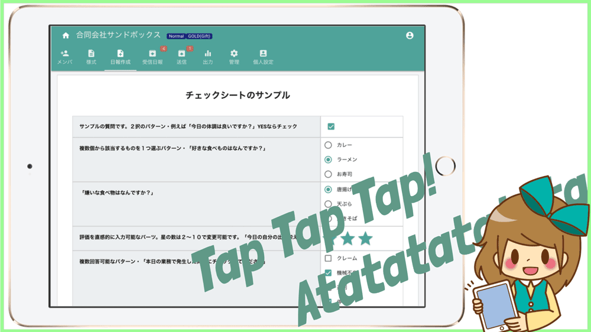

# チェックシートをアプリ化・提出も集計も簡単

## チェックシートとは？
チェックシートは、所定のテンプレートに従って、設問に対する回答を記入するシートです。  
「チェック」の名がつくように、確認事項の振り返りとして1項目づつチェックを入れて、漏れがないかを確認するために使用することもあります。  
チェックシートは非常に様々な種類があり、例えば「買い物リスト」や「清掃点検シート」などもチェックシートと呼べます。  
何らかの病気の疑いがあるときにもチェックシートは使われていますね。例えば「逆流性食道炎チェックシート」などです。  

## 会社の業務におけるチェックシート
様々なチェックシートの中でも、このページでテーマとして扱うのは、業務で利用するチェックシートです。
「5Sチェックシート」や「機械設備点検シート」何らかの「調査点検シート」など、こちらも非常に様々な種類のチェックシートがあります。

会社の業務内容や、同業でも会社各自のルールによって、チェックシートのカタチは多種多様です。
Nipoは業務のチェックシートをクラウドシステム化します。業務におけるチェックシートをシステム化する上で、そのシステムはどのようなことが求められるのでしょうか？チェックシートをアプリ化するってどんな感じ？
活字よりも映像の方がイメージしやすいこともあります。

::: tip
業務に特化したチェックシートって堅そうなイメージだけど簡単ですっ。
トイレの壁に貼ってある清掃チェックシートの延長みたいなものです。
:::

### チェックシートを繰り返し利用する
業務で使うチェックシートに共通することは「繰り返し何度も利用する」ことではないでしょうか？
「逆流性食道炎チェックシート」を毎日記入することはありません。
しかし例えば「調査点検シート」は調査のたびに1枚のチェックシートに記入し、提出します。「5Sチェックシート」の場合も。日々の業務の中で、チェックシートを繰り返し何度も使うことになります。毎日増え続けるため、効率よく蓄積したチェックシートを保存する仕組みもあります。

スマホかタブレットを開いて、「新規作成」ボタンをタップすれば、まっさらなチェックシートが画面に表示されます。設問は毎回同じですが、ちゃんと読みながらチェックしなきゃだめですよ。そう、つまりNipoはチェックシートを繰り返し(反復継続して)利用可能なんです。

::: tip
スマホアプリの「チェックシート」は1度で使い捨てのアプリが多いです。  
iPhone純正アプリの「リマインダー」だって繰返しは想定してないです。チェックしたらその項目は消えてしまいます
:::

### 紙によるチェックシートの保管

スマートフォンのような小さな画面でチェックシートを作成できますが、作成されたチェックシートを1枚のA4用紙に綺麗にアウトプットすることができます。 
「古い」と言われても、紙による書類はデジタルには無いメリットがあります。
赤ペンで注釈を書き込むことも、承認印を押すことも簡単です。
チェックシートをデジタル化しても、紙として残すことはかんたんです。
※補足
ここでは「印刷」と説明していますが、正しくはPDF出力です。PDFはレイアウトを崩さず印刷できるため、ここでは便宜上、紙によるチェックシートとして説明しています

### 溜まったチェックシートを集計・加工する
様々な目的によって作成されたチェックシートはどうしていますか？
チェックシートの種類によっては、目を通して数か月後にまとめて処分することもあります。あるいは、提出されたチェックシートをエクセルシートに書き写して、集計や並べ替えを行う場合もあります。チェックシートの目的によって変わります。

チェックシートをシステム化する大きなメリットの1つが、「集計の自動化」です。あなたがこれまで手動で行ってきた、チェックシートの集計をNipoが代わりに行います。とても魅力的だと思いませんか？しかも超格安、きっとあなたの1日の給料よりも安い金額です。

::: tip
日報・チェックシートデータの集計に興味がわきましたか？詳しくは「日報データの集計」をご覧ください。
:::

### 用途に応じて複数のチェックシートを使い分ける

例えば、土地家屋の調査にチェックシートを利用する場合、1枚のシートで完結する「土地家屋チェックシート」を用意することもできますが、土地と家屋のチェック内容が異なるのであれば、「土地」専用のチェックシートと、「家屋」専用のチェックシートの2種類を用意することもできます。

んー、例が悪いですね。もっと極端に例示すると・・・

「トイレ清掃チェックシート」のテンプレートと、「温室管理チェックシート」のように、全く異なるチェックシートがあってもNipo上で管理できるということです。

チェックシートは最大で20種類まで作成でき、必要に応じて使うチェックシートをボタン1つで切り替えできます。もちろん、それらのチェックシートは会社オリジナルのものを自由に無料で作れます。

::: tip
チェックシートの様式を「テンプレート」って言うよ。詳しくはテンプレート作成をご覧あれ
:::

### チェックシートの内容を社内で共有する
社内の他のスタッフが作成したチェックシートを、会社内の全員が読めるように運用することができます。
（その逆で、上司以外読めないようにすることも可能）
情報共有をすることで多くのメリットがあります。チェックのミスに気づくことができるかもしれないし、新しいビジネスの販路が広がるきっかけが見つかるかもしれません。

## チェックシートをアプリ化することで生まれる付加価値について
これまで、業務で行ってきたチェックシートの作成や管理をシステム化・アプリ化することで様々なメリットが生まれます。

### スマホ・タブレットでチェックシートが作れる

クラウドシステムの強みは、豊富なデバイスです。今お使いのスマートフォン・タブレットがそのままチェックシートアプリになります。
「VPNとか設定しなきゃだめなの？」「セキュリティは大丈夫？」など、通信の暗号を心配するかもしれません。
詳しくはセキュリティについてのページに譲りますが、安心してご利用ください

### チェックシートの内容を簡単に集計できる

紙のチェックシートでは、集計するために「エクセルシート」へ書き写す必要があります。
エクセルによるチェックシートで受け取る場合でも、複数のスタッフのチェックシートをまとめるにはやはり1枚のエクセルシートへコピーしなければなりません。
10名の1か月分をまとめるとなると、非常に大変です。1日1枚としても300枚を1枚のエクセルシートにまとめるのは非効率なうえ、ミスも混入しやすくなります。
Googleスプレッドシートを利用するのも良い案ですが、チェックシートとしての体裁を保つのは困難です。熟練度が低いと誤って他人のセルを削除してしまう凡ミスも発生します。

Nipoを使えば、チェックシートの集計も簡単にできます。
集計のデータを1枚のエクセルシートにまとめて書き出すこともできます。
countif関数などを使って、例えばチェックシートに〇が付いた数をカウントすることも簡単です。

### チェックシートを日報のように承認・棄却できる

スタッフから提出されたチェックシートに不備があれば「棄却」して書き直してもらうことも、「承認」したり、
チェックシートに対してコメントを残すことも可能です。グループ内で誰が読んだかを把握することも、過去のチェックシートを文章から検索することもかんたんにできます。
Nipoがもともと日報アプリのため、日報アプリでできる機能をそのままチェックシートでも利用可能というわけです

### 増え続けるチェックシートのデータ管理がかんたん
紙によるチェックシートはファイリングする手間があります。
メールや共有サーバに保管されたチェックシートは日付やスタッフでフォルダ分けする手間があります。
スタッフが多いほど、過去のチェックシートの管理は煩雑になってきます。普段見直さないことをいいことに、どこかへ紛失したチェックシートをそのままにしていませんか？
チェックシートをシステム化することで煩雑なデータ管理や、バックアップの手間がなくなります。
スタッフが書いたチェックシートは受信BOXに提出順に蓄積されますが、強力な検索や絞込み機能を使って目的のチェックシートをかんたんに見つけ出すことが可能です

