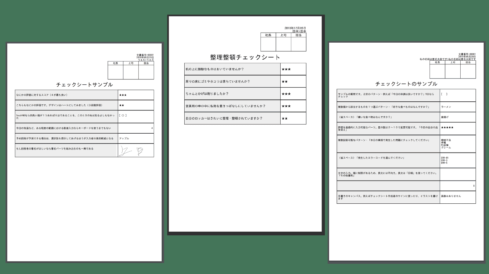

# チェックシートをアプリ化・タブレットで入力&PCで集計

## チェックシートとは？
チェックシートは、所定のテンプレートに従って、設問に対する回答を記入するシートです。  
「チェック」の名がつくように、確認事項の振り返りとして1項目づつチェックを入れて、漏れがないかを確認するために使用することもあります。  
チェックシートは非常に様々な種類があり、例えば「買い物リスト」や「清掃点検シート」などもチェックシートと呼べます。  
何らかの病気の疑いがあるときにもチェックシートは使われていますね。例えば「逆流性食道炎チェックシート」などです。  

## 会社の業務におけるチェックシート
様々なチェックシートの中でも、このページでテーマとして扱うのは、業務で利用するチェックシートです。

- 5Sチェックシート
- 機械設備点検シート
- 現地調査シート
  
など、こちらも非常に様々な種類のチェックシートがあります。
会社の業務内容や、同業でも会社各自のルールによって、チェックシートのカタチは多種多様です。
Nipoは業務のチェックシートをクラウドシステム化します。業務におけるチェックシートをシステム化する上で、そのシステムはどのようなことが求められるのでしょうか？チェックシートをアプリ化するってどんな感じ？
活字よりも映像の方がイメージしやすいこともあります。

<figure>

<figcaption>iPadを横向きにするとちょうどチェックシートの体裁を保ちながら入力できるように設計されています。タップ操作だけで入力できるパーツを多用することで入力効率が向上します</figcaption>
</figure> 

<Alice label="業務用チェックシートって意外とかんたんなんですね" icon="ok" />

### チェックシートに適したデザインのテンプレートを活用する
チェックシートは文章のような曖昧さではなく、数値や「YES/NO」といったきっちりとした入力方式にするべきでしょう。もちろんそれらに対応する様々なパーツが利用できます。ここではチェックシートに特に有用なパーツをいくつかピックアックしてみました。  

#### レートパーツ:なにかの評価に対するスコア
たとえばショッピングサイトなどでおなじみの[レートパーツ](/manual/template/rate)を使えば、0〜10までの値を入力できます。  
見た目は星かハートから選ぶことが出来ます。また、上図では緑色ですが、これはグループの[テーマカラー](/manual/setting/color_theme)によって変わります。

#### スライダーパーツ:今日の気温など、ある程度の範囲における数値入力ならキーボードを使うまでもない
10以上の値が入力したい場合は、[スライダーパーツ](/manual/template/slide)もあります。更に大きな値の場合は、通常の[数値パーツ](/manual/template/math)を使うこともできます。  
若干個人の好みもありますが、タブレットやスマートフォンがメインの場合は、レートやスライダーのほうが入力しやすいです。
実際にスライダーとはどんな入力方式か、サンプルを用意しました。値を変えて動かしてみることで体験できます
<SampleSlide />

#### チェックボックスパーツ: YesかNoなら四角い箱が１つあれば十分である

その他、Yes/Noといった二択で回答できるチェック項目であれば、[チェックボックス](/manual/template/checkbox)パーツも便利です。お好みでトグルスイッチ風に変更も可能です。

#### 選択肢パーツ:予め回答が予測できる場合は、選択肢を提示してあげるほうが入力者の負担軽減になる
選択肢というパーツは、予め回答を提示して入力者が選ぶタイプのものです。  
選択肢は２種類あります。
- [選択肢から１つだけを選ぶ「選択肢ー単回答式」](/manual/template/select1)
- [選択肢から複数個選べる「選択肢ー複数回答式」](/manual/template/select2)

用途に応じて使い分けてください。

## チェックシートを繰り返し利用する
業務で使うチェックシートに共通することは「繰り返し何度も利用する」ことではないでしょうか？
「逆流性食道炎チェックシート」を毎日記入することはありません。
しかし例えば「調査点検シート」は調査のたびに1枚のチェックシートに記入し、提出します。「5Sチェックシート」の場合も。日々の業務の中でチェックシートを繰り返し何度も使うことになります。毎日増え続けるため、効率よく蓄積したチェックシートを保存する仕組みもあります。

スマホかタブレットを開いて、「新規作成」ボタンをタップすれば、まっさらなチェックシートが画面に表示されます。(詳しくは[日報を書く](/manual/report/write)を参照）  
設問は毎回同じですが、ちゃんと読みながらチェックしなきゃだめですよ。そう、つまりNipoはチェックシートを繰り返し(反復継続して)利用可能なんです。

<Alice label="スマホアプリのチェックシートは１度きりのものがおおいね" icon="phone" />

## 増え続けるチェックシートを効率よく保管する

<figure>

<figcaption>作成されたチェックシートをPDFに変換した様子。余白や文字サイズなど微調整可能です</figcaption>
</figure> 

Nipoで作成されたチェックシートはクラウド上に保存されます。もちろん[受信BOX](/manual/res/res)から直接チェックシートを読むことも出来ますが、ここではあえて「チェックシートをPDF化」できる機能をご紹介します。  
PDF化されたチェックシートを印刷して保管したり、PDFのまま保管することも可能です。もちろん、Nipo上に保管しておくのもOKです。
<Alice label="「古い」と言われても、紙による書類はデジタルには無いメリットがあります。" icon="here" />

紙によるメリットは非常に大きいと思っています。デジタルは便利ですが、実態が無いために見落としてしまうリスクがあります。  
そして何より、電気がないと動きません。対する紙の書類は、電気がなくても読めるのです。

### 溜まったチェックシートを集計・加工する
作成されたチェックシートはどうしていますか？
さっと目を通して終わりということもあるでしょう。  
あるいは、提出されたチェックシートを[エクセルに出力して、集計や分析](/manual/utility/analyze)を行う場合もあります。

チェックシートをシステム化する大きなメリットの1つが、**集計の自動化**です。
これまで手動で行ってきた、チェックシートの集計をNipoが代わりに行います。とても魅力的だと思いませんか？しかも[超格安](/price/)、きっとあなたの1日の給料よりも安い金額です。

紙のチェックシートでは、集計するために「エクセルシート」へ書き写す必要があります。
エクセルによるチェックシートで受け取る場合でも、複数のスタッフのチェックシートをまとめるにはやはり1枚のエクセルシートへコピーしなければなりません。
10名の1か月分をまとめるとなると、非常に大変です。1日1枚としても300枚を1枚のエクセルシートにまとめるのは非効率なうえ、ミスも混入しやすくなります。
Googleスプレッドシートを利用するのも良い案ですが、チェックシートとしての体裁を保つのは困難です。熟練度が低いと誤って他人のセルを削除してしまう凡ミスも発生します。

Nipoを使えば、チェックシートの集計も簡単にできます。
集計のデータを1枚のエクセルシートにまとめて書き出すこともできます。
countif関数などを使って、例えばチェックシートに〇が付いた数をカウントすることも簡単です。

### 用途に応じて複数のチェックシートを使い分ける

<figure>

<figcaption>用途に応じて複数のチェックシートを用意できます。一覧から選択することでチェックシートの入力が開始します</figcaption>
</figure> 

例えば、土地家屋の調査にチェックシートを利用する場合、1枚のシートで完結する「土地家屋チェックシート」を用意することもできますが、土地と家屋のチェック内容が異なるのであれば、「土地」専用のチェックシートと、「家屋」専用のチェックシートの2種類を用意することもできます。
このように全く異なるチェックシートがあってもNipo上で管理できます。

チェックシートは最大で100種類まで作成でき、必要に応じて使うチェックシートをボタン1つで切り替えできます。  
多すぎると探すのが大変ですって？その場合は[テンプレートの分類分け](/manual/template/_category)をすることで効率よく見つけることが出来ます。

<Alice label="タイトル順に並ぶから、よく使うテンプレートに_とか.をつけると上の方に表示できるよ" icon="pc" />

### チェックシートの内容を社内で共有する
社内の他のスタッフが作成したチェックシートを、会社内の全員が読めるようにしたり、逆に上司しか読めないような設定で運用することもできます。  
いわゆる「アクセス権限」というやつですが、Nipoではこれを[グループモード](/manual/group/mode)で設定します。  
情報共有をすることで多くのメリットがあります。チェックのミスに気づくことができるかもしれないし、新しいビジネスの販路が広がるきっかけが見つかるかもしれません。

### チェックシートを日報のように承認・棄却できる

<figure>

<figcaption>チェックシートにたいして承認や棄却、そしてコメントといったリアクションを取ることができます</figcaption>
</figure> 

スタッフから提出されたチェックシートに対して[承認や棄却](/manual/res/reaction)、または[コメントを残す](/manual/res/comment)ことが可能です。  
グループ内で誰が読んだかを把握することも、[過去のチェックシートを文章から検索](/manual/res/search)することもかんたんにできます。
Nipoがもともと日報アプリのため、日報アプリでできる機能をそのままチェックシートでも利用可能というわけです

