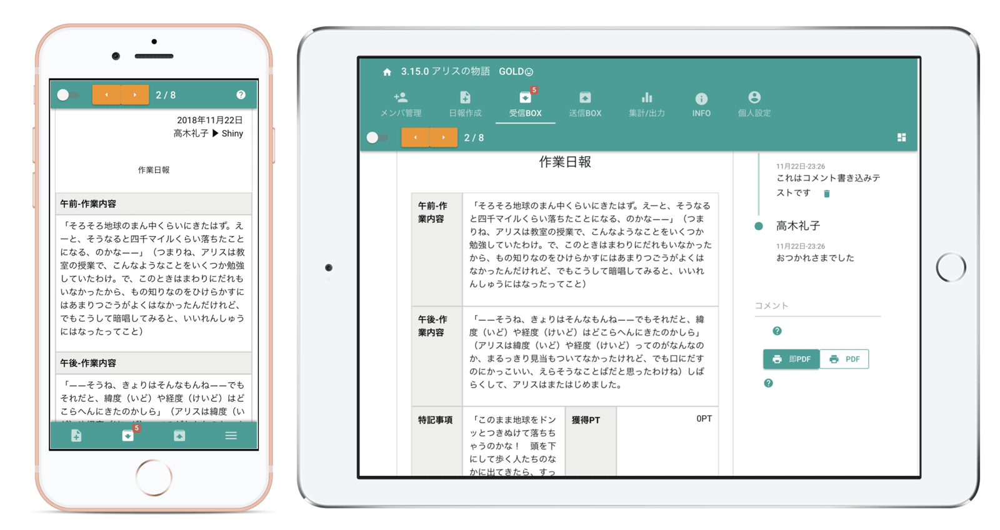

# 個人用の日報アプリとして活用する
[[toc]]
## 個人日報とは自分用のメモです
様々なお客様からお問い合わせをいただきます。開発者として想定もしなかった使い方もあり、逆に色々勉強になります。
今回頂いたお問い合わせいただいた内容が  
::: tip お客様
一人で使う日報としてGOLD PLANを申し込みたい
:::

というものでした。つまりメモや伝票の代わりとしてNipoを活用したいというお問い合わせです。  
通常、日報とは「日々の報告」であり、報告を書く人と報告を受ける人の2名がいるはずだと思い込んでいましたが、なるほどテンプレートがカスタマイズできるため、ただのメモ帳を超えて使えるということを教えていただきました。

## 一人で日報ももちろんできます。クラウド型伝票の代わりにもなります
個人用に日報を書き、それを蓄積することはなんの問題もなくできます。Nipoでは提出先の指定が必要ですが、提出先を「自分自身」にすることで自分だけの個人日報として活用できます。

Nipoはクラウド型の日報システムのため、スマートフォンやタブレット・PCなど場所や端末を選ばずに利用できます

<Alice label="外出先でも手軽に使えるのは利点ですね" icon="phone" />
「クラウド型の個人用メモ」と考えると例えばEverNoteなどのサービスが思い浮かびますが、EverNoteがメモであれば、Nipoは「日報」です。そもそも基本思想が違う為、比較することはナンセンスですが、クラウド型日報のメリットとして「テンプレートがある」という点が大きな差ではないでしょうか。自分のメモ用として使うにしても、テンプレートがあるほうが書きやすく、またCSV出力などをするとフィールドごとに区切られて出力できるため、あとでエクセルで編集したり、並べ替えをしたりするのにも適しています。

フィールドがあることで、ただのテキストメモではなく、整頓されたデータに昇格します。そう考えると例えば売上伝票、仕入伝票といった使い方もNipoでできます。

小規模な事業、それこそ個人日報の規模であればわざわざ販売管理システムを導入するよりも、Nipoで「売上伝票」や「活動記録」といったテンプレートを作成して管理した方が、手軽かもしれません。

シンプルなメモアプリでは物足りないけど、コストも掛けずに小さな規模で個人日報やかんたんな販売管理がこなせるのも、Nipoならではです。

## 無料で使えます。有料プランも1名から申し込み可能になりました
PDF変換やCSV出力など、一部の機能はロックされてしまいますが利用期限や保存容量に関係なく、ずっと無料で使い続けることができます。特に個人の備忘録としてはコストをかけずに始められるため、是非手に取って使ってほしいと思います。

また、前述のように「伝票の代わり」として使う際は、あとからCSV出力が必要になるかもしれません。そういった機能の解除には「GOLD PLAN」という有料のコースを利用する必要があります。

実をいうとつい昨日まではGOLD PLANの最低申込人数が2名からでした。開発者は当初「日報は書く人・読む人の最低2名で成立する」と妄信していたため、2名からの申し込みとしていましたが、今回のお問い合わせを受けて、申し込み人数が最低1名からに変更されました。

## 小規模事業者の味方でありたいと思っています
多くの日報アプリサービスでは、「最低申込人数」が設定されています。もちろんNipoもそうでした。今回の件でNipoは最低申込人数が1名となり、より手軽なお値段（1名500円です）で気軽にお使いいただけるようになりました。Nipoの開発会社が小規模なので、同じように小規模な事業者さまの味方でありたいと思っています。Nipoの開発はそもそも零細企業向けのサービスのため、1名からの申し込みを解禁したことは自然な流れなのかもしれません。
