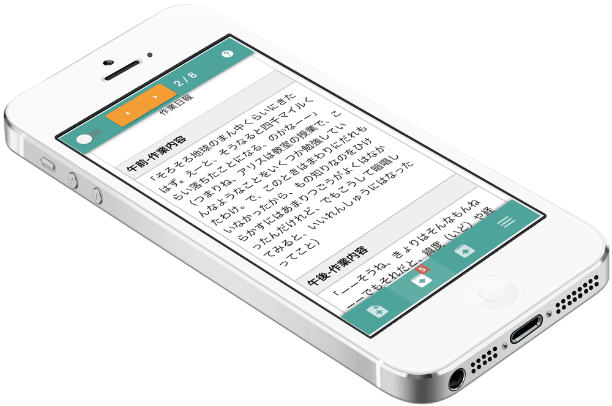
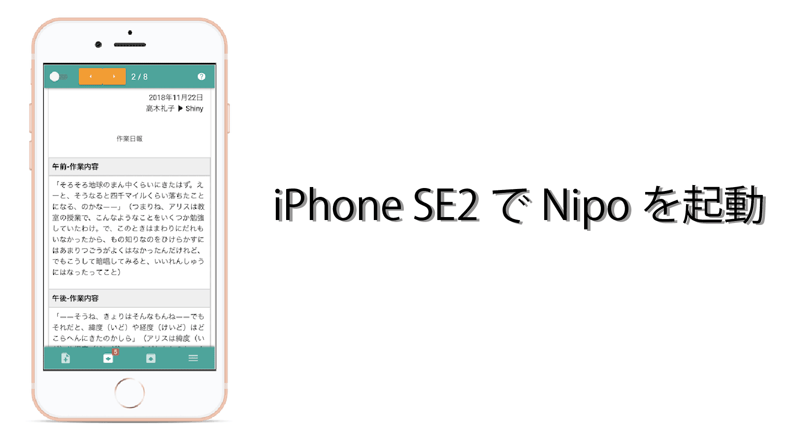
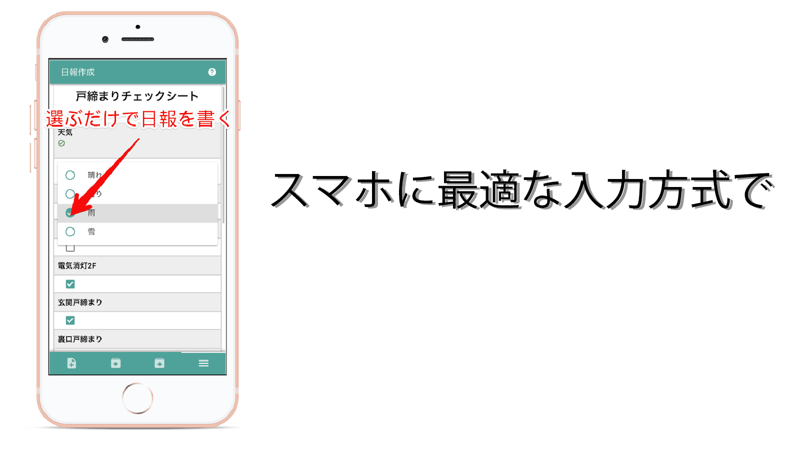
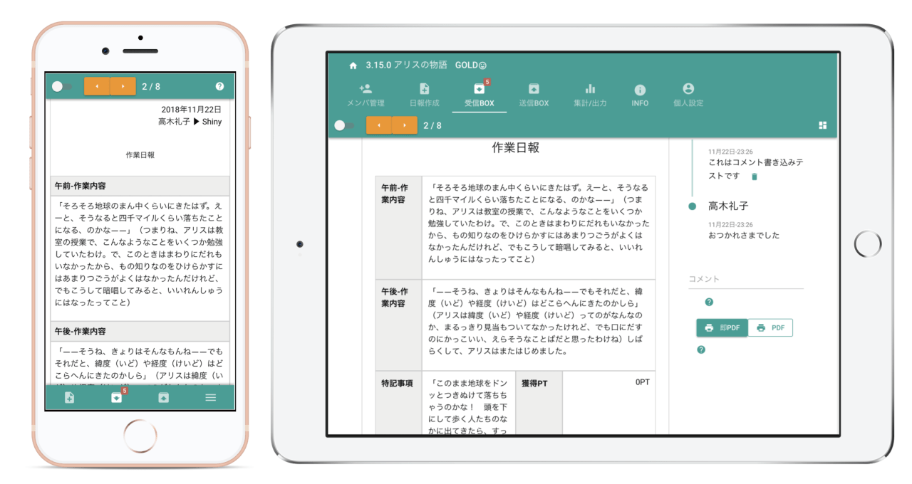

# スマホで日報を作成しよう
[[toc]]
## かんたん！スマートフォンで業務の日報作成

  

**「日報を書くために、パソコンに向かうのはめんどう・・・かんたんにできないの？」**

日報は毎日書きます。ちょっとした手間でも、毎日になると大きな負担です。  
では、スマートフォンで日報を書くというのはどうでしょう？  
いつも持ち歩いているスマートフォンから日報が書けたら便利だと思いませんか？使い慣れたスマホなら、パソコンが苦手なスタッフでも安心です。  
スマートフォンはパソコンよりもずっとかんたんに使えるので、スタッフさんたちの負担も軽減できます。  
Nipoでスマートな日報業務をはじめてみませんか？

## スマートフォンに適したレイアウトで
  
スマートフォンの画面って縦長ですよね。

上下にスクロールしやすいので、Nipoでは日報のデザインが縦長表示になります。

また、操作もパソコンとは大きく異なります。

キーボードやマウスが無いスマートフォンは、操作の感覚も全然違います。そのためスマートフォンでもかんたんに日報を作成できる仕組みがたくさん用意されています。例えば一覧から選択するだけで入力できる項目や、シングルタップで入力できるチェックボックスなど、スマートフォンと相性の良い項目を使って日報テンプレートを作ってみましょう。

スマートフォンでの日報作成負担も軽減できるはずです

::: tip
スマートフォンは長文の入力が苦手です。それを踏まえた上で、できるだけ文字入力の負担を減らすことが、スタッフの負担軽減に繋がります
:::
## スマートフォンとパソコンの連携もかんたんです！

外出先から日報を読んだり、書いたりできるフットワークの軽さはパソコンには真似できません。

そんなスマートフォン、とってもかんたんで便利ですが、画面が小さいのが玉にキズ・・・。

そんなときは、スマートフォンとパソコン（タブレット）を組み合わせて使ってみましょう。スマートフォンで作成された日報は、画面の大きなパソコンやタブレットで読むことが可能です。日報の集計や、印刷といった機能も、パソコンから行うことができます。

::: tip 
スマートフォン単独でも、日報の印刷や集計は可能です。しかし画面の小さなスマートフォンでは、集計結果をエクセルに出力した結果を読むのは少し不便です。細かな作業はパソコンを活用しましょう
:::
たとえば、スマートフォンとタブレットではこんなに大きな差が生まれます

上の図は同じ日報を表示しています。  
左は、iPhone8で、右はiPad Air2です。見た目の違いは一目瞭然ですね。

## スマホアプリは「子機」であることを忘れないで
iPhoneや、Androidスマートフォン向けに、Nipo専用のアプリを公開中です。日報を書くたびにSafariなどのブラウザを開くのは面倒ですので、利便性向上のためのモバイルアプリを公開しております。  
日常業務はモバイルアプリのほうが便利ですが、モバイルアプリの立ち位置はあくまでも「子機」です。母体はWeb版のNipoであることを理解してください。   
画面の小さいスマートフォンから、日報のテンプレートを作成するのは非常に効率が悪いです。テンプレート作成などの初期設定は、PCからWeb版のNipoを起動して予め作成しておきましょう。  
スマートフォンアプリはお膳立てが済んでから導入してください。  

