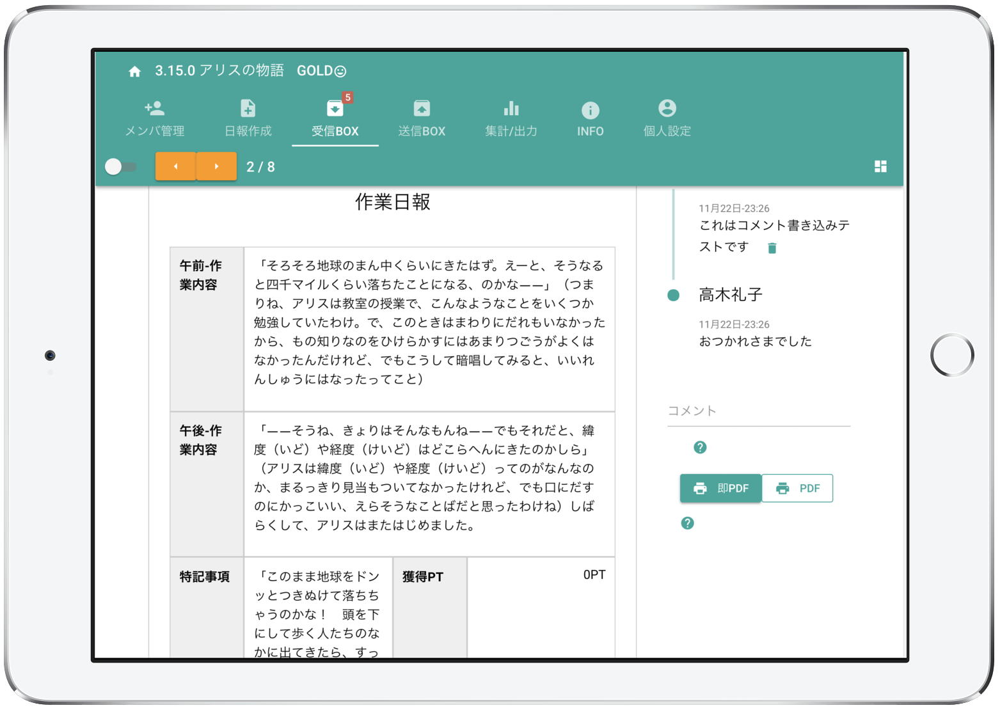
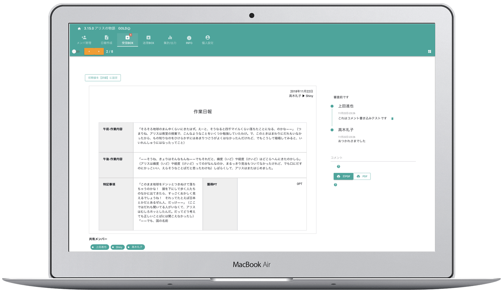
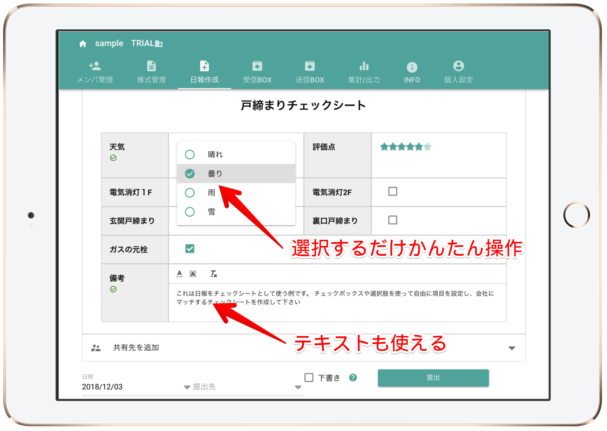
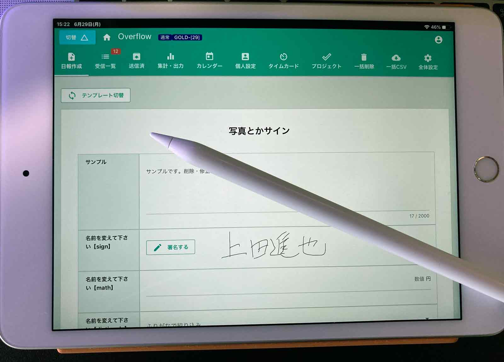
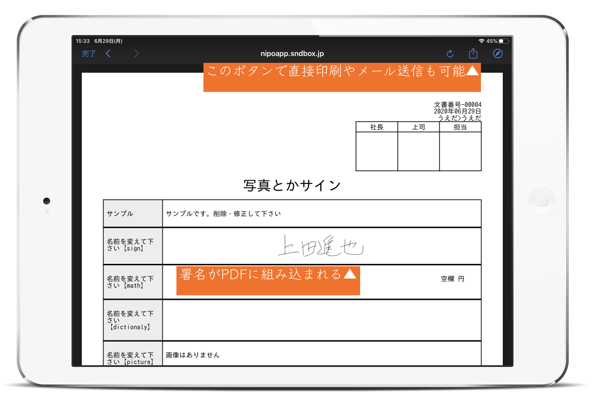

# iPad / Tabletで日報を作成する
[[toc]]
## iPadを使って日報を書く
<Alice label="PCが使えない!なんて方も大丈夫です" icon="tablet" />

**「スタッフがPCを使えない」**
もしそのようなお悩みをもっているのなら、タブレットを使った日報はいかがでしょう。たとえばiPadから[日報の作成](/manual/report/write)や、iPad上から[日報をPDF化](/manual/utility/pdf)したり、
プリンタがあればタブレットから印刷することもできます。  
なによりも、iPadはとってもかんたんに操作できるメリットがあります。PCが苦手でも、iPadは使えるという人も多いはずです。

<figure>

<figcaption>iPadから日報を表示した様子。9.7インチのサイズであれば日報らしい見た目のままに表示することが可能</figcaption>
</figure> 

## パソコンと同じ日報業務がiPadだけで完結できます
Nipoはレスポンシブデザインで作られた日報アプリです。レスポンシブの特徴は、「どの機器からアクセスしてもきれいに見える」点です。例えばパソコンのように、大きな画面からNipoを利用するとこんな感じになります

<figure>

<figcaption>11インチ以上のモニタであればNipoをフルに活用できます。</figcaption>
</figure>

iPadから見た画面と比べて、表示されるエリアが増えました。  
よく見てみると、iPadから見た画面と比べてみると、機能に大きな違いが無いことに気づきます。  
極端に言うと、**パソコンがなくてもNipoを利用することが可能**です。

::: tip パソコンとiPadの連携はできるの？
iPadで書いた日報をパソコンから読むことも、その反対も可能です。クラウドシステムの強みですね
:::

## タブレットだから時間や場所を気にせず使える

<figure>

<figcaption>iPadから日報を作成している様子。PCと見た目の遜色がほとんど無く、ストレスフリーで日報の作成が可能です。</figcaption>
</figure>

iPadはとってもコンパクト。カバンに忍ばせても邪魔になりません。
iPadとWifiがあれば、いつでもどこでも。[日報を読んだり](/manual/res/res)、[コメントを返したり](/manual/res/comment)できます。
もちろんiPadから[日報を書く](/manual/report/write)ことも可能です

## タブレットだからこその強みを最大限に活用できます。
iPadの優れた特徴として、**タッチパネルが使える**のもポイントです。iPadがそのまま１つのキャンバスになるので、[手描きの地図やメモ](/manual/template/canvas)も指先一つでサクサクと描けます。
タッチパネルの他にも、背面に高性能なカメラが搭載されていますので、「現場の写真をカシャっと撮影して日報へ添付する」。といった使い方も可能です。([写真パーツ参照](/manual/template/pict))  
カメラの無いPCではデジカメのデータを取り込んだり、メールで送ったりと非常に手間ですが、iPadならそれ1台で完結できます。これもまた、PCよりも優れたポイントですね。

タップ操作がとっても使いやすいので、タップで入力できる[日報のテンプレート](/manual/template/_about)を作れば、スタッフの入力負担も大幅に軽減できます。 
例えば[選択肢](/manual/template/select2)や、[スライダーパーツ](/manual/template/slide)、ネットショップなどでおなじみの[レートパーツ](/manual/template/rate)などはタップ操作と相性がとても良いです。 
Wordで作ったような、きれいなレイアウトで日報を読んだり、書いたりできるのはNipoならではの大きな特徴です。

<Alice label="逆に長文の入力などはPCに比べて苦手です。文字入力を極力減らせるテンプレートを心がけましょう" icon="ok" />

### 大きな画面とタッチパネルを使って署名の入力もできます

<figure>

<figcaption>iPad mini5とApple Pencilを使って報告書に署名を書いたところ。工事現場の受領サインなどにも活用できます</figcaption>
</figure>

現場でお客様から署名をもらうケースは多数考えられます。日報テンプレートには[署名専用のパーツ](/manual/template/sign)がありますのでこれを組み込んでみましょう。
スタイラスペン（タッチペン）を使えばストレス無く署名をすることができます。  
対応機種は限られますが、Apple Pencilなども利用できます。

<figure>

<figcaption>先程の報告書（署名あり）をiPadからPDFに変換できます。PDFをそのまま印刷したり、メールに添付して送ることも可能です。</figcaption>
</figure>

ここでは署名された報告書をPDF化している例をご案内していますが、もちろん、Nipo上にも保存されるので[受信ボックス](/manual/res/res)から上司が見ることも可能です

<Alice label="スマホでも署名はできるけど画面が小さいのでちょっと書きにくいかな" icon="phone" />

## iPadにNipoを導入するまえに
タブレット１つでNipoを始めることも出来ますが、もしパソコンが使えるのであれば、**初期設定(主に[テンプレート作成](/manual/template/_make))はパソコンで済ませる**ことをおすすめしています。  
<Alice label="報告書用のテンプレート作成はキーボードやマウスが使えるほうが操作しやすいためです" icon="pc" />

データはすべてクラウドに保存されるため、パソコンで初期設定した環境がそのままタブレットや[スマートフォン](/idea/smartphone)でも利用可能です。
また、[日報をCSVに出力](/manual/utility/analyze)してエクセルで集計するといった操作は、パソコンのほうが優秀です。  
タブレットにこだわりすぎず、適材適所でPCとタブレットの長所を活かすことで、効率的な日報の運用が可能になります。

[iPadやiPhoneでNipoを導入する手順](/system/ios)はこちらになります
