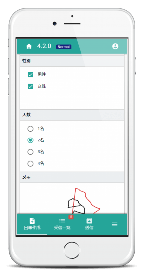
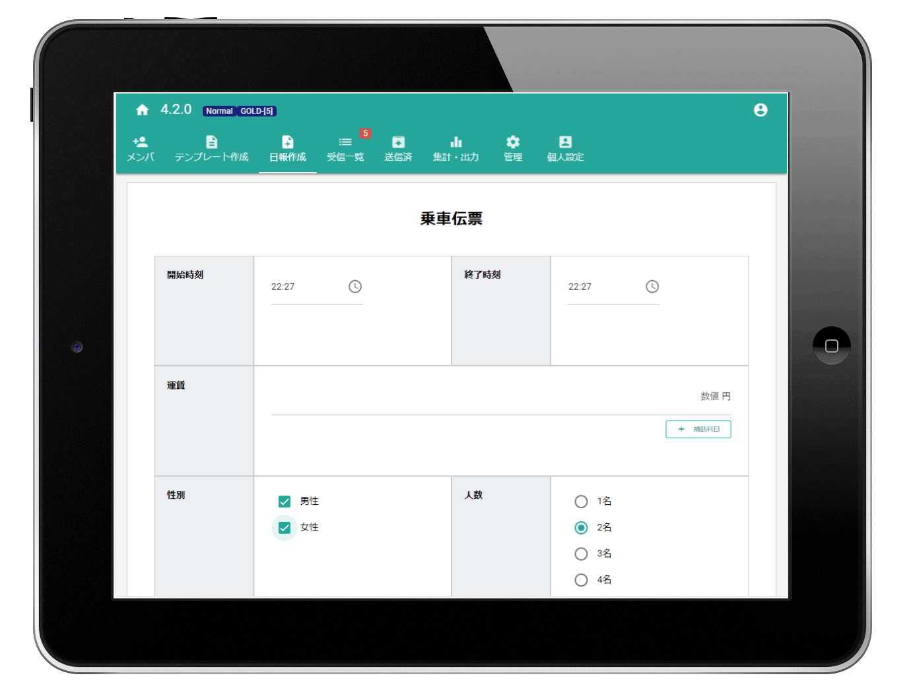
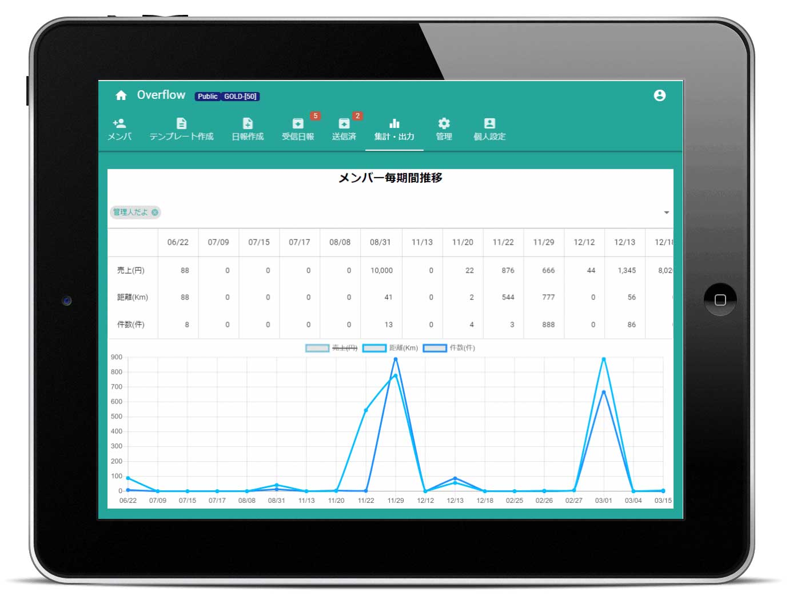

# タクシー日報をスマホで書く

Nipoの一つの使い方としてご紹介しています。タクシーに限らずさまざまな業種で使えます
## 乗車時間やお客様の性別・人数などをスマホで簡単入力
  
Nipoを使えばタクシーの日報をスマートフォンから入力できます。PCからの利用も可能ですが、手軽に使えるスマートフォンからの入力も簡単でおすすめです。  
その日の走行距離や、乗降回数、売上金額などをスマートフォンから入力するだけでかんたんに日報が作成できます。  
1日の終わりに書く日報とは別に、1件1件の情報を「伝票」のように保管するのも可能です。  
都度都度入力するので、必要最小限でかんたんに入力できる「伝票」のテンプレートを作成し、1日の終わりに「報告書」のテンプレートに書く。このような運用も可能です。（テンプレートは20種類保存可）  
図は、乗車客の性別・人数など、タップだけで入力できるように設計された伝票です。
さっと取り出してかんたんに入力でき、業務の妨げを極力減らした入力が可能です。文字入力が面倒なら手描きのメモで代用するのも一つの手です

**※慣れもありますが紙に書いた方が楽です。本当の便利さはデータの集計や分析の利便性にあります**

## 必要な項目は自由にカスタマイズできます

  
前章で例示した伝票もそうですが、Nipoは日報のテンプレートを自由にカスタマイズできます。  
タクシー日報にどのような項目が必要でしょうか？同じタクシー業でも会社や地域によって必要な項目は異なるため、必要な項目を自由に追加して会社にマッチしたオリジナルのタクシー日報テンプレートを作ってください。  
作成したタクシー日報テンプレートは、PCやスマートフォン・そしてタブレットから利用可能です。図はタブレットから入力するイメージです。  
日報作成者の負担を減らすためにもできるだけかんたんに書ける工夫をすべきです  

## デジタルが不安ならタクシー日報を印刷して保存しよう
通常の日報と異なり、「運転日報」は保存期間があります。領収証などと同じように、手に触れて保存できる「紙の媒体」は非常に心強いものです。かさ張るという点はデメリットですが、これをどうとらえるかは人の価値観によって分かれます。  
Nipoはスマホで入力したデータであっても綺麗な体裁を保ってA4用紙に印刷することが可能です。  
プリンターがWifiにつながっていれば、スマートフォンから直接日報の印刷も可能です。
タクシー日報の作成からPDF保存、そして印刷までの全てをスマートフォン1台で完結できます。PCはもちろん便利ですが、PCが無くてもタクシー日報に関して不自由はありません。  
（テンプレート作成やエクセルによる集計など、PCが必要になる場面もあります）

## 乗車時間や顧客数などの集計がかんたんです
  
タクシー日報を電子化する最大のメリットはデータの集計や分析が容易であることだと思っています。  
例えばタクシー日報に「売上・距離・件数」という3つの項目がある場合、毎日日報を書くだけで図のように集計、グラフ化できます。  
スマホは画面が小さすぎるので非推奨ですが、タブレットでとても使いやすい集計です。  
「売上の多い順に並べたい」など、更に詳細な分析を行いたい場合は、タクシー日報の全データをCSVとしてエクスポートしましょう。  
エクセルでそのまま開くことができ、並べ替えやフィルタリングなど、エクセルの持つ豊富な分析機能がフルに活用できます。

もちろんエクセルシートへの転記もボタン1つのかんたん操作で終わりです

