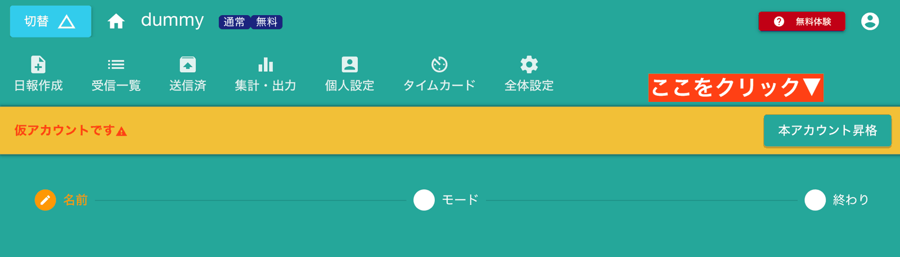

# 匿名アカウントについて
正式なアカウントではなく、ちょっと試したいときには一時的な仮アカウントを発行できます。これを**匿名アカウント**といいます。  
匿名アカウントではE-mailもパスワードも不要です。それでもNipoのシステム上は1つの正式なアカウントとして認識されます。  
匿名アカウントとしてログインするには、「アカウント無しで使う」をクリックするだけです

::: warning あくまでも一時的なアカウントであることを理解してください
E-mailもパスワードも不要ですぐにNipoを使えるという利便性がありますが、ブラウザのキャッシュが切れてしまうと、同じ匿名アカウントを利用できなくなります。  
また、スマホ・タブレット・PCなど複数の端末からログインできるクラウドシステムのメリットを受けられない点もデメリットです。
:::

## 匿名アカウントを正式なアカウントへ昇格する
匿名アカウントの目的は「手軽なお試し」です。お試しの結果Nipoが気に入ってもらえて、継続して利用しようと思ったら必ず正式なアカウントへ昇格してください。  
前述の通り、匿名アカウントは非常に不安定な状態です。OSのアップデートやNipoのアップデート、セッションの有効期限切れなど様々な要因でログインの接続が途切れると、その匿名アカウントへ戻すことはできなくなります。
不幸な事故が起こる前にかならず正式なアカウントへ昇格をお願いします  
匿名アカウントの方は常時オレンジバーが表示されています。ボタンをクリックして次の画面へ進んで下さい

## 匿名アカウントにE-mailとパスワードを紐付けする
正式なアカウントには「E-mail」と「ログイン用のパスワード」が必要です。逆に言えば「E-mail」と「パスワード」があれば匿名アカウントではなく正式なアカウントとなります。  
E-mailとパスワードを入力することで、ご利用中の匿名アカウントに紐付けが完了します

これで匿名アカウントから正式アカウントへ昇格しました。通常のアカウント同様に、にE-mailの認証を行って下さい。

