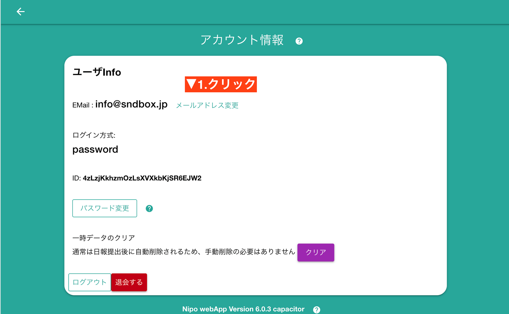
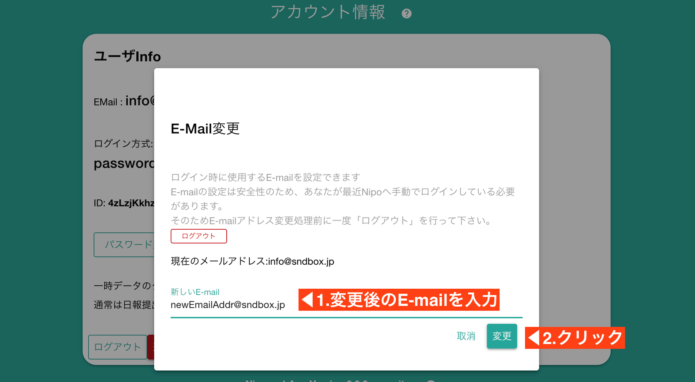
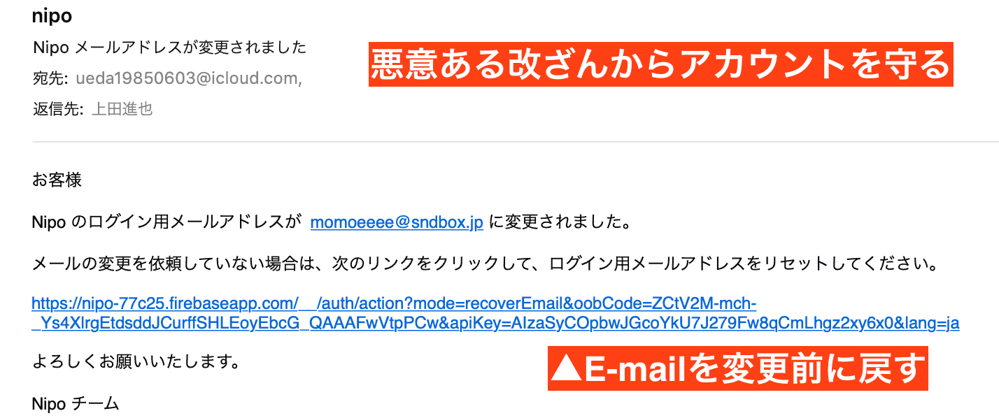

# メールアドレスの変更

E-mailを変更するには、まず画面右上にある「アカウントボタン」をクリックします

アカウント画面に切り替わります。ここで「メールアドレス変更」ボタンをクリックしてください

::: danger 変更に失敗するとき
安全性のため、E-mail変更は「手動ログイン後数分」でロックされます。ロックされた場合は一度ログアウトして再度やり直して下さい  
自動ログインではロックは解除されませんので、アプリの再起動ではなく**必ずログアウト**をする必要があります
:::

## アカウントの保護
Nipoには不正にログイン用E-mailアドレスを書き換えられてアカウントが乗っ取られないための安全装置が用意されています。
悪い人があなたのアカウントを盗みだし、E-mailアドレスを変更しようとしたとき、変更前のE-mailアドレスに必ず通知が届きます。  
その通知から変更前のE-mailに強制的に戻すことが可能です。

::: tip E-mailは重要
メールアドレスは**セキュリティにおいて、非常に重要な意味と役割を持ちます**。パスワードの再発行や、メールアドレス変更時の警告表示など、あなたを守る様々な仕組みにメールアドレスが利用されます。  
**必ず正常に受信できるメールアドレスを指定**してご利用ください。
:::
