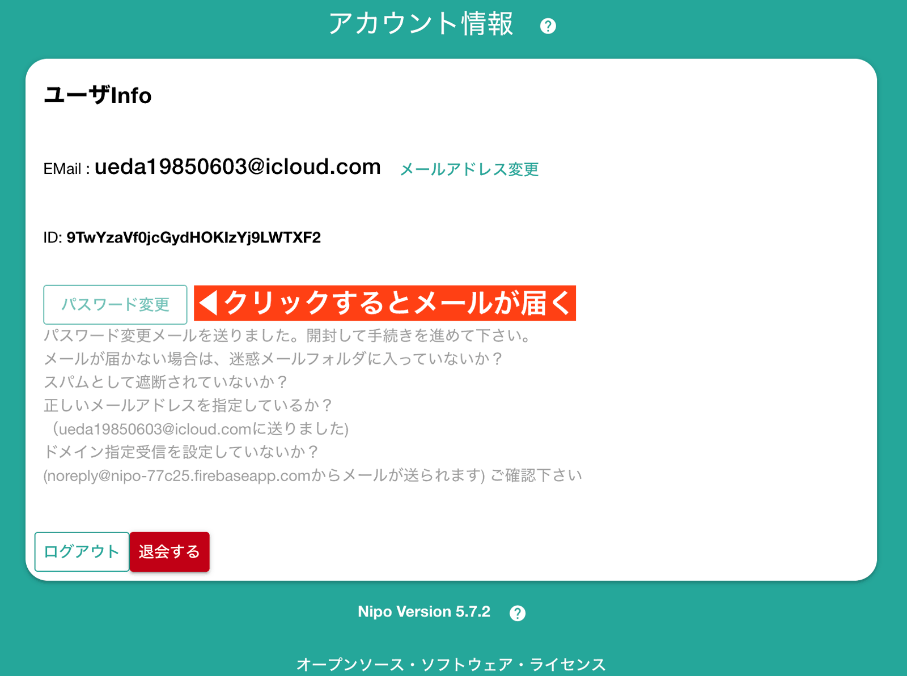
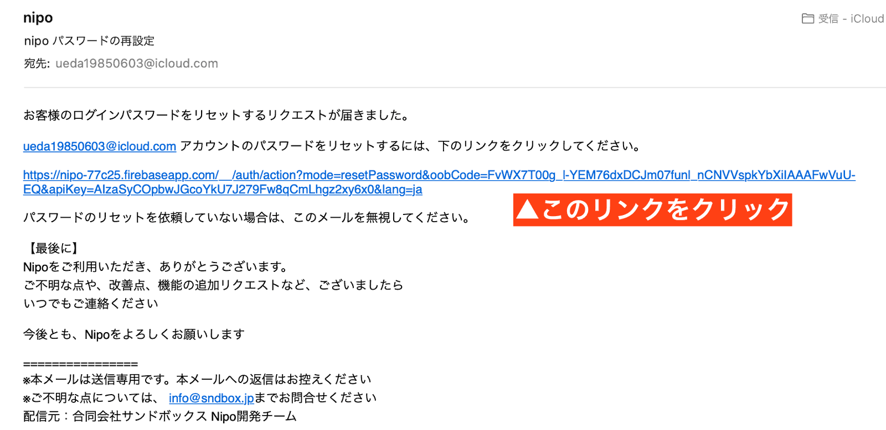

# ログインパスワードの変更

E-mailを変更するには、まず画面右上にある「アカウントボタン」をクリックします

アカウント画面に切り替わります。ここで「パスワード変更」ボタンをクリックしてください

登録されているE-mailアドレス宛へ、メールが届きます。メールボックスを確認してください

画面の指示に従い、新しいログインパスワードを設定します。
ログインパスワードの変更と、パスワード亡失時の再発行は同じ画面です。

::: tip
メールアドレスが正しくないとパスワードの変更もできません。安全性のため、
必ず正しいE-mailを使って下さい
:::
