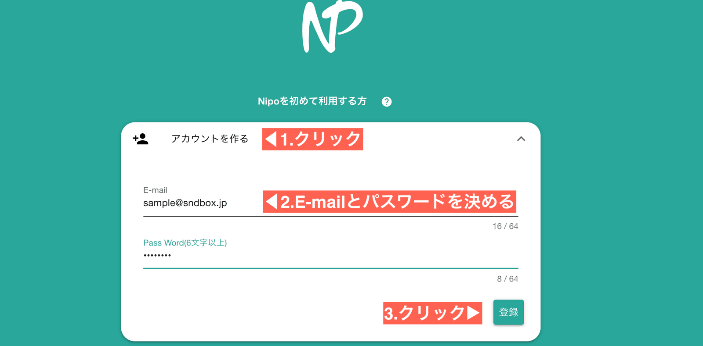
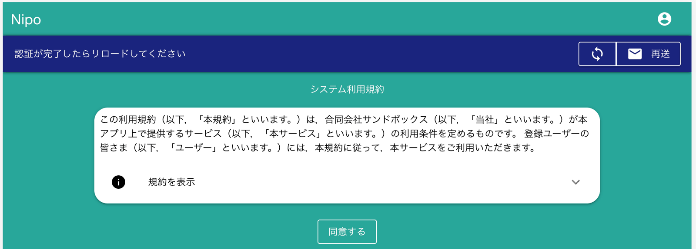
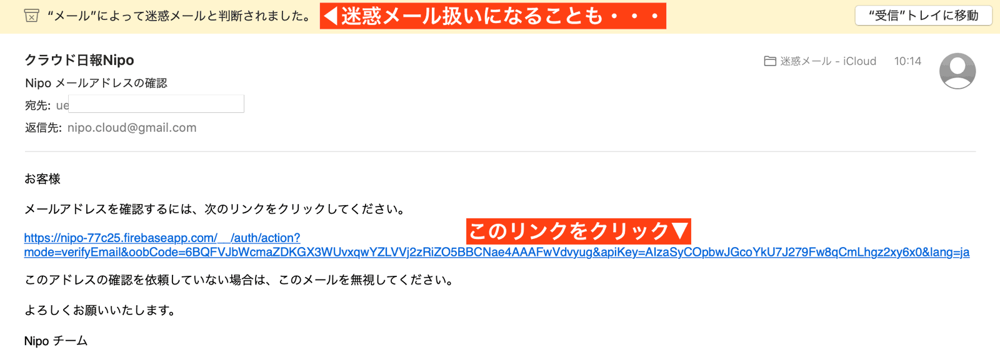
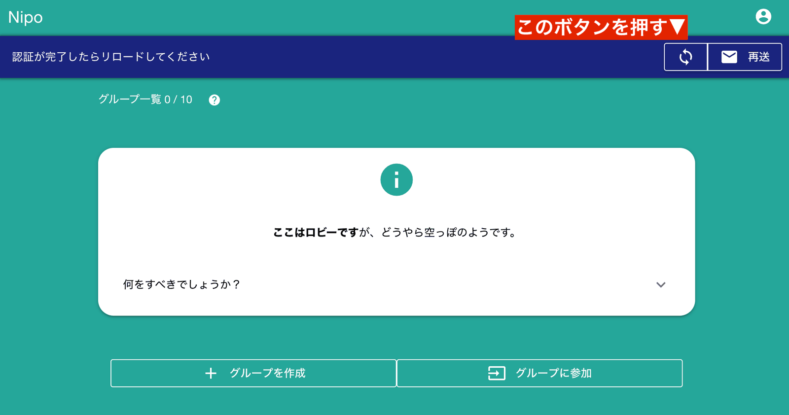

# ユーザアカウントについて

## アカウントはNipoがあなたを特定する重要な情報です
アカウントはユーザを識別するため、必ず必要なものです。  
Nipoを利用する際はアカウントを作成し、他人に悪用されないためにパスワードを設定して利用します。  
Nipoのアカウントを作成するにはE-mailアドレスとパスワードを決める必要があります。そしてログインの際にも、E-mailアドレスとパスワードを入力してログインします

## アカウントを作成する
Nipoを利用するためには、アカウントを作成してください。Nipoの利用が初めての方は、本ページではなく「Nipoの始め方」を読みながら操作したほうがスムーズです

アカウントが作成されると、その後自動でログインが開始されます
::: warning
E-mailアドレスは受信できるものを使用して下さい。パスワードを忘れた際に必要になります
:::

### 利用規約の同意
自動ログインが開始されると最初に利用規約の画面が表示されます。

ご一読の上、「同意」をお願いします

### E-mailが正しいことを証明する
アカウント作成と同時に、登録したE-mailアドレスへメールが2通届くはずです。
- 登録完了のご案内メール
- E-mailが正しいことを確認するメール

このうち、E-mailが正しいことを確認するメールを開いてください。  
メールの内容は下図のようになっています。環境によっては迷惑メール扱いになることもありますので、受信トレイに表示されない場合は迷惑メールフォルダも併せてご確認をお願いします

メールを開き、長いURLをクリックします。

「メールアドレスは確認済みです」という画面が表示されたら、その画面は閉じてしまってOKです。
Nipoの画面へ戻り、リロードボタンをクリックしてください。

以上でメールアドレスが正しいことを確認できました。

::: warning 確認しないと・・・
E-mailが正しいことを確認しないとE-mailによる通知やアプリ内からの問い合わせ機能が使えません
:::
