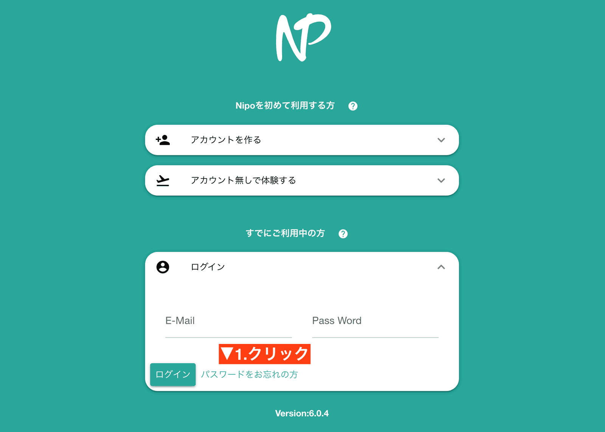

# ログインパスワードを忘れたとき

Nipoは通常、自動ログインが有効になるため普段パスワードの入力をしなくても利用できます。しかし端末の買い替えや、OSのアップデートに伴い、ログイン状況が切れてしまい、  
いざパスワードを入力しようとするとパスワードを忘れてしまうこともよくあります。  

お客様のパスワードは復号出来ない暗号により暗号化して保存しており、Nipoの管理者であっても元のパスワードを知ることはできません。  
そのため、パスワードを忘失したときは登録しているE-mailアドレスを使い、パスワードを再設定してください。

ログイン画面に、「パスワードを忘れた方」というボタンがあります。このボタンをクリックします

E-mailアドレスを入力してください。  
入力したE-mailアドレス宛に、パスワードリセットのメールが届きます。以降は、メールの指示に従って操作してください。

::: danger E-mailを忘れた場合
もしもログイン用のE-mailアドレスを忘れた場合、アカウントを復旧する術はありません。  
受信できないアドレスや、存在しないE-mailアドレスを指定した場合も同様です  
E-mailはNipoにおいて、お客様を識別するための唯一の手段であり、非常に重要なものです。必ず正しく、正常に受信できるE-mailアドレスを利用してください
:::
