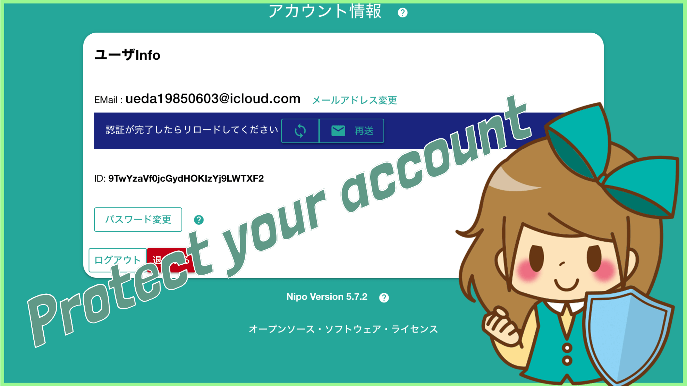
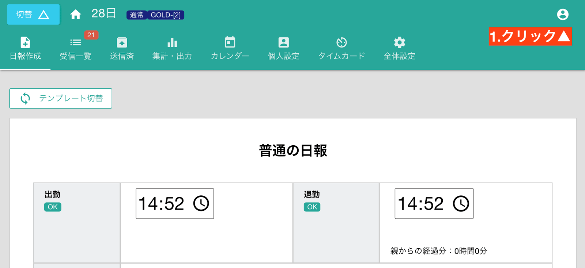
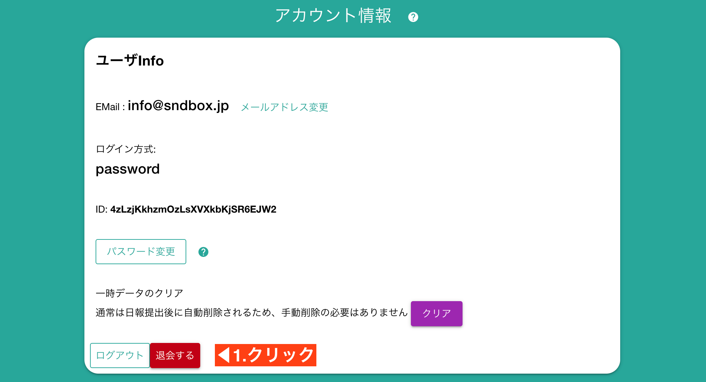
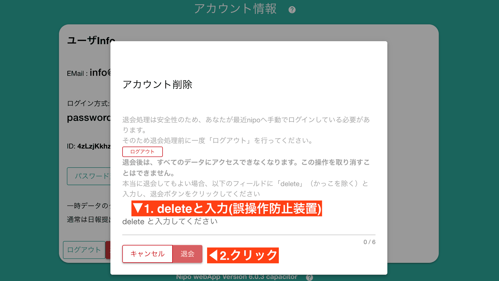

# アカウントを削除する

Nipoを今後利用しないのであれば、アカウントの削除をするべきです。  
あなたのE-mailとパスワードは削除と共に完全に抹消され、セキュリティリスクを軽減させることに役立ちます

アカウントを削除するには、まず画面右上にある「アカウントボタン」をクリックします

「退会する」ボタンをクリックします

## 匿名アカウントの削除
[匿名アカウント](/manual/account/anonymouse)でご利用の場合は、お客様のE-mailやパスワードといった一切の情報を受け取っておりませんので、そのままブラウザを閉じるだけで大丈夫です。