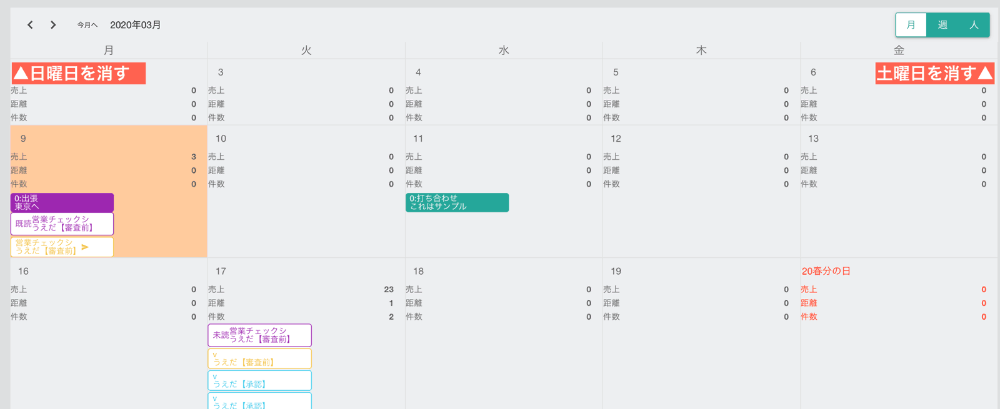

# 共有カレンダー<Badge text="一部GOLD限定" type="warning" />

## カレンダー上売上高を集計表示

カレンダーと聞くと予定の管理が最初に思い浮かぶかもしれません。

もちろん予定の管理としても大変使いやすいカレンダーですが、Nipoではカレンダー上に日々追加されていく売上日報の売上高や訪問件数といった集計可能なデータを抜き出してカレンダー上に表示することができます。

上の図を見ていただくのが最もわかりやすいでしょう。各日で提出された日報の合計金額を表示しています。

もちろん集計の対象となった日報もカレンダー上に表示でき、ここから直接日報を読むことも可能です。

## スタッフを軸においた週カレンダーにワンタッチで切り替え可能

月間カレンダーだけではありません。スタッフ毎に予定や日報を表示できる「スタッフ毎・週カレンダー」もサポートしています。スタッフ毎に売上高を集計することはもちろんのこと、スタッフ毎の予定スケジュール確認もかんたんです。

## 不要な曜日を非表示にして見た目をスッキリできます

会社やお店の定休日が決まっていればその曜日をカレンダー上から非表示に設定できます。例えば上の画像の例では、土曜日と日曜日を非表示にした月間カレンダーの例です。月〜金までしか表示されていないのがわかりますね。

例では「月間カレンダー」ですが、前述の「スタッフ毎・週カレンダー」や通常の週カレンダーでも同様に指定した曜日が非表示になります。

曜日の非表示は「スタッフ単位」に設定できます。

## ドラッグ操作で決まった予定を簡単に登録できます

毎週行われる会議や打ち合わせなど、ルーチンワークとなっている予定を毎回手動で追加するのは面倒です。かと言って自動予定登録だと予定がずれるとき手動で治す手間があります。

自動予定登録よりも使い勝手の良い（かもしれない）クイック予定機能はいかがでしょう？

「打ち合わせ」といった、繰り返し行われる予定を登録しておけば、その予定をカレンダー上にドラッグするだけで簡単に予定が登録できます。自動予定登録と違い、予定が１日、２日ずれ込むことがあっても問題なく予定の登録が可能です。

## カレンダーに登録された予定に対してコメントをする

カレンダーに登録された予定はグループ内のメンバが閲覧できます。カレンダーの予定にたいして何らかのコメントを残すことができるというのも面白い機能ですね。

共有カレンダーだからこそコメント機能などを活用してコミュニケーションの一助となればいいと思います
