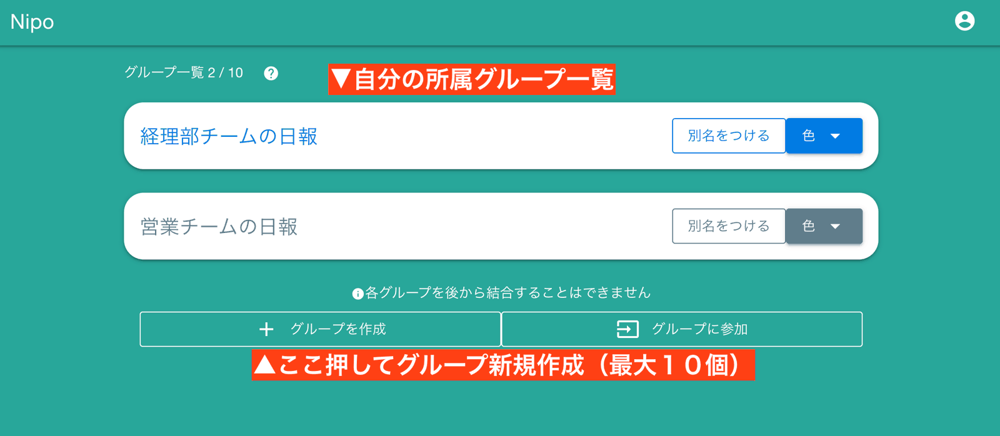
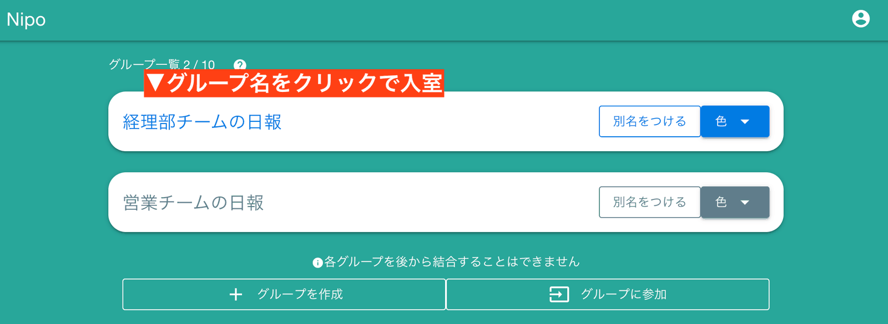
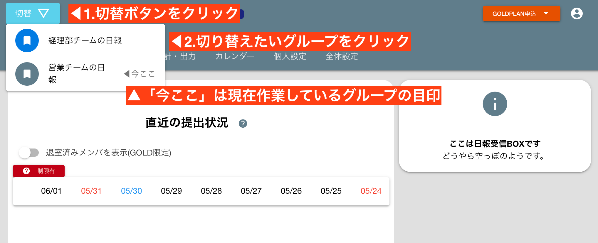
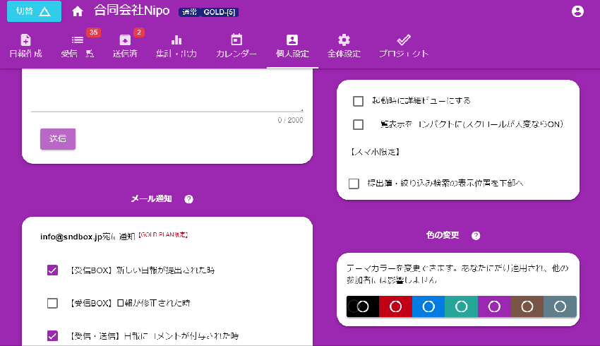

# グループは日報の遣り取りをする部屋のことです

グループは誰でも作成できます。作成した人がそのグループの最高責任者（Admin）になります。  
Nipoでは日報や、チェックシートの提出をこの「グループ」の中で行います。

## グループを作成する

グループの作成は簡単です。「グループを作成」ボタンをクリックして、グループの名前を入力するだけです。
名前はお好みでOKですが、わかりやすい名称がいいでしょう。例えば会社名や部署名がおすすめです

グループを作成すると、グループ一覧に１つのグループが追加されます。あなたが作ったので、あなたがそのグループの**管理者**です。
規模や用途に応じてグループを作成できます。20名以下であれば１つのグループで十分ですが、明確に目的が分かれる場合は、
グループをあえて分けてもいいでしょう。

## グループは独立した自治権をもった1つの組織です
Nipoで言う「グループ」はとても柔軟です。各グループにはNipoアカウントを持つ誰でも招待可能です。  
例えば社外の人とグループを作ったり、プロジェクトごとにグループを作ったり、社内の部署単位でグループを作ったり・・・自由に好きな人をグループに招待できます。
そしてグループは独立自治権が認められます。つまりそのグループの管理者がそのグループを統治するという、地方自治と同じ考えです。  
現場を知らない管理者にちょっかい出されることなく、必要な人だけで日報のやり取りができます。  
必要なテンプレートだって自前でカスタマイズできるんです。ざっと以下の項目は各グループで独自のものが使えます

- 日報やチェックシートのテンプレート
- 参加するメンバー
- 共有カレンダー

## グループに入室する
作成したグループに入室するには、入室したいグループ名をクリックしてください。  
(※右の方にある「別名をつける」といったボタンを押すと別の挙動になるので注意してください。詳しくは後述)

初めて入室すると簡単な初期設定が始まります。質問は２つくらいなので、気軽に設定してください。
ここで設定した内容はあとからいつでも変更可能です

## グループを切り替える
現在のグループから他のグループへ切り替えるには、画面左上の「切替」ボタンを使います。

## グループのカラーテーマを変更
複数のグループを使い分けると操作ミスが起こる可能性もあるので、グループごとに色分けできます。  
この色分けは**個人単位**で適用される点に注意してください。スタッフAさんとスタッフBさんでは同じグループでも違う色を指定できます
詳しくは「グループの個人設定」を御覧ください

