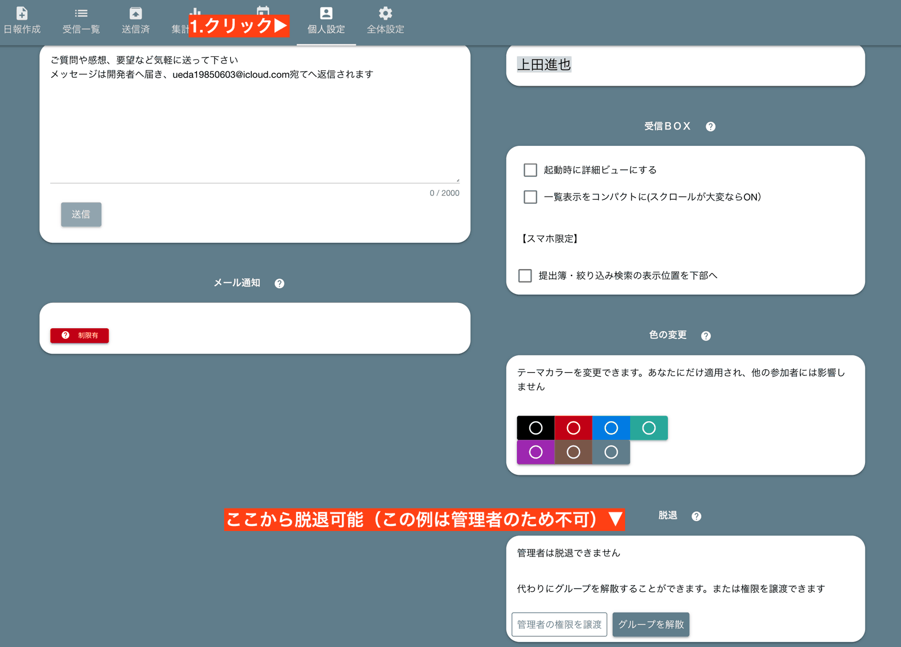

# グループは日報の遣り取りをする部屋のことです

グループは誰でも作成できます。作成した人がそのグループの最高責任者（Admin）になります。  
Nipoでは日報や、チェックシートの提出をこの「グループ」の中で行います。

## グループを作成する

グループの作成は簡単です。「グループを作成」ボタンをクリックして、グループの名前を入力するだけです。
名前はお好みでOKですが、わかりやすい名称がいいでしょう。例えば会社名や部署名がおすすめです

グループを作成すると、グループ一覧に１つのグループが追加されます。あなたが作ったので、あなたがそのグループの**管理者**です。
規模や用途に応じてグループを作成できます。20名以下であれば１つのグループで十分ですが、明確に目的が分かれる場合は、
グループをあえて分けてもいいでしょう。

## グループは独立した自治権をもった1つの組織です
Nipoで言う「グループ」はとても柔軟です。各グループにはNipoアカウントを持つ誰でも招待可能です。  
例えば社外の人とグループを作ったり、プロジェクトごとにグループを作ったり、社内の部署単位でグループを作ったり・・・自由に好きな人をグループに招待できます。
そしてグループは独立自治権が認められます。つまりそのグループの管理者がそのグループを統治するという、地方自治と同じ考えです。  
現場を知らない管理者にちょっかい出されることなく、必要な人だけで日報のやり取りができます。  
必要なテンプレートだって自前でカスタマイズできるんです。ざっと以下の項目は各グループで独自のものが使えます

- 日報やチェックシートのテンプレート
- 参加するメンバー
- 共有カレンダー

## グループに入室する
作成したグループに入室するには、入室したいグループ名をクリックしてください。  
(※右の方にある「別名をつける」といったボタンを押すと別の挙動になるので注意してください。詳しくは後述)

初めて入室すると簡単な初期設定が始まります。質問は２つくらいなので、気軽に設定してください。
ここで設定した内容はあとからいつでも変更可能です

## グループを切り替える
現在のグループから他のグループへ切り替えるには、画面左上の「切替」ボタンを使います。

## グループのカラーテーマを変更
複数のグループを使い分けると操作ミスが起こる可能性もあるので、グループごとに色分けできます。  
この色分けは**個人単位**で適用される点に注意してください。スタッフAさんとスタッフBさんでは同じグループでも違う色を指定できます
詳しくは「グループの個人設定」を御覧ください

## グループから脱退する
退職や転勤でグループから脱退する場合は、個人設定から脱退をすることができます。  
管理者は脱退することができませんので、もし管理者が脱退する場合は先に管理者権限を他のスタッフへ移管してください

## グループを解散する（グループの削除）
削除したいグループで次の操作を行います
1. 全体設定をクリック
2. グループ管理をクリック（モバイルアプリでは表示されないため、スクロールして見つけます）
3. グループ解散の中に「drop」と入力（誤操作防止装置です）
4. 解散をクリック

グループを削除することで、日報、テンプレート、カレンダーの予定、タイムカード情報など、グループ内の全てのデータが削除されます。  
特にNipoはクラウドシステムのため、使わなくなったグループは解散して確実にデータを消去したほうがセキュリティリスクを減らすことができます
削除すればたとえアカウントが乗っ取られたとしても、重要なデータを盗まれる心配もありません
::: tip
実際にデータが削除されるのは数日〜１ヶ月程度かかります。一定周期で削除されるため削除される時期は明確にはわかりません
:::

### グループを削除できないとき
グループに管理者以外のスタッフがまだ残っていると削除することができません

この場合は先に[スタッフを追放](/manual/group/rmstaff)してください。

