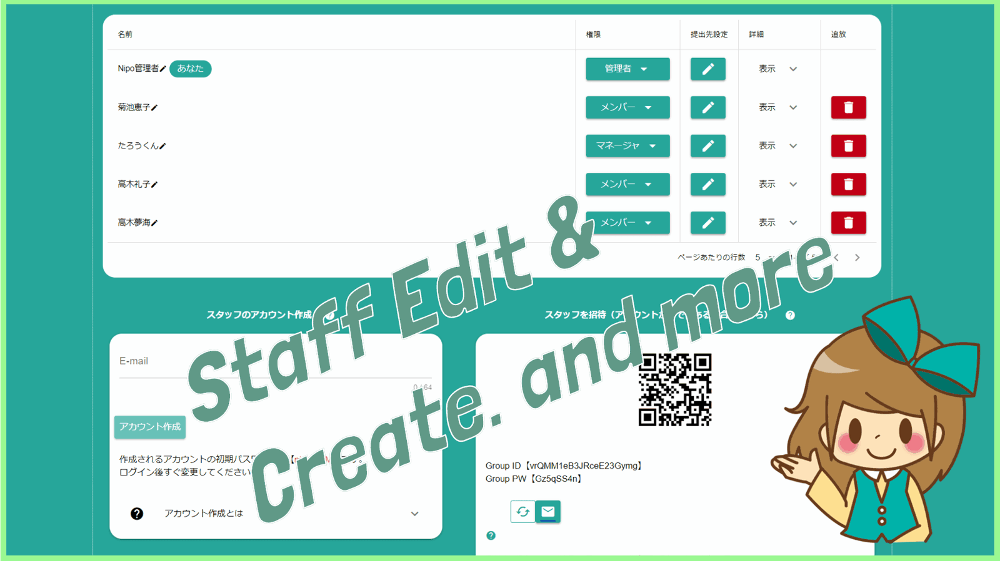
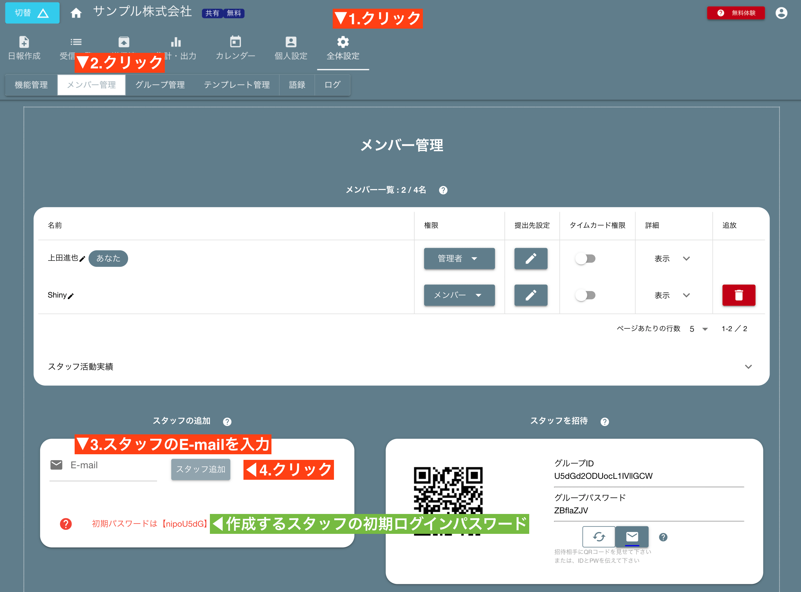
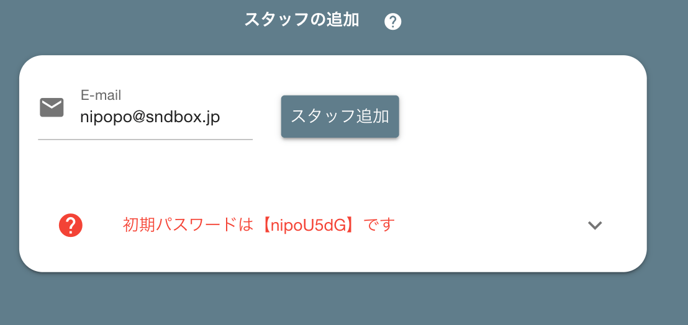

# スタッフを追加する<Badge text="管理者向け" />
  

Nipoでは1ユーザ1アカウントのため、スタッフの追加は**Nipoのアカウント作成**と同じ意味を持ちます。  
追加するには、「全体設定」を開き、「メンバー管理」までスクロールしましょう。

## スタッフのアカウントとログイン方法
例えば次のような値でスタッフを追加したとします

「アカウントが作成されました」と表示されればアカウントの作成に成功です。  
このアカウントでログインするには次の情報をログイン画面で入力します  

**E-mail** : nipopo@sndbox.jp
**password** : nipoU5dG

利用するスタッフに上記ログインの情報と、NipoのURL(https://nipoapp.sndbox.jp)を伝えてください。
スマートフォンやタブレットから利用を想定する場合は、専用アプリをご案内してください

::: warning
作成直後の初期パスワードは、グループごとにランダムで共通のパスワードとなります。安全性のためにも、パスワードを変更することを推奨します。
:::

### アカウントの所有
作成したアカウントは独立した１つのアカウントです。  
利用するスタッフの裁量でログインパスワードの変更や、ログインメールアドレスの変更をすることが可能です。  
会社組織としてアカウントをコントロールしたい場合、スタッフのアカウントは**会社で管理可能なE-mailアドレスで作成**してください。  
E-mailはセキュリティ上厳格に管理されており、スタッフがパスワードを忘れた際のパスワードリセットに利用したり、
勝手にログインメールアドレスを変更されてもアカウント作成時のE-mailアドレスへ強制的に戻すことが可能です。
万が一スタッフが退職した際、そのアカウントのログインパスワードが分からなくてもE-mailさえ受信できればリセットできます
