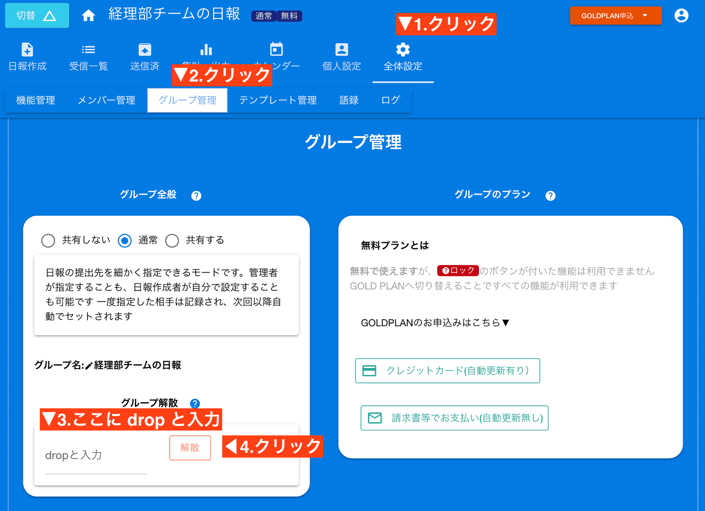
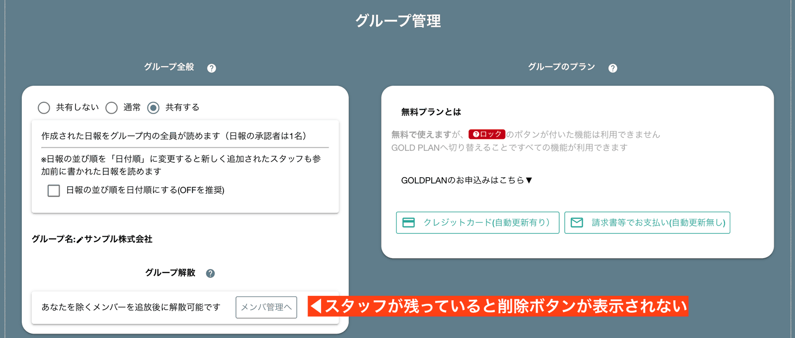

# グループを解散する（グループの削除）<Badge text="管理者向け" />
削除したいグループで次の操作を行います
1. 全体設定をクリック
2. グループ管理をクリック（モバイルアプリでは表示されないため、スクロールして見つけます）
3. グループ解散の中に「drop」と入力（誤操作防止装置です）
4. 解散をクリック

グループを削除することで、日報、テンプレート、カレンダーの予定、タイムカード情報など、グループ内の全てのデータが削除されます。  
特にNipoはクラウドシステムのため、使わなくなったグループは解散して確実にデータを消去したほうがセキュリティリスクを減らすことができます
削除すればたとえアカウントが乗っ取られたとしても、重要なデータを盗まれる心配もありません
::: tip
実際にデータが削除されるのは数日〜１ヶ月程度かかります。一定周期で削除されるため削除される時期は明確にはわかりません
:::

## グループを削除できないとき
グループに管理者以外のスタッフがまだ残っていると削除することができません

この場合は先に[スタッフを追放](/manual/group/rmstaff)してください。
