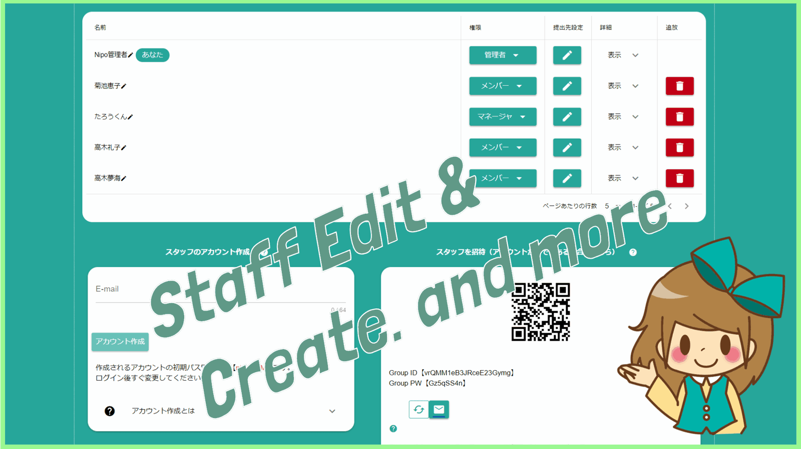

# スタッフの設定をする<Badge text="管理者・マネージャ" type="warning" />

各スタッフごとに名前や各種権限の設定ができます。なお設定変更できる人は「管理者」と「マネージャ」だけです。

## スタッフの権限を変更する
誰でも自由に設定されては困るので、権限の設定でデキる人とできない人を分ける必要があります。権限は「管理者」「マネージャ」「メンバー」の3種類で、下図から確認できます。

### 管理者 – 一番偉いひと –
グループの管理ができる人です。管理者は1グループに1名までです。最初にグループを作った人が管理者になりますが、必要に応じて管理者の権限を他のスタッフに譲ることもできます。他のスタッフに権限を譲ると自分自身の権限が後述する「マネージャー」に降格します。

### マネージャ – 次に偉い人 –
マネージャは管理者とほぼ同じ権限ですが、細かいところで若干の違いがあります。具体的には次のような違いがあります。

- 管理者は1名しか設定できませんがマネージャは複数人なることができます
- 管理者がマネージャをメンバーに降格したり追放したりできますが、その逆はできません
- マネージャは追放することができますが、管理者を追放することはできません
- マネージャはグループを解散できませんが、管理者はグループを解散できます
- 【グループモードが「共有しない」限定】管理者が提出先に指定され、マネージャは共有先に指定されます

違いを並べてみましたが日常業務でこれらの違いを意識する必要性はありません。基本的に管理者とマネージャは管理する側という位置づけです。

### メンバー – 普通の人 –
メンバーは管理権限がありません。グループに関する全体的な設定や、日報テンプレートの編集などはできません。

## スタッフの日報提出先情報を指定
「提出先設定」をクリックし、各スタッフが誰に日報を提出するか指定することができます。

各日報のテンプレートごとに指定可能です。例えば日報はAさん宛に、トラブル報告書はBさん宛という具合に指定可能です。

また、日報作成時に日報作成者が自由に提出先を変更できるのですが、それを許可したくない場合は「日報作成時に提出先、共有先をロックする」にチェックを入れて下さい。
提出先、共有先はグループモードによっても影響を受けます。
::: tip 共有しないモード
**共有しないモード**の場合は、提出先・共有先の設定が一切無視され、すべての日報は管理者宛になります。
:::
::: tip 共有するモード
**共有するモード**の場合は、提出先のみ設定可能です。共有先の設定は無視され、日報作成時に全てのスタッフが共有先に含まれることになります
:::

::: tip 通常モード
**通常モード**の場合は、すべての設定が有効に機能します
:::

## スタッフにタイムカード管理権限を設定する

タイムカードについて詳しくは「タイムカード機能」を御覧ください。ここでは簡単に説明します。タイムカード管理の権限が付与されると、

- 他人のタイムカードを参照できる
- タイムカードを削除できる
- タイムカードの丸めや超過労働時間の設定ができる
といったことができます。

## スタッフの名前を変更する

管理者の権限があればメンバーの名前を変更できます。変更したいメンバの名前をクリックし、名前を入力して下さい
::: tip
管理者のほか、自分の名前は各自で設定もできます
:::

## スタッフの活動実績を把握する<Badge text="一部GOLDPLAN限定" type="warning" />
スタッフが月に何枚、日報を書いたのか？月に何件、コメントを残したのか？といった、スタッフ毎の活動実績を把握できます。スタッフの活動量を把握する一つの目安になります。

各項目については次のとおりです

- 日報提出回数
  - 集計している月の日報提出回数です。下書きは含みません。提出した日報を削除してもカウントは減りません。そのため正確な値ではなく、一つの目安となります
- タイムカード
  - 日報を通じてタイムカードを打刻した回数と、打刻漏れによる手動打刻の回数を表します。こちらもタイムカードを削除したとしても、カウントは減りません。一つの目安としてご利用ください
- 既読
  - 日報を既読にした回数です。日報を共有する会社であれば、きちんと既読されるかは大きな関心があると思います。
- コメント
  - 日報に対して書いたコメントの回数です。投稿したコメントを削除しても、カウントは減りません。「コメントを書く」という実績が集計されるのであり、実際のコメント件数を反映するものではありません。
- 承認と棄却
  - 日報を「承認」した回数です。他の項目同様、棄却に変更しても「承認」のカウントは減りません。
  「承認」▶「棄却」▶「承認」と操作した場合、「承認」が2、「棄却」が1とカウントされます。

それぞれの集計は、活動した日を基準に集計されます。先月の日報に対してコメントを付けたとしても、「コメントを書く」行為が今月に行われているならばコメントの集計は「今月に＋１」されます。

活動実績は無料プランの場合、「当月分」のみ読むことができます。月の切替にはGOLDPLANへの加入が必要です。

## ユーザを特定するUIDについて<Badge text="補足" type="warning" />
参加しているユーザには、固有のUIDが割り当てられます。UIDとは【hYIgZRB9mxtTQ9JeJNfWJSqXQAQ2】のような非常に長い文字と数字の組み合わせで表示されます。
このUIDはNipoのアカウント作成時に自動で割り当てられ、書換不可能な情報です。値はユニーク(一意：絶対に重複しない値である）です。この特性からユーザを特定するのに最も確実で信用できる情報となり、ログデータなどはUIDで表示されます。

※同じくユニークな情報にE-mailがありますがE-mailはユーザの手で変更することができてしまいます