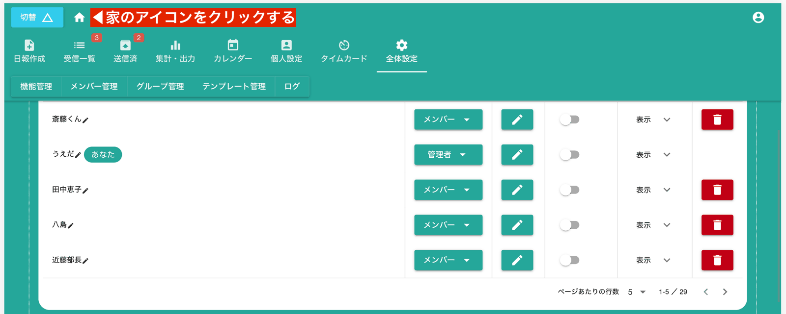

# 既に存在するアカウントをグループに招待(誤って追放した場合もこちら)
Nipoにまだ登録されていないE-mailであれば「アカウントの作成」でいいのですが、すでに登録済みのE-mailを利用しようとするとエラーが発生します。

とくに誤ってスタッフを追放してしまい、新たに同じE-mailでスタッフを追加しようとするときに多く発生します（この件でお問い合わせもよくありました）
このような場合では、すぐ右側（スマホでは下側）にある**QRコード**を相手に見せてください。  
相手が遠方にいる場合は、グループID(この例ではHn5zqyR19zV5YfKYaWeUという文字列)とグループパスワード(同：yFd4R9yw)を相手に伝えてください。  
E-mailでもSlackでもお好みの方法で大丈夫です

## 招待を受ける側の操作
QRコードまたはグループIDとパスワードを受け取った人は、次の手順で操作します  
まず家のアイコンをクリックし、グループ一覧画面へ移動します

次いで、画面一番下にある「グループに参加」ボタンをクリックします

最後に、QR読み取りボタンをクリックし、提示されたQRコードをスキャンします。  
カメラなしの端末や、QRコードを受け取っていない場合はグループIDとパスワードをそれぞれ入力してください

::: danger
グループのIDとPWが分かると誰でもグループに参加できます。第三者にIDとPWを知られないように注意し、PWは定期的に変更してください。  

:::
