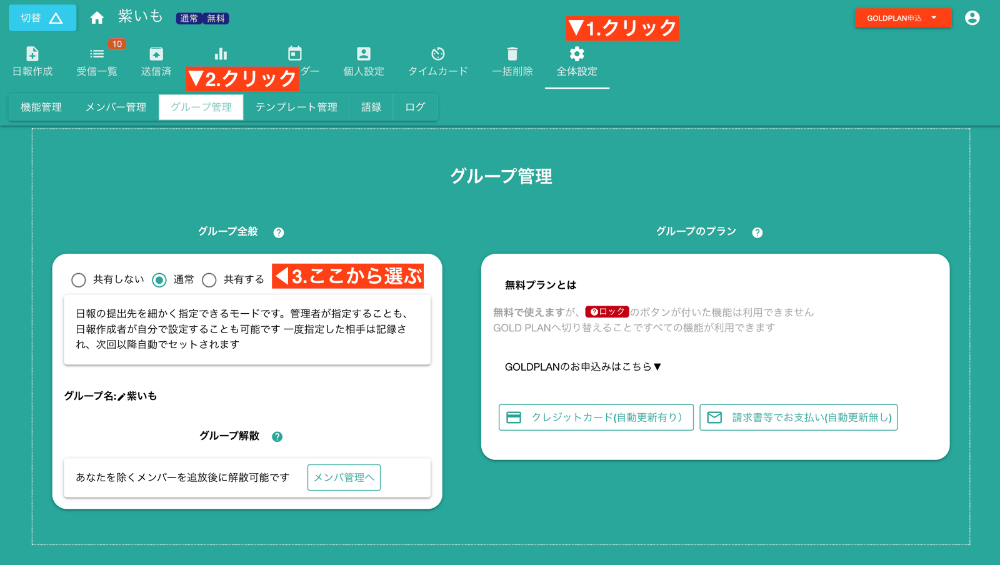
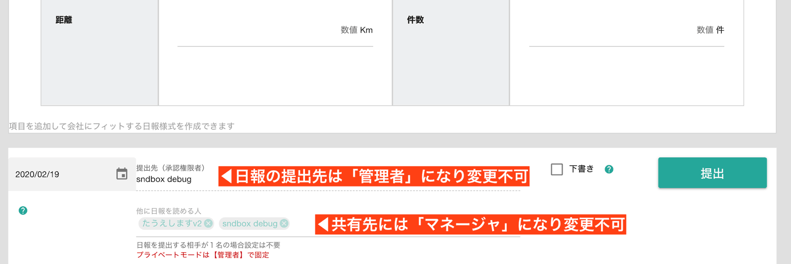
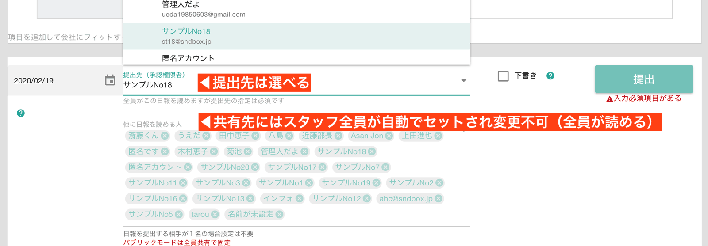
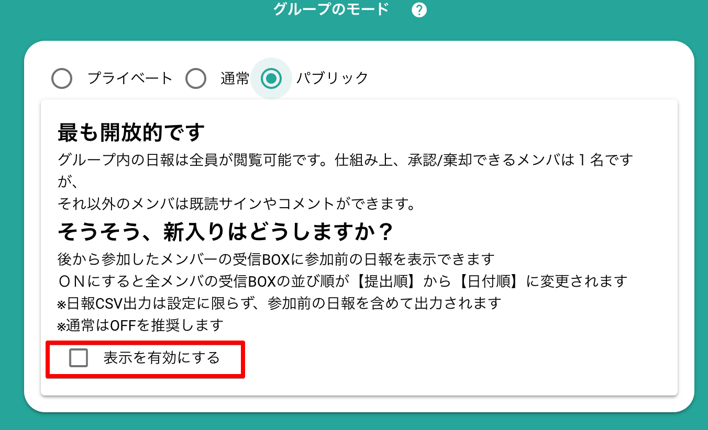
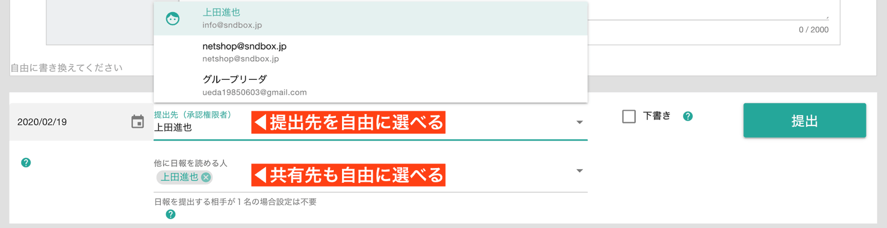

# グループのモードについて<Badge text="管理者向け" />

グループのモードとは、大まかに日報の共有範囲を決めるためのものです。  
モードは以下の３種類があります

- 共有する
- 共有しない
- 通常

この３種類は大まかな設定です。更に細かく提出先や共有先のルールを定めたい場合は、スタッフ個別に指定することも出来ます。  
詳しくは[スタッフの提出先を指定](/manual/group/editstaff.html#dist)を御覧ください。  
なお、細かく指定する場合は**グループのモードを通常にする**ことをおすすめします

## グループのモードー「共有しない」について  
スタッフが日報を作成する際、**提出先に「管理者」、共有先に「マネージャ」**が自動でセットされます。日報作成者はこの提出先と共有先を変更できません

<Alice label="部下の報告を上司１名で受け取るならこれがおすすめかな？" />

## グループのモード「日報を共有する」について
提出先は１名ですが、共有先に全スタッフの名前が自動で登録されます。つまり全員が全員の日報を読める状態になります（承認できる人は１名だけです）

::: tip 新規に参加したメンバーは参加前の日報を読めるのでしょうか？
共有モードは全員共有が前提ですが、参加前に書かれた日報は原則として読めません。  
Nipoは**共有先に指定された人だけが読める**というルールで成り立っているためです。書いた時点でまだ居ないスタッフは、当然共有先に名前がありません。    

ただし「表示を有効にする」のチェックをONにすれば読めるようになります。これは全員がほんとうの意味ですべての日報を読めるようになります。  
しかし日報の並び順が「提出順」から「日付順」に変わることに留意して下さい

:::

## グループのモード「通常」について
日報やチェックシートを作成する都度、誰が読めるのかを個別に指定できるモードで、最も柔軟性があります。  
提出先や共有先は一度設定すれば２回目以降は自動で前回と同じメンバーがセットされるため、手間もかかりません。

::: tip 管理者の指定が優先されます
管理者が個別に提出先や共有先を指定することもできます。この際は管理者が指定した設定が優先されます。
詳しくは[スタッフの提出先を指定](/manual/group/editstaff.html#dist)を御覧ください。  

:::