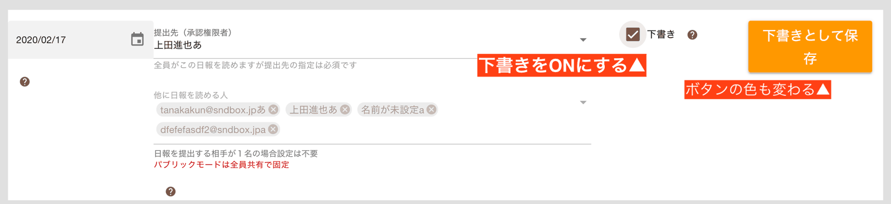
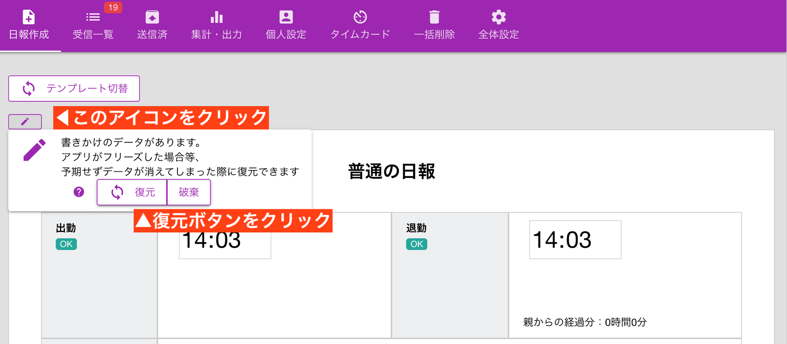

# 日報の下書きと自動保存<Badge text="応用編" />

## 日報の下書きについて

下書き機能を使えば、日報を途中まで書いて作業をやめることができます。「下書き」にチェックを入れ、「下書きとして保存」ボタンをクリックしてください。
下書きの状態では、誰も読むことができません。後で忘れずに日報の修正を行い、下書きから本番用へ書き直します。下書きした日報は「送信済」に保存されるため、「送信済」から編集して下書きから清書へかきあげます
くわしくは[日報の修正](/manual/report/edit)を御覧ください

## 日報のオートセーブ機能
日報を書くと、書きかけの情報が全てローカルストレージ（ブラウザ上の保存領域）に自動で保存されます。これを「オートセーブ機能」といいます。  
万が一、日報の作成中にアプリがフリーズしたり、不具合で日報の提出に失敗したときにも入力中のデータは失われず、続きから日報作成が可能です。

オートセーブされたデータは、日報が提出されたタイミングで自動削除されます。

また、オートセーブは各テンプレート単位で行われます。例えば「A報告書」を書いている途中で、「B報告書」に切り替えたとき、「A報告書」も「B報告書」もオートセーブされます。「B報告書」を書き終えたあとで「A報告書」に切り替えれば、続きから入力が可能です。

::: tip 下書きとの違い？
後述する「下書き」と似ていますが、下書きは「Webサーバ上に実際に保存する」のに対して、オートセーブは「端末の中に保存する」という違いがあります。用途としてもやはり異なり、オートセーブは一種の「安全措置」であり、下書きとは本質的に異なります。
:::