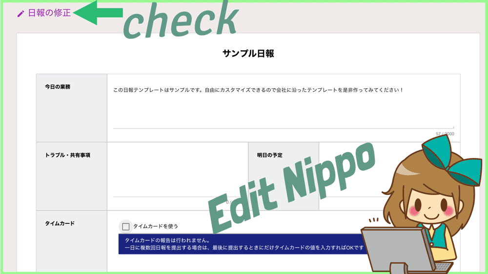
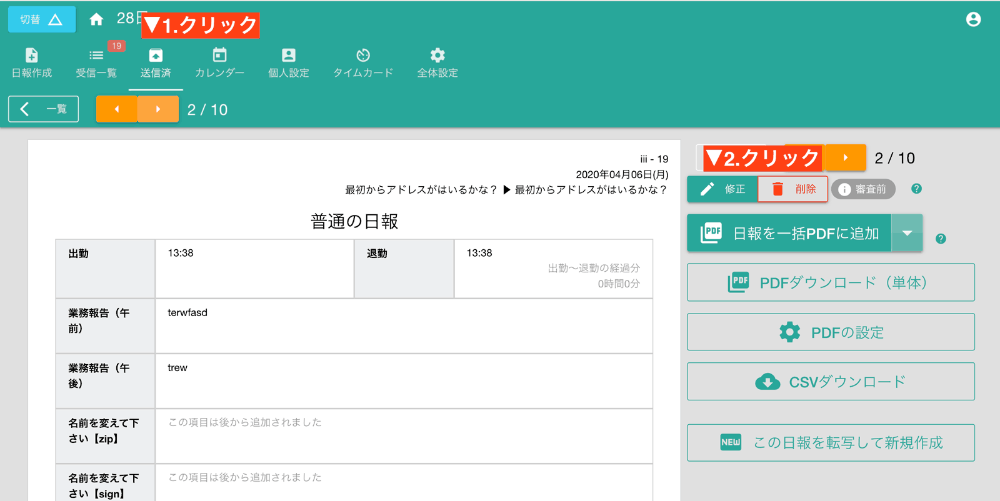
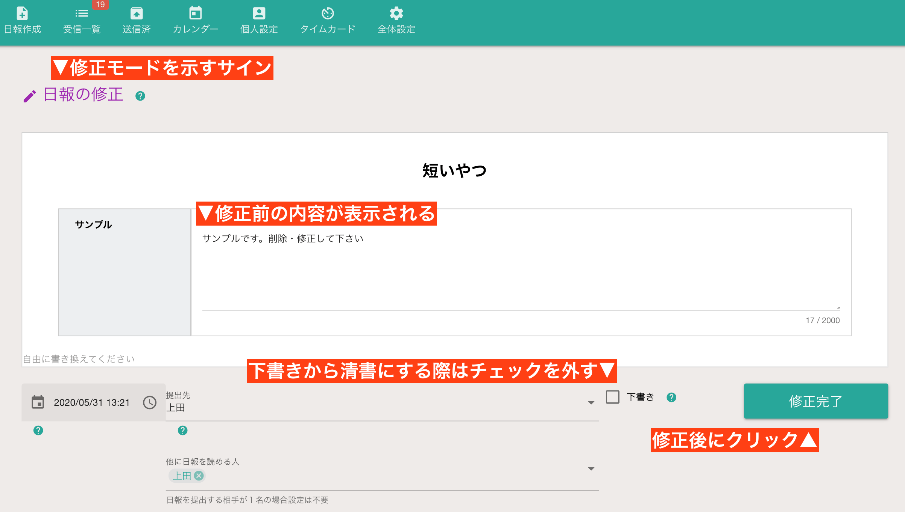
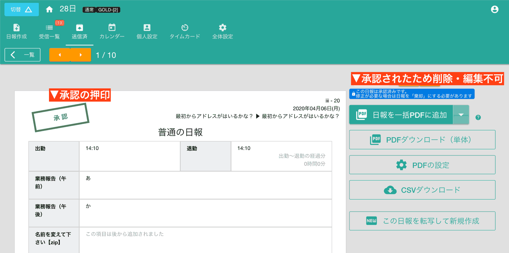
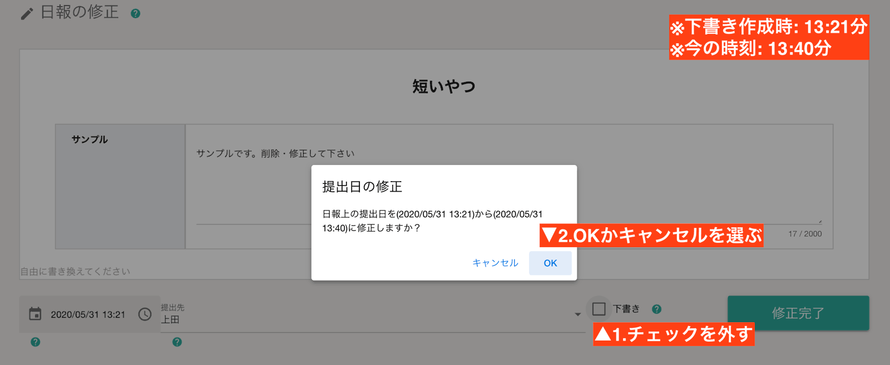
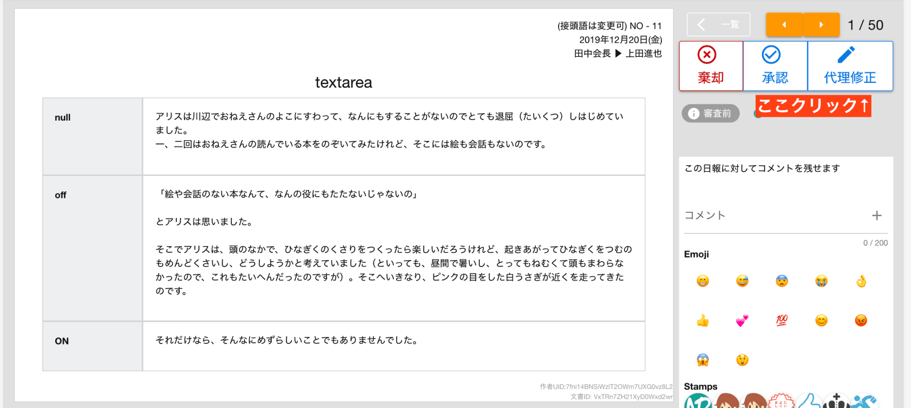
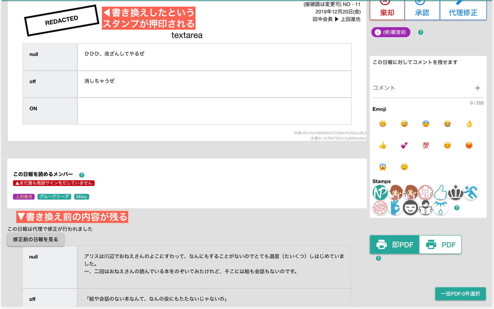

# 日報・チェックシートの内容を修正

日報が棄却されたときや、下書きのままになっている日報を正書するとき、日報の修正機能を使います。  
下書きの修正は別途、専用の章を設けて解説していますのでそちらをご覧ください  
修正したい日報を開いて、「修正」ボタンをクリックすると、下図の画面に切り替わります

## 日報の修正画面について

画面の見た目は、日報・チェックシートの[新規作成画面](/report/write)とほとんど同じです。使い方もほとんど同じですが、少しだけ相違点があります。  
::: tip
例えば画面上に「日報の修正」と表示されている点もその１つです。
:::

修正では、すでに書かれた内容がコピーされています。文書などの場合はキーボードから入力して直しますが、
手描きのイラストが含まれている場合はその画像をそのまま再利用するか、再び書き直すか選びます。
::: warning
前の手描きイラストに追記はできません
:::

誤っている箇所を手早く修正して、再提出してしまいましょう。内容を書き換えて「修正完了」ボタンをクリックします。修正することで次のような変化が起きます
- 日報・チェックシートのステータスが「審査前」に戻ります。提出先のメンバーは再び「承認・棄却」を行って下さい
- 既読していたメンバーが全員「未読」に戻ります。共有先のメンバーは再び「既読」を行ってください
- メール通知を有効にしている場合、当該日報に関係のあるメンバーに対してメール通知が行われます
- 修正された日報・チェックシートが受信BOXの先頭に表示されます

### 日報が修正できない場合
すでに承認された日報やチェックシートは修正・削除できません。

どうしても削除が必要な場合は、提出先のスタッフに連絡して当該日報を一度「棄却」にしてもらう必要があります

## 下書きを清書にする
日報の修正機能は、「棄却されて修正する場合」も「下書きの日報を清書にする場合」も同じ手順で操作します。  
下書きから清書にする場合には、「下書き」のチェックを外し忘れないように注意してください。チェックを入れたままだと下書きのままになります。

::: tip 下書きから清書へ切り替えるとき
下書きの日報は、下書き保存されたときの時間を記録しています。下書き保存したときのままで提出することも可能ですし、今現在の時刻へ修正することも可能です。

:::

::: warning
システム上、下書きした日報は「修正版」として提出先に届きます。
:::

## 自分宛てに届いた日報を代理で修正
自分宛てに届いた（提出先として指定）日報を、日報作成者に変わって代理で修正することができます。  
代理修正は他人の日報を書き換えるという性質上、トラブルになりかねません。そのため代理修正を行うと修正の履歴が残ります。

### 日報を代理修正する手順
受信日報画面にある、「代理修正」ボタンをクリックします。なおこのボタンが表示されるのは、
「自分が提出先に指定されている」かつ「自分が書いた日報ではない」場合に限られます

::: warning
代理修正では「提出先」の変更や、下書きへの変更など一部の操作はロックされます。書き換えできるのは日報の本文だけです。
:::

### 代理修正した日報
実際に書き換えた結果は次のようになります

本来は軽微な誤字、脱字をいちいち棄却せずにその場ですぐに治せる便利機能としてリクエストを頂きました。  
しかし他人所有の日報を書き換えることはトラブルにも直結しやすく、また承認権者の権限が強くなりすぎるため、履歴とスタンプで日報作成者の権利を守るためにこのような対応となりました。

### 代理編集▶自己編集で編集履歴がクリアされます
もし編集履歴をクリアしたい場合は、日報の作成者自身が履歴のある日報を修正してください。
修正者＝日報のオーナー　の場合は改ざん防止のための履歴が不要になるため、これまでの編集履歴もさかのぼって削除されます。

 

