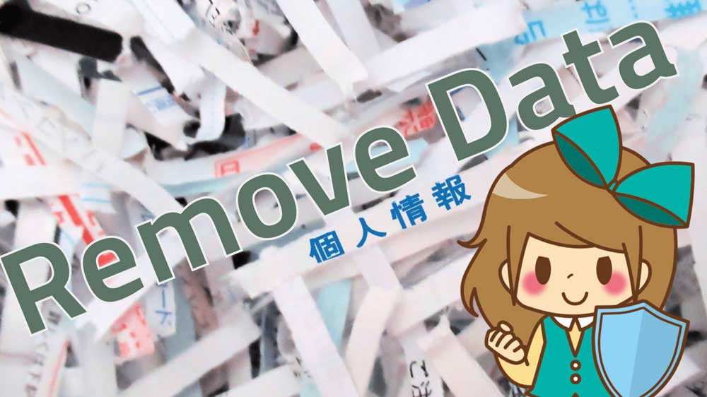

# 日報を削除する

会社の業務で作成する日報や、業務チェックシートは蓄積していくものです。そのため削除することは、あまりありませんが、例えば誤って２通作ってしまった場合など、本当に不要なら削除しましょう。
::: warning
日報やチェックシートを削除できるのは作成したオーナー本人と、グループの管理者だけです
:::

## 自分の書いた日報を削除する
削除の手順は次のとおりです
- 送信BOXをクリック
- 削除したい日報を開く
- 削除ボタンをクリック

### 日報が削除できない場合
すでに承認された日報やチェックシートは修正・削除できません。

どうしても削除が必要な場合は、提出先のスタッフに連絡して当該日報を一度「棄却」にしてもらう必要があります

## 日報を削除する事による影響範囲
データをNipoのサーバ上から削除することにより、いくつかの影響を受ける機能があります。
具体的には次のとおりです
- 集計機能の結果が変わります
- 削除した日報は受信BOX/送信BOXから見れなくなります

特に「集計」は合計値だけでなく、ランキング表示の順位なども変動する可能性があります

:::tip 
タイムカードには影響しません
:::