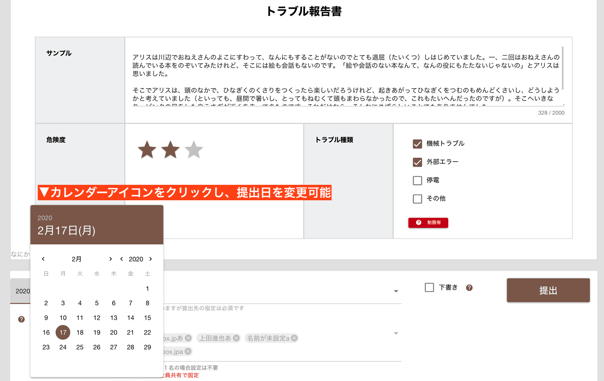

# 日報やチェックシートを書いて提出する<Badge text="一般向け" type="info" />

初めてNipoで日報を書いてみましょう。手書きやWordで作る日報よりもずっと簡単です。大まかな流れとしては
- 使用するテンプレートの選択
- テンプレートに従って日報を書く
- 提出先を選んで「提出」をクリック
の３ステップです

## 使用するテンプレートを選ぶ

**日報作成**をクリックすると、使用するテンプレートの選択画面に変わります。

ここで使用するテンプレートを選びます。

::: tip
- テンプレートが1種類しか無い場合は自動でテンプレートが選ばれます
- テンプレートが１つも無い場合は、エラー画面が表示され[テンプレート作成](/manual/template/_make)を促されます
:::

## テンプレートに沿って日報を書きましょう
使用するテンプレートをクリックすると、入力画面が表示されます。

今回はサンプルということで非常にシンプルなテンプレートを用意してみました。各フィールドを埋めていきましょう。

<h2 id="dist">提出先と共有先を選んで「提出」します</h2>

日報を読んでほしい相手を指定します。管理者が予め提出先を指定している場合もありますので、その際はこのステップはスキップし、「提出」ボタンを押して終わりです。

### 提出先と共有先の違い<Badge text="ワンポイント" />
提出先と共有先は似ていますが意味が異なります
::: tip 提出先＝承認権限者
１名のみ指定できます。その日報を承認・棄却できる人になります。  
メールで言うところの「宛先」になります。
:::

::: tip 共有先=日報を読める人
複数名指定できます。その日報を読むことができる人になります。
メールで言うところの「CC」になります。  
社内全員で日報を共有するといった場合は、全員の名前を共有先に含めます
:::

なお、提出先と共有先の情報は、テンプレートごとに自動で保存されるため、2回目以降は手動で選択する必要はありません。

### 提出先と共有先が指定できないケース
グループの管理者側で「提出先」や「共有先」をロックすることができます。もし提出先・共有先が変更できない場合はグループの管理者にお問い合わせください。  
グループ管理者側では、[スタッフの管理](/manual/group/editstaff)と[グループのモード設定](/manual/group/group)ご参照ください

<h2 id="date">日報の提出日時を変更する</h2>
さてここから先は少し応用編になります。

デフォルトでは本日となっている提出日を変更できます。未来の日付を指定しても、提出した瞬間に相手に届くので勘違いなさらないように。
ここで変更した日付は[日報の受信画面](/manual/res/res)で日報の右上にが表示されるものです。
受信できる相手は誰でしたっけ？はい、そうですね。「提出先」と「共有先」が受信できます

::: warning 受信ボックスにはどういう順に並びますか？
日報の日付を修正して提出すると、受け取る側はどのようにみえるのでしょうか？正解は「提出された順」に並びます。提出日は関係ありません。図を見てください。16日の日報よりも13日の日報が上に来ているのがわかります。13日の日報のほうがあとから作成されたためです

ただし、例外もあり、「グループモードがパブリック」で、なおかつ「新入りにも過去の日報を表示させる」が有効になっていると、受信ボックスの並び順が「日報に指定された提出日順」に変わります。
提出日が前後しがちな職場や、メンバーが多いグループでは、うっかりすると日報が埋もれてしまって、見落としてしまうかもしれません。そのため、通常は「新入りにも過去の日報を表示させる」モードをOFFにすることを推奨します
:::

## プロジェクトの指定について<Badge text="準備中" />
プロジェクト機能については現在試験運用中です