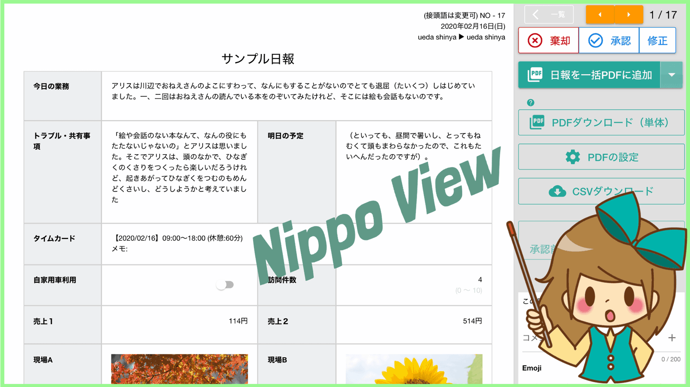
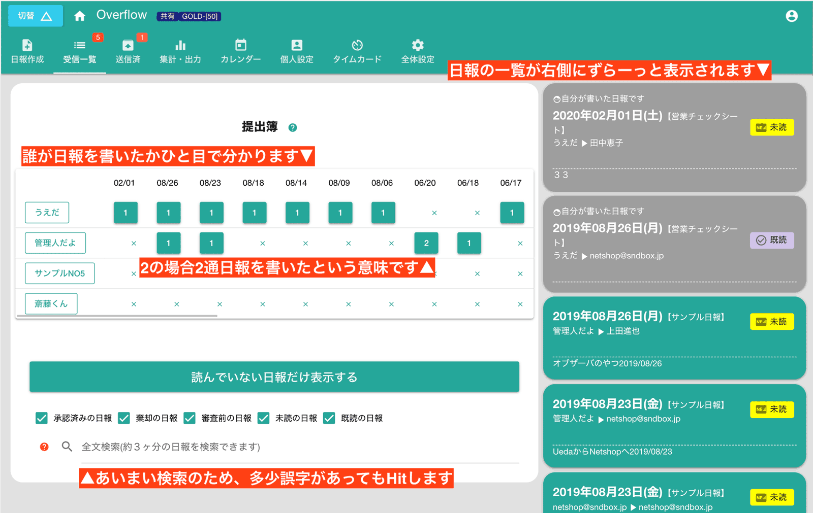
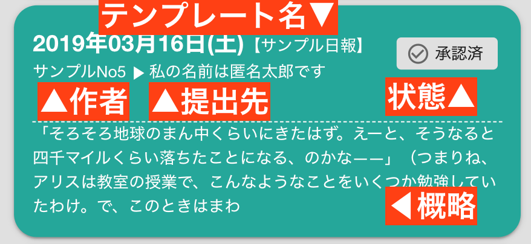
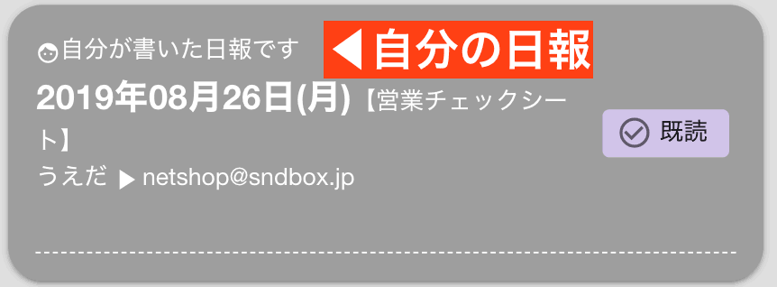
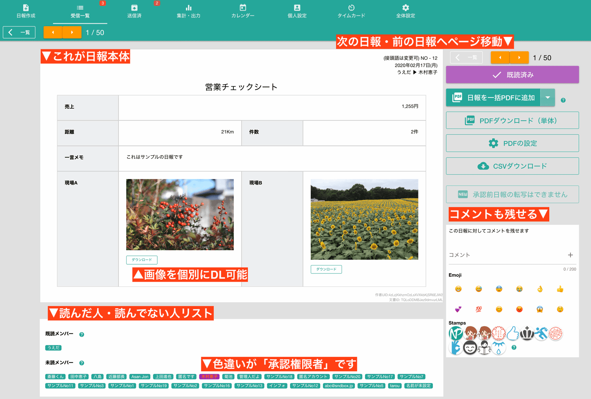

# 日報を受信する

スタッフが作成した日報の内、あなたが読める日報だけがこの「受信ボックス」に表示されます。受信ボックスは
- 一覧表示
- 詳細表示
の２種類の表示形式があります。

::: tip 【一覧表示】
日報を一覧で表示するモードです。日付や提出者など大まかな情報を把握できます
:::
::: tip 【詳細表示】
1件の日報を全画面で表示するモードです。多くの機能は詳細表示で利用できます
:::
個人設定で一覧表示か詳細表示のいずれか１つを初期画面として固定することができます

::: warning あなたが読める日報とは？
受信ボックスではあなたが読める日報だけ表示されます。読める日報とは、次のとおりです
- 日報の提出先にあなたが指定されている場合
- 日報の共有先にあなたが指定されている場合
詳しくは[日報作成](//manual/report/write)を御覧ください
:::

## 一覧表示
一覧表示モードの画面は次のようになっています

左側の上段に「日報提出簿」が表示されています。左側下段は日報やチェックシートを絞り込んだり、検索したりするためのエリアです。  
右側は日報やチェックシートをカード形式で表示しています。この「カード」をクリックすることで、詳細表示モードへ切り替わります。

### 一覧表示カードの意味について

画面右側には日報が一覧で表示されます。ぱっと見るだけでどのような日報なのかを大まかに判断できるようになっています。
１つのカードが１つの日報に紐付いています。

::: tip
概略が長くてスクロールが大変でしたら、個人設定から概略を非表示にできます。
:::

日報カードにはそれぞれ「状態」が表示されます。状態は自分が「提出先」なのか「共有先」なのかによって少し変わります

::: tip あなたが宛名に指定されている場合に表示される状態
- 審査前（オレンジ）
  - あなたの承認を待っている日報です（あなたが宛名に指定されている日報です）
- 棄却済み（赤）
  - その日報が棄却されました
- 承認済（灰）
  - その日報が承認されました
:::

::: tip あなたが共有先に指定されている場合に表示される状態
- 未読（黄）
  - あなたがまだ既読サインをだしていない日報です（承認権限は無し）
- 既読（紫）
  - あなたが既読サインを出した日報です
:::

## 詳細表示モード
画面全体に１件の日報またはチェックシートを表示します。下の画像を御覧ください

ご覧の通り、日報です。日報の詳細な状況を確認したり、受け取った日報に対して承認したり、コメントを残したりできます。詳しく見ていきましょう
