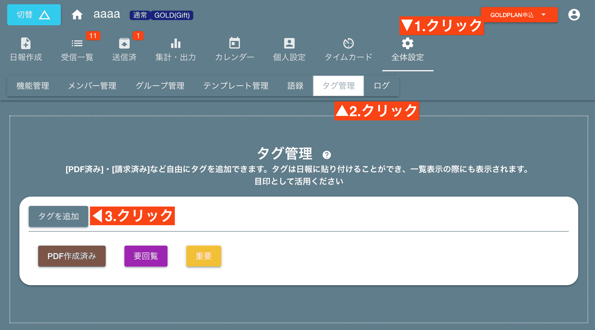
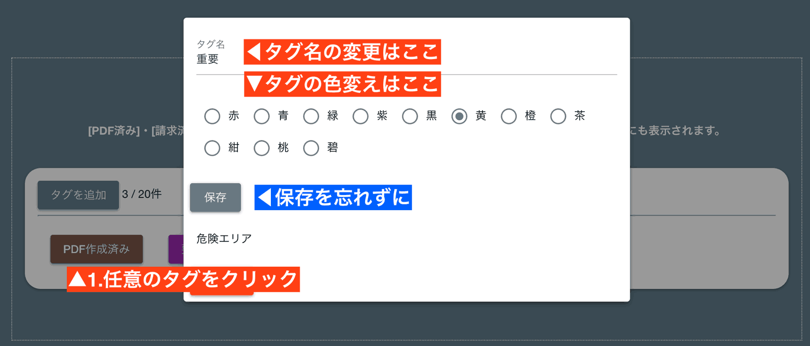
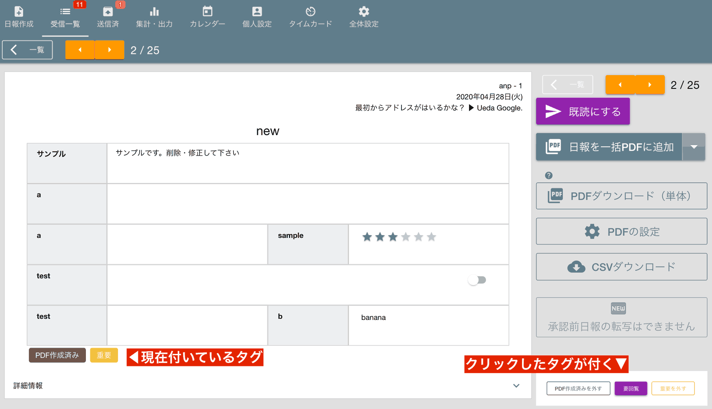
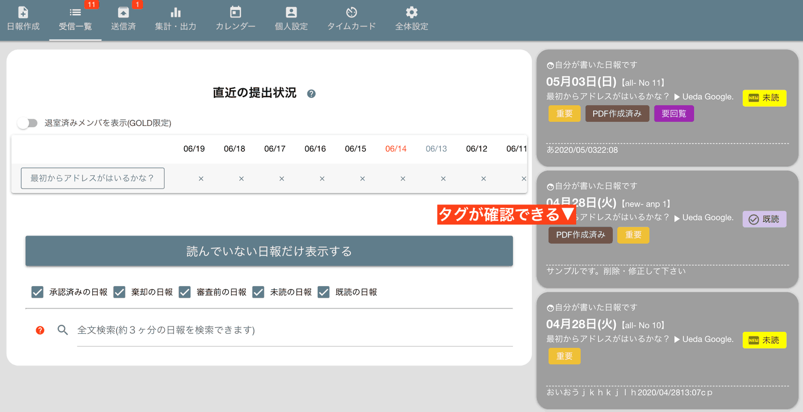

# 日報にタグを付ける
受け取った日報にタグを付けることで、簡易的な目印として役立てることができます。  
タグの作成は管理者・マネージャーの権限が必要ですが、タグを付けたり外したりするのは基本的に誰でも実行可能です。

## タグを作成する
まず最初にタグを用意しましょう。タグは管理者画面から作成できます。

タグを追加ボタンを押すと、タグの名前を聞かれます。お好みの名前をつけてください。
<Alice label="タグ名はあとから変更も可能なので気軽につけて見ましょう" icon="ok" />

### タグの編集
すでに作成したタグの名前を変更したり、タグの色を変えたいときは任意のタグをクリックして編集画面を表示します

編集内容は至ってシンプル
- タグの名前
- タグの色
  
設定項目は上記の2種類しかありません。設定を変更したら、忘れずに保存をしましょう（自動保存ではありません）

## 日報にタグを付ける

受信BOXから日報を表示してみましょう。画面右側に、タグが表示されています。  
このタグをクリックすると、日報にタグが付きます。  

<Alice label="タグを外すときはもう一度クリックだよ" icon="ok" />

タグは付いていても付いていなくても、日報に影響はありません。  
タグの主な用途は**目印**として使うことです。日報一覧表示の際、タグが付いていることがひと目で確認できます

## 細かい制御は不可能です
タグは一時的な作業の目印として利用を想定しているため、その日報を読めるスタッフであれば誰でも自由にタグを付けたり、外したりすることができます。  
細かいアクセス制御は出来ません。  
付与されたタグはその日報を読めるスタッフ全員が同じように見ることができます。  
タグによる検索は現時点でサポートされておりませんが、将来的にタグによる検索もサポートされます