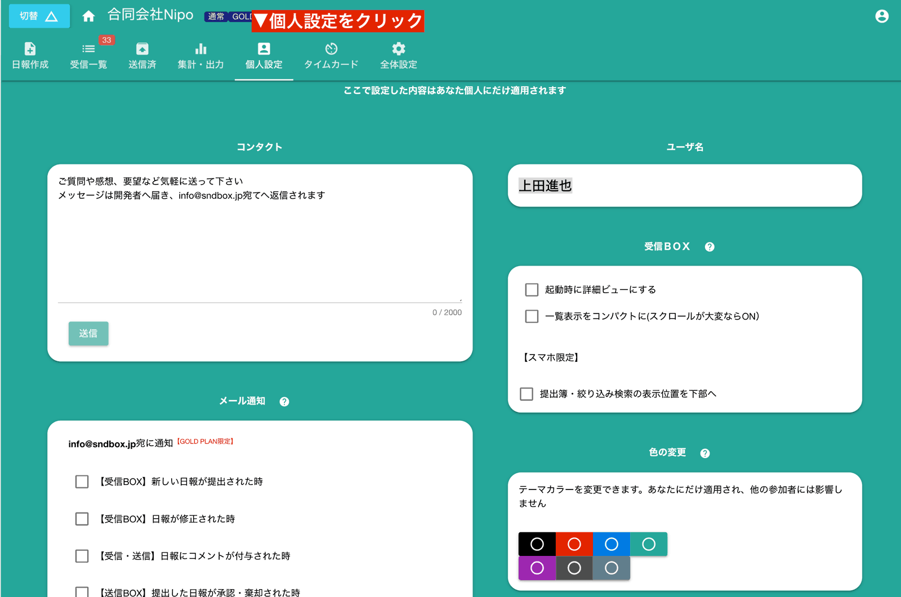

# 個人設定について
設定は「グループ全体に対する設定」の他に、あなた個人にのみ適用される「個人設定」があります。  
個人設定はグループごとに設定が行なえます。例えばAグループではカラーテーマを「緑色」にし、Bグループではカラーテーマを「灰色」にするといったことが可能です。  
同じグループにいるZさんはAグループの色を「黒色」にしているかもしれません。そんなことはいいのです。あなたが使いやすい設定を独自に行いましょう

