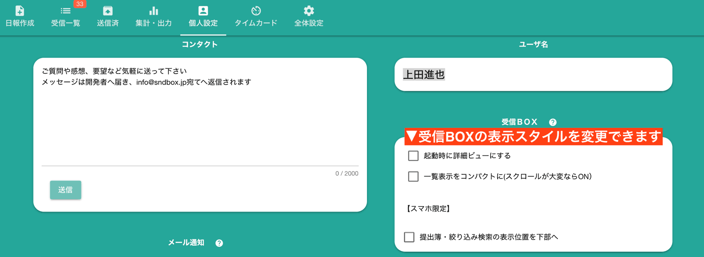
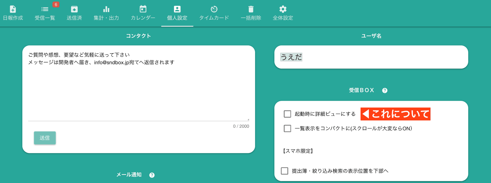
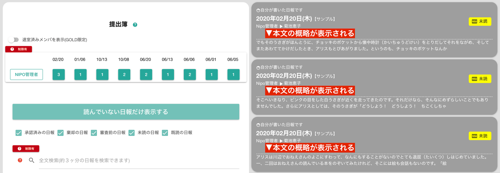
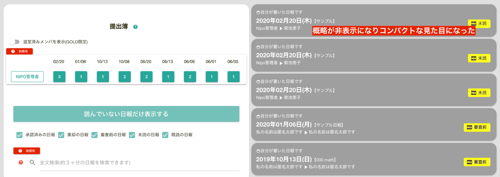
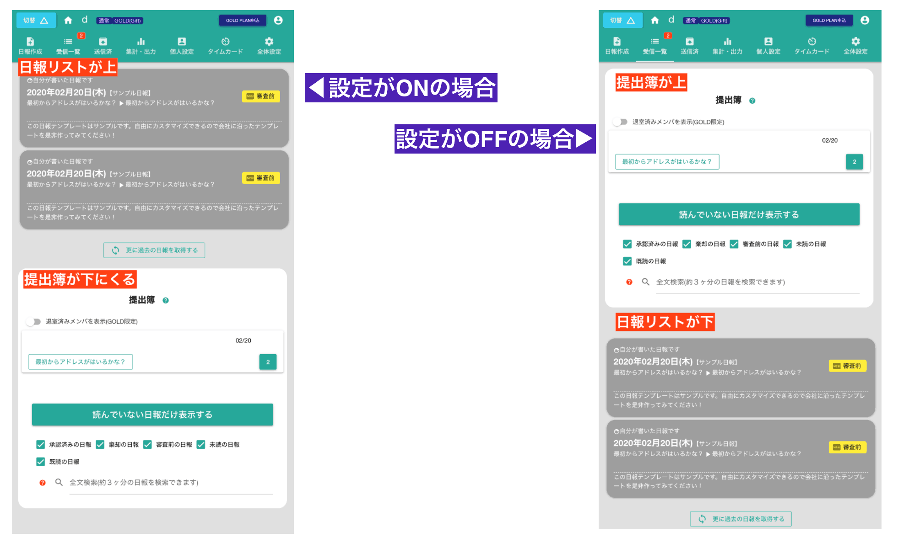

# 受信BOXの個人設定について

受信BOXは日報が届く場所です。表示形式が多少変更できます。

## 起動時に詳細ビューにするか否か

この設定がONの場合、「受信BOX」を開いたときに一番最新の日報が最初に表示されます。
一覧表示に戻る際は、受信BOX画面の「一覧」をクリックして戻ります。  
::: tip
この設定はOFFがおすすめです。
:::

## 一覧表示をコンパクトにするか否か
一覧表示では、日報が１つのカードとしてたくさん並びます。量が多いと当然スクロールもたくさんしなければなりません。  
スクロールが大変であれば、この設定をONにすることでカードの表示内容が省略されるため、少ないスクロールで下の方まで簡単に見ることができるようになります。
具体的な違いを画像で確認してみましょう
### 一覧表示をコンパクトにしない例

ご覧の通り１つ１つのカードが大きく表示されます。この画面幅では３件しか表示されていません
（これは見せるためにあえて狭めているわけで、実際のモニタではもっとたくさん表示されます）

### 一覧表示をコンパクトにする例

コンパクトにすると各カードのうち、日報本文の概略が表示されなくなりました。これにより同じ画面サイズでもたくさんのカードが一度に表示できます。  
カードが小さくなるためスクロールの手間も軽減されます

## 提出簿・絞り込み検索の表示位置を下部へ
この設定は画面幅の小さいスマートフォンでしか変更が体感できません。設定に「スマホ限定」と書かれているのは、スマートフォンでないと体感できないからです。  
違いは下の図のとおりです。

