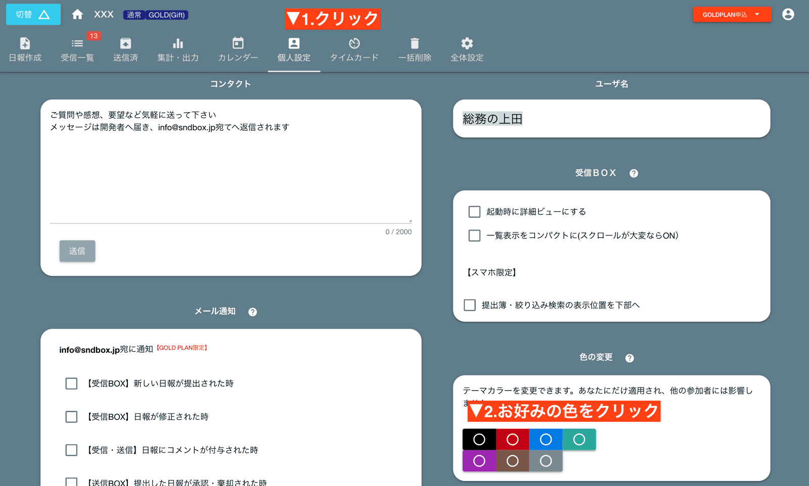
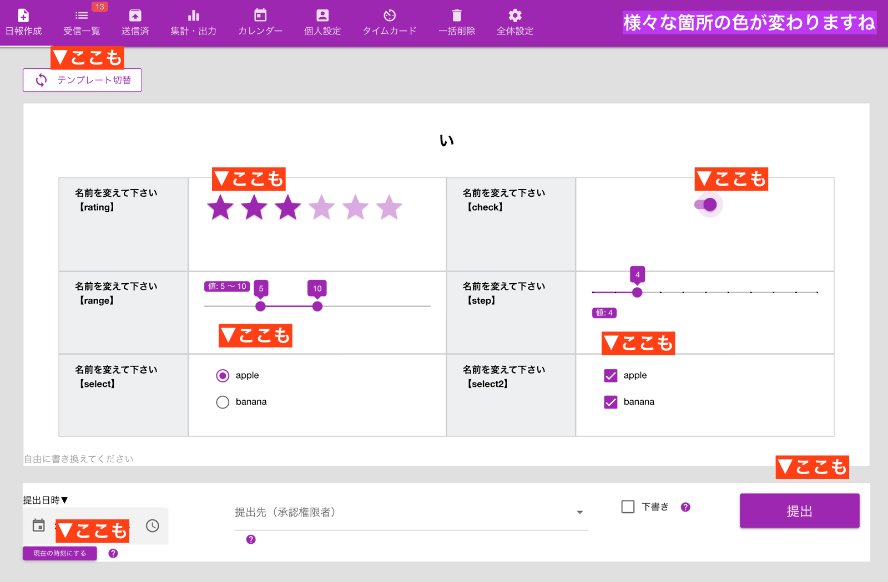
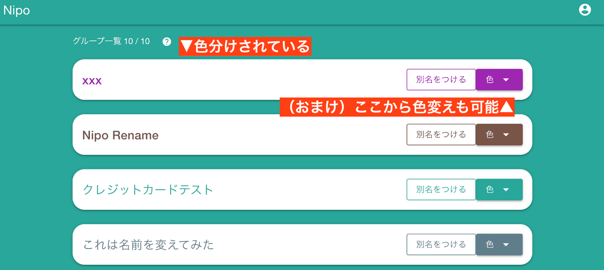

# グループのカラーテーマを変更する
画面の色を7色からお好みで設定できます。

## 色の変わる範囲
背景色だけではなく、選択肢の色や星の色など、広範囲に影響します

また、複数のグループを表示するロビー画面でも、グループの色が適用されます

## 色変えによって複数のグループをうまく使い分ける
色分けの最大の目的は、複数のグループを運用する際に視覚的な効果で誤操作を防ぐことです。  
グループは複数あってもそれぞれの画面の見た目はほぼ一緒のため、色という視覚的情報で操作ミスを軽減できます。  
<Alice label="まぁ日替わりやその日の気分で色を変えてもいいと思うよ。どうせ自分の画面しか色は変わらないので他のスタッフの迷惑にもならないし"  icon="ok" />