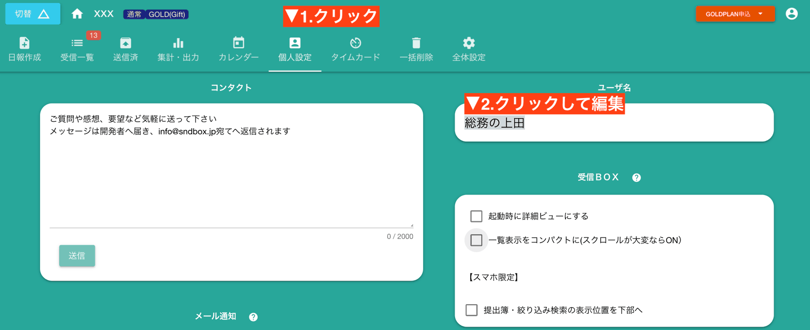

# グループで名乗る名前を変える
そのグループで名乗る名前を変更できます。律儀に1つの名前を使う必要はありません。  
グループごとに好きな名前で名乗ることが可能です

## 名前の使われる場所
グループに参加しているメンバーから表示される名前になるので、できるだけわかりやすい名前を設定しましょう。  
名前は非常に広範囲で参照されます。
- 日報作成時の提出先一覧
- 日報作成時の共有先一覧
- コメントしたとき
- 共有カレンダー上
- タイムカード管理画面

その他、色々な場所で使われることを理解してください。
## 同姓同名のスタッフがいる場合
同姓同名のスタッフがいてもE-mailも併せて表示されるため心配は有りませんが、混乱を避ける意味で肩書なども併記するといいでしょう。

## 名前の変更は管理者も可能
自分の名前を自分で設定する以外にも、実は管理者（またはマネージャ）がグループ管理からあなたの名前を変更することもできます。  
どちらが優先されるというわけではなく、最後に設定した値で上書きされます。
