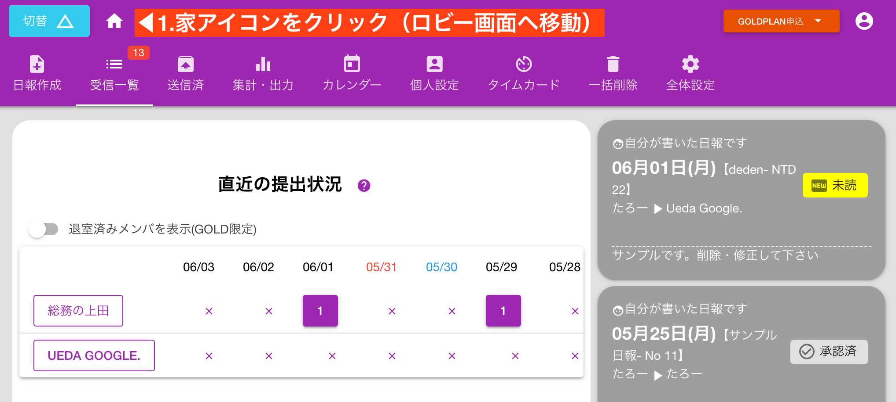
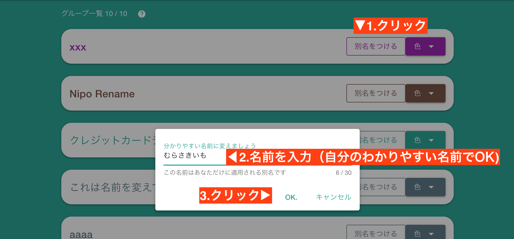
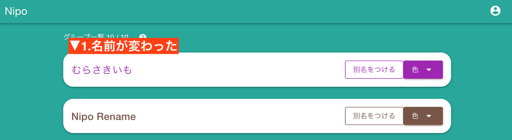
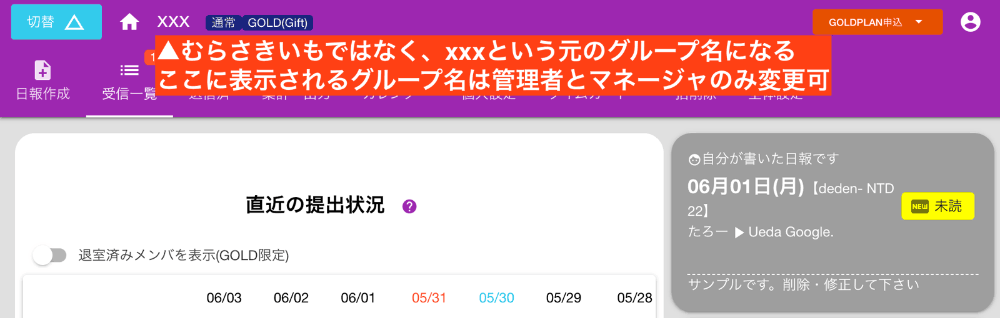

# グループ名を変更する
グループ一覧に表示する名前を変更することができます。  
ただし、変更されるのは一覧表示だけで、実際にグループ内へ入ると、本来のグループ名が優先して適用されます。
## グループ名の変更はロビー画面から行います
設定はロビー画面からしか行なえませんので、一度家のアイコンをクリックして、ロビー画面へ切り替えてください

変更したいグループの「別名をつける」をクリックします

自分でわかりやすい名前をつけてください。この名前はあなたにしか適用されません。  
ここでは 「むらさきいも」という別名をつけてみました

しかしこの「むらさきいも」という名前が適用されるのはこのロビー画面のみです。実際に「むらさきいも」のグループに入ると・・・

むらさきいもではなく、xxxというグループ名が表示されます。
<Alice label="xxxはサンエックスと読むよ" />

あくまでも一覧に表示するときの別名であり、本来のグループ名は別にあるということです。  
