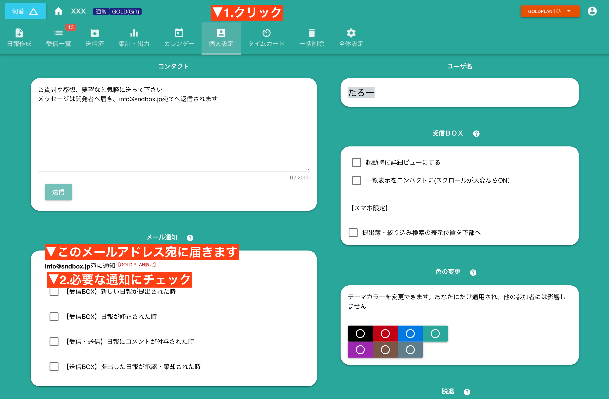
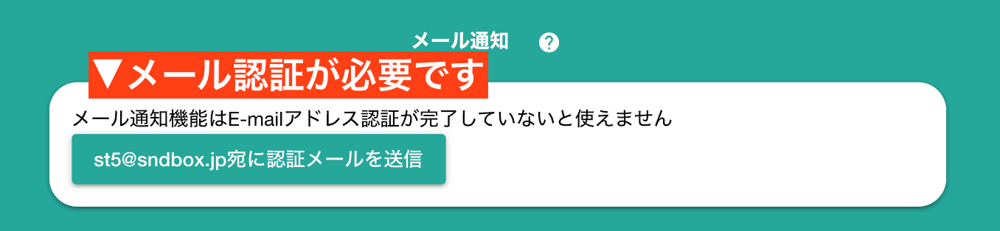

# E-mail通知 <Badge text="GOLD限定" type="error" /> 
日報やチェックシートが提出されたり、修正されたタイミングでメールを受け取ることができます。通知は４タイプあり、デフォルトでは全てOFFになっています。  
通知が必要な方は手動でONに切り替えてください。
## 通知をONにする
手順は以下のとおりです

## 各種通知の意味
通知のタイプには4種類あります。それぞれ度のタイミングで通知メールが届くのかを詳しく見ていきましょう
### 【受信BOX】新しい日報が提出された時
あなたが読める日報が届いたときに通知されます。あなたが読める日報とは、あなたが「提出先」か「共有先」に指定された日報のことです

### 【受信BOX】日報が修正された時
あなたが読める日報が修正された時に通知されます。なお、日報が修正されると日報につけた「既読サイン」や「棄却サイン」が消えますので、あらためて修正後の日報を読んであげて下さい。

### 【受信・送信】日報にコメントが付与された時
あなたが読める日報に、誰かがコメントしたときに通知されます。コメントは新しい順に並び、200文字までメールに添付されます

### 【送信BOX】提出した日報が承認・棄却された時
あなたが提出した日報が、「承認か棄却」されたときに通知されます。なお、共有先に指定されたメンバーが既読サインをだしただけでは通知されません。

## E-mail通知が使えないケース
E-mail通知はGOLDPLAN限定の機能です。無料プランの場合はご利用になれません。  
（チェックをONにしても届かない）
また、このケースの他に以下の２つのケースでも、同様にE-mail通知を利用できません。

### メール認証が未了の場合は不可

正しいE-mailであることを確認するためのEmail認証手続きが済んでいない場合は、E-mail通知機能を利用できません。  
先にE-mail認証を済ませてください

### 匿名アカウントの場合は利用不可

匿名アカウントの場合はE-mailアドレスが指定されていないため、当然E-mail通知機能は利用できません。
先に匿名アカウントを正式アカウントへ昇格させて下さい。