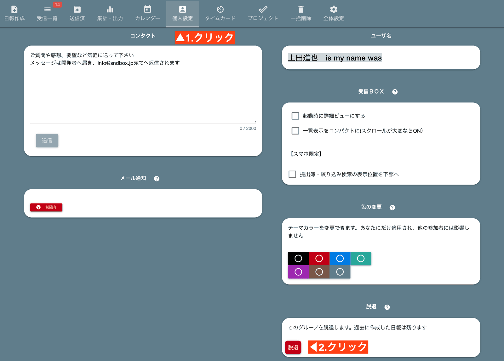
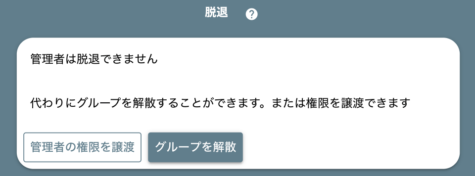

# グループを抜ける
グループから脱退するには、「脱退」ボタンをクリックします。脱退後は日報にアクセスできず、ロビーの【グループ一覧】からも削除されます。

- 一部の箇所でメンバーの名前が【退室済み】に変わります
- 脱退者の書いた日報は残りますが、その日報のオーナーは不在となります

## グループ脱退後に再加入する
一度脱退したメンバーを再びグループに招待することもできます。
過去に本人が書いた日報のオーナーとして、これまで通り作業できます。グループへの参加については、グループへの招待を御覧ください
再加入すると脱退前の日報のオーナーとしてそのまま過去の日報を修正したり、コピーしたりすることもできるようになります。

## 管理者は脱退不可能です
もしあなたがグループの管理者だった場合は、脱退できません。

管理者は各グループに必ず１名必要です。あなたが脱退することで管理者不在になってしまうことを防ぐため、このような安全装置が働きます。  
管理者の権限を他のスタッフに譲ってから脱退を行って下さい。
また、スタッフがあなたしか居ない場合は、脱退ではなく「グループの解散（削除）」を行ってください。

