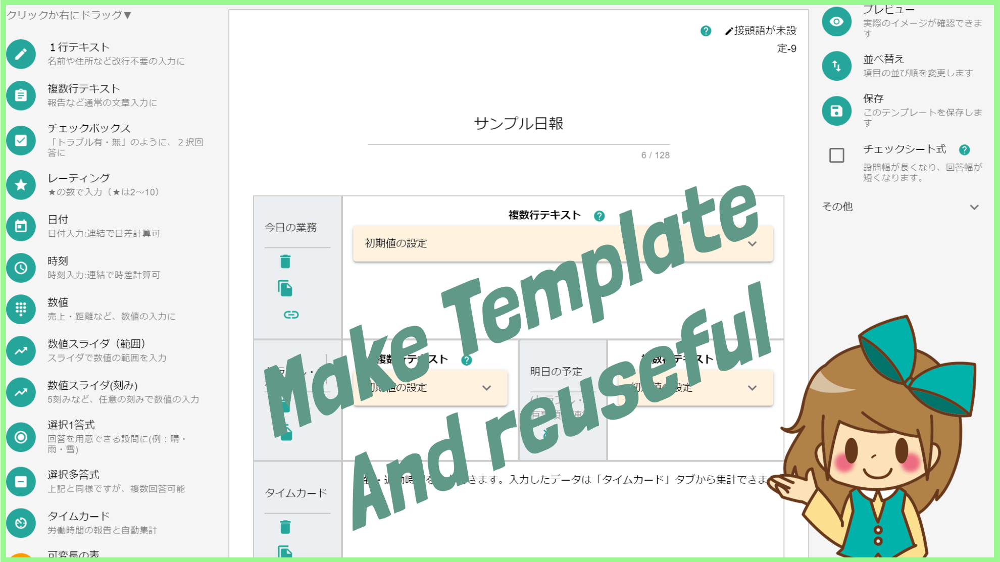
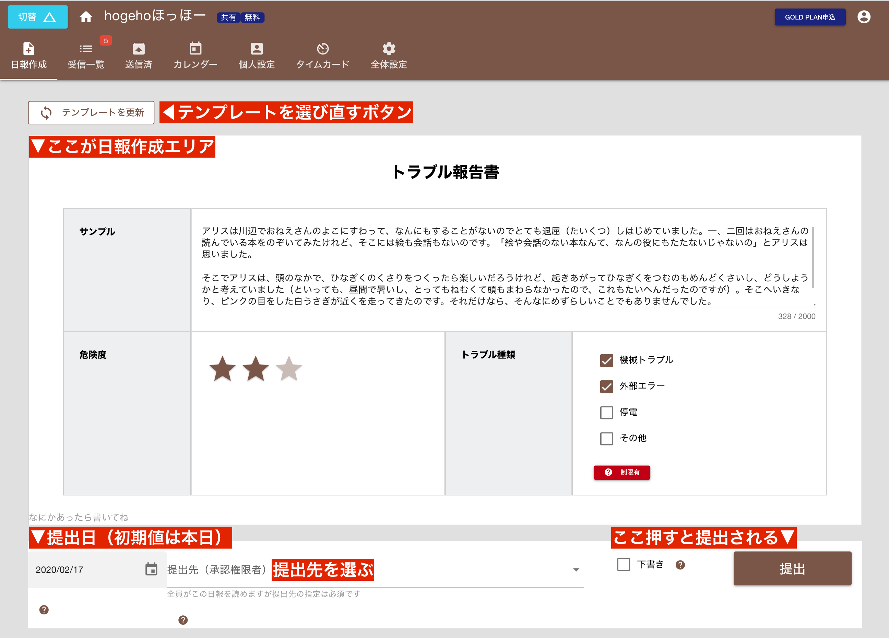
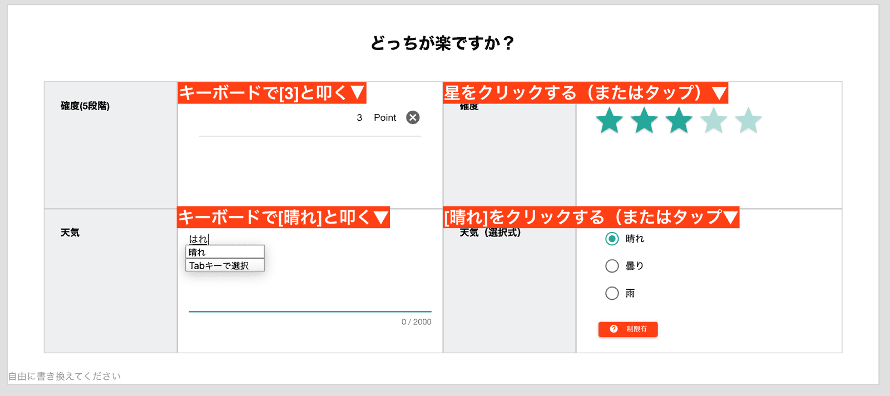

# テンプレートについて<Badge text="管理者向け" />

テンプレートとは日本語で「雛形」といいます。管理者がテンプレートを作成し、スタッフがそのテンプレートを元に日報を書いて提出します。  
例えば下図は「トラブル報告書」というテンプレートです（即席で作りました）

管理者は報告で知りたいことをテンプレートに盛り込むことで、部下は日報に何を書くべきか明確にわかります。
つまりテンプレートは、**読み手と書き手をつなぐ大切な役割**を担っています

## テンプレートの作り方によってスタッフの業務負担を減らす
「もっと楽にできないかな？」テンプレートを作る前に、少しだけ考えてみましょう。  
Nipoでは10種類を超えるパーツを自由に組み合わせてテンプレートを作成できますが、せっかくですから従業員の入力負担を軽減できるように作成するように意識してみてください。

例えば上の画像を例にすると、確度（1〜5段階）で入力が欲しいのなら、キーボードで叩くのと星の数で直感的に入力するのはどちらが楽でしょうか？  
こんな感じで少しだけ、楽にできる工夫を意識してみて下さい
