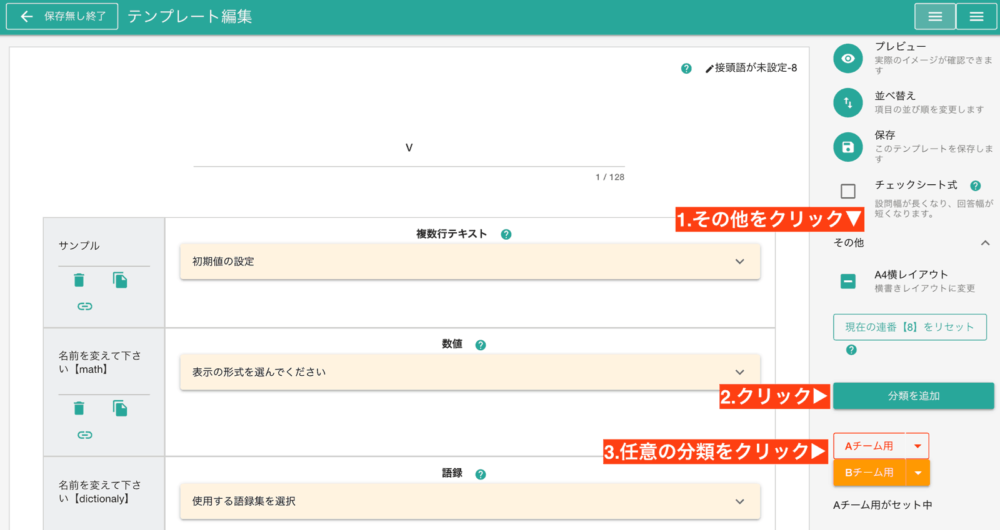

# テンプレートに分類を導入する<Badge text="管理者向け"/><Badge type="warning"  text="応用" />
通常はテンプレートをそんなに多く使わないと思うので、分類分けは不要です。  
しかしテンプレートの種類を多く使う場合は、分類分けをしておくと目的のテンプレートを見つけやすくなります。  
実際に分類をセットすると、日報のテンプレートを選択時、次のように表示されます  

図の通り、テンプレート名の隣に分類名が色分けされて表示されます。視覚的にもわかりやすく、また分類ごとに絞り込み表示も簡単に行えます。

## テンプレートに分類をセットする手順
分類はテンプレートの編集画面から行います。[テンプレートの編集画面を表示する手順はこちら](/manual/template/_make)をどうぞ。  
テンプレート編集画面の右側にある「その他」ボタンをクリックします  
  
ついで、「分類を追加」ボタンをクリックしてください。分類名と分類の色を指定できます。  
追加された分類はすぐ下に表示されるので、すぐに見つけられるでしょう。  
追加した分類をクリックすることで、当該日報テンプレートに「分類」がセットされます。

最後に忘れず「保存」をクリックしてください。  
おつかれさまでした。以上で日報テンプレートに分類を追加できました。

## テンプレートにセットした分類を解除する
テンプレートにセットした分類を解除したいときは、「分類を解除」ボタンをクリックしてください。
  

## 補足：分類の削除
不要になった分類を削除できます。削除した分類が使用されていた場合は、自動でテンプレートから解除されます
  
::: warning 即座に削除されます
テンプレートの編集は保存するまで適用されませんが、分類は即時保存になるため注意してください
:::

## 補足：分類の編集
分類の色と分類名を変更できます。変更したい分類のボタンにある下向きの三角ボタンをクリックし、「編集」をクリックしてください。  
以下のような編集画面が表示されます  
  
設定項目は2種類しかないため、非常にシンプルです。  
