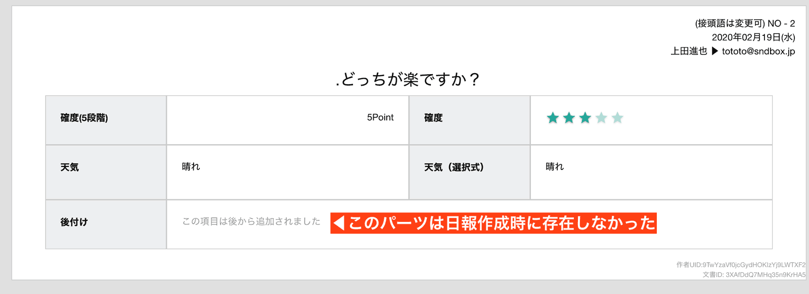
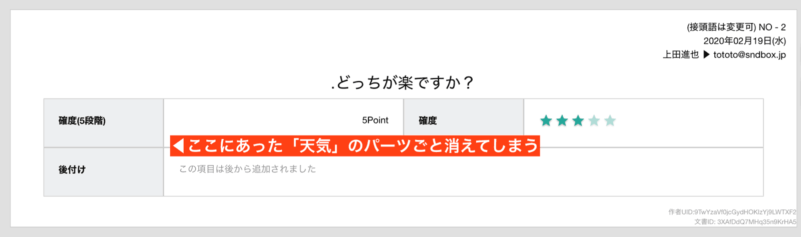

# 運用開始後に日報・チェックシートテンプレートを修正する<Badge text="管理者向け"/>
テンプレートの編集はいつでも可能ですが、Nipoでは現在最新のテンプレートを元に日報を表示する仕組みのため、過去に作成された日報に影響を与える可能性があることに留意して下さい。
パーツの追加についてはあまり大きな問題になりませんが、パーツの削除については注意が必要です

## 日報のテンプレートに後から追加する
新しく追加したパーツが無い時期に作成された日報は、当然その項目が空欄になります。スタッフの記入漏れなのか？テンプレートの変更による空欄なのかを判別できるように、テンプレート編集による空欄の場合は、「この項目は後から追加されました」と表示されます。

テンプレートに項目を後付けします。当然、過去に書かれた日報やチェックシートには追加された項目はありません。その結果、「この項目は後から追加されました」と表示されます（下図参照）
::: tip
「この項目は後から追加されました」は日報修正を行うと消えます。
:::

## 日報のテンプレートに後から削除する
項目を削除すると、過去の日報・チェックシートに遡って、削除された項目が表示されなくなるので注意してください。たとえば「天気」の列を削除すると、下図のように過去に作成した日報の項目も消えます

::: tip
厳密に言うと「消えた」のではなく「被表示になった」だけで、データは残っています
:::