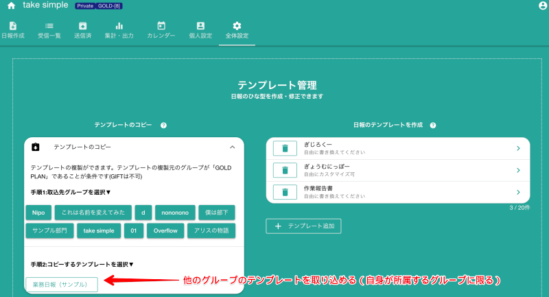

# 他のグループのテンプレートを取り込む
他のグループで使用している日報のテンプレートをコピーして取り込むことができます。複数のグループで同じテンプレートを使いたい場合に便利です。

外部のグループからテンプレートを取り込みますが、全く関係の無い会社のテンプレートを取り込めるわけではありません。 取り込めるグループのテンプレートには条件があります。

- 管理者が取り込み先のグループに所属していること
- 取り込み先のグループがGOLD　PLANであること（お試しのGOLDは不可）
上記２つの条件を満たすと、他のグループから日報のテンプレートを取り込むことができます

