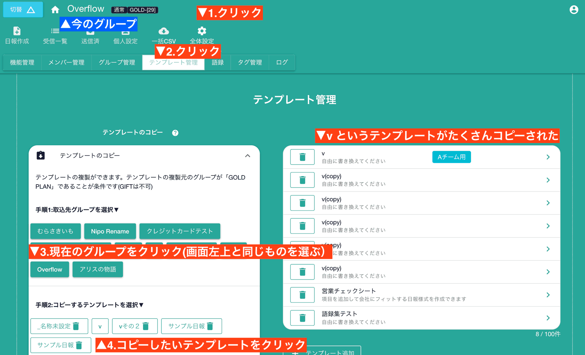

# テンプレートのコピーとインポート<Badge text="GOLD限定" />
テンプレートを作成するのは手間がかかるため、テンプレートのコピー機能とインポート機能をうまく活用することで、作業の短縮ができます。  
コピーはその名の通り、テンプレートのコピーです。  
インポートは他のグループで利用しているテンプレートを、現在のグループに取り込むことを言います。  
それぞれ言葉は違いますが、テンプレートを複製するという意味においては同じものです。  
さらに言えば、操作手順も同じです。  

## テンプレートをコピーする
詳しい手順は文字よりも画像のほうが伝わりやすいと思うので、まずは下図を御覧ください

- テンプレートのコピーを開きます。
- 取り込み先のグループを選択します（コピーの場合、作業グループと取り込み先グループは同一になります）
- 取り込むテンプレートのボタンをクリックします
## 他のグループのテンプレートを取り込む  

他のグループで使用している日報のテンプレートをコピーして取り込むことができます。複数のグループで同じテンプレートを使いたい場合に便利です。  
  
外部のグループからテンプレートを取り込みますが、全く関係の無い会社のテンプレートを取り込めるわけではありません。 取り込めるグループのテンプレートには条件があります。  

- 管理者が取り込み先のグループに所属していること
- 取り込み先のグループがGOLD　PLANであること（お試しのGOLDは不可）

上記２つの条件を満たすと、他のグループから日報のテンプレートを取り込むことができます

