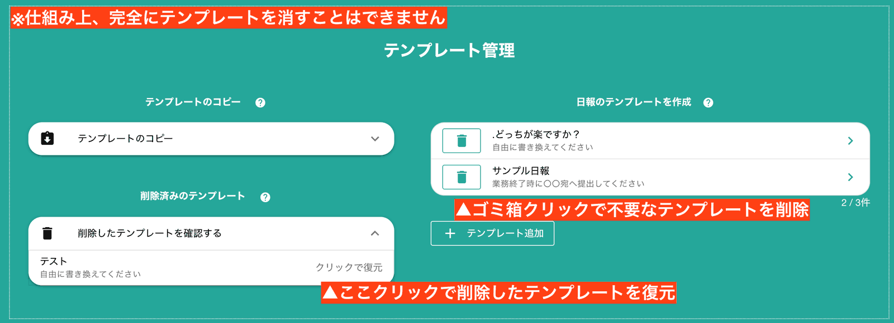

# テンプレートの削除と復元について<Badge text="管理者向け" />
不要になった日報・チェックシートのテンプレートを削除することができます。テンプレートを削除しても、過去の日報やチェックシートに影響はありません。

削除したチェックシートのテンプレートはかんたんに復元できます。「削除済みのテンプレート」をクリックし、復元したいテンプレート名をクリックします。これで削除したテンプレートが復元されます

::: tip
毎年テンプレートの内容が変わるような用途では、過去のテンプレートを削除することでスタッフが誤って古いテンプレートを使ってしまうトラブルを未然に防ぐことが可能です
:::
