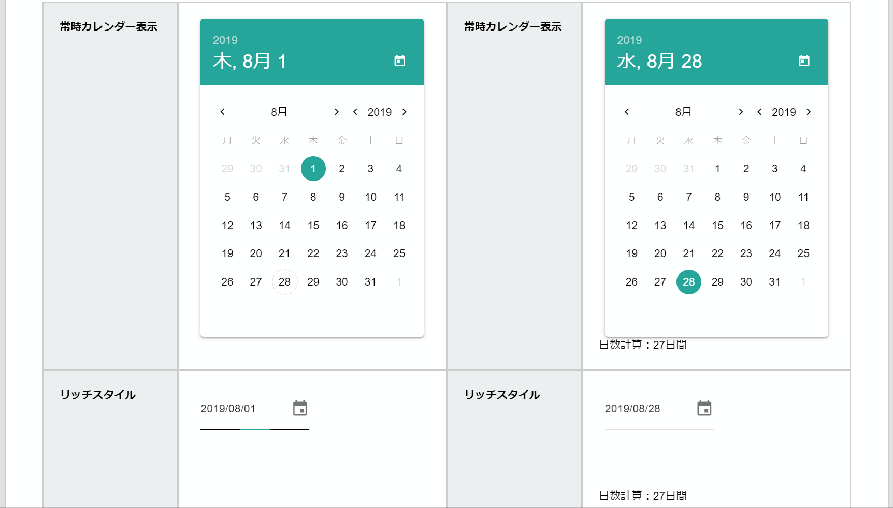

# 日付

日報の中に日付を入力する際に活用して下さい。  
上図のように、カレンダーから日付をピックアップする形式での入力となります。初期値が「本日」になるため、初期値を固定することができません。  
なお、日報の提出日については日報テンプレートとは別に用意されているので、提出日のためにこの項目を用意する必要はありません。なお、和暦には非対応です  

::: warning 非対応
- 検索の対象
- 入力必須の指定
- 初期値の設定
:::
