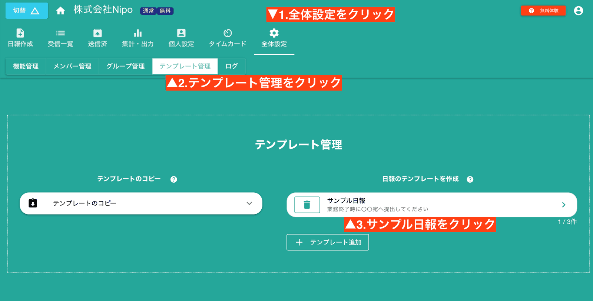
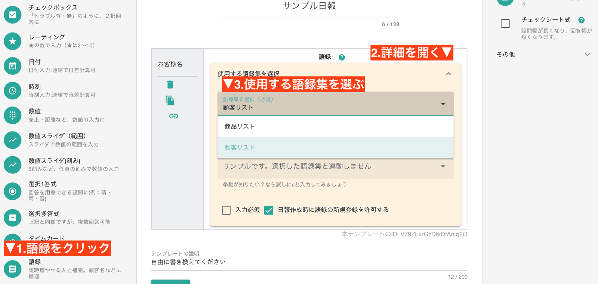

# 語録

語録は「選択肢」と「1行テキスト」を合わせたような機能を持つパーツです。入力によって語録（選択肢）を絞込み、選択することで入力できる仕組みです。選択肢パーツと異なり、語録は容易に新しい語録を追加可能です。現場名、顧客名、商品名など頻繁に追加される項目には、語録を使うのが最適です。

語録を利用するには最初に「語録集」を用意します。語録集は複数個作成できます。語録集の中に「語録」を追加していきましょう。

例えば「顧客リスト」が語録集にあたり、「上田進也」などの顧客1名1名が「語録」にあたります。

## 顧客名のように随時増え続け、繰り返し使うデータに最適です
語録は「語録集」という大きな単位と、その語録集の中に登録される実際の値「語録」から構成されます。例えば「顧客リスト」という語録集の中に、

- 株式会社○○
- 有限会社XX
- 田中さん

といったデータが格納できます。各顧客名が「語録」に該当します。この他にも、商品名や工事現場の現場名、部品名など細々と増えていくデータの扱いに向いています。
必要になったら追加し、不要になったら消していく、とても柔軟な使い方ができます。
語録はプランによって異なりますが、GOLD PLANの場合、１つの語録集に対して最大1,000件までの語録が登録可能です。無料プランは50件になります

### 語録集の作成と語録の登録について
語録集の作成手順は次のとおりです

作成されたばかりの語録集は空っぽです。作成した語録集を選択し、データを登録してみましょう。

語録集に登録する語録は、必ず「値」と「ふりがな」のペアで登録する必要があります。

「ふりがな」は日報作成時、文字入力で絞り込みの検索となります。部分一致で検索可能です
「値」は実際に日報上へ表示されるものです。

ここで、「顧客が100人もいるのに手動で登録させるのは大変！」と思うかもしれません。でも語録については全てを完璧に整える必要は無いです。頻繁に利用する顧客名を10件程度登録したらそれで完了です。詳しくは後述しますが、残りの未登録顧客については、「必要になったタイミングでその都度追加していけば良いのです」。

### 語録を日報テンプレートに組み込む
さて、語録集は作成しただけでは機能しません。語録集は日報のテンプレートに組み込むことで初めて機能します。早速テンプレートの編集をしましょう。
テンプレートの編集は、「全体設定」「テンプレート管理」から開けます。ここでは「サンプル日報」に語録集をセットして見ましょう
  
パーツ一覧から「語録」を選びましょう。語録パーツは１つの日報テンプレートに何個でも組み込めます。  
語録パーツで利用する**語録集のセットも忘れずに**。語録集を選ばないと、Nipoが「顧客リスト」なのか、「商品リスト」なのか判断できませんからね。  

::: tip なぜ語録集を選ぶの？
語録って便利に見えますが何でも詰め込むと逆に使いにくくなります。顧客名なら顧客名だけの語録集、商品名なら商品名だけの語録集という具合に、  
用途や種類で分けた方が目的の語録を探しやすくなります。そのためNipoでは語録集を複数種類作成できるようになっています。
どの語録を使うかは機械にはわかりません。あなたが指定してください
:::

### 日報の作成（語録集を使ったケース）
早速、日報を書いてみましょう。一覧から選択する他、キーボードから文字を入力すると「絞り込み」もできます。このあたりは「選択肢」パーツと違う点その１ですね。

上の図は、[s]と入力して絞り込みした様子です。「sandbox」や「axis」「asnpuru」といったSの付いた語録がリストアップされているのがわかりますね。
<Alice label="asnpuruって何？ただの誤入力かな？（はい、そうです）" icon="question" />

絞り込まれた語録から選ぶだけで入力が完了です。普通に入力する「１行テキスト」に比べて、以下の点で優れています。
- 株式会社や（株）など入力者によって微妙に変わる「表記ゆれ」が無くせる
- 誤字、脱字といったヒューマンエラーを防げる
- 入力の手間を大幅に削減できる

### 未登録の語録を新規追加する
語録集の便利な点は、かんたんに新しい語録を追加できる点にあります。選択肢パーツと比べても圧倒的に便利です。
<Alice label="百聞は一見に如かず 千聞とてまた然り。今サンプルを出しますね" icon="pc" />

めっちゃかんたんです。

でも、スタッフが自由気ままに新しい語録をどんどん追加されると困る・・・って方もいるかも知れません。  
特にふりがなは様々なパターンが想定されます。    
**ひらがな？カタカナ？それともローマ字？前株は略すか？**  
などなどルールは多岐に渡り、人によって好みが変わります。なお、ローマ字の場合は大文字、小文字は同一として扱われます。 
追加される単語はあとから管理者が修正できますが、それ以前にスタッフに語録の新規追加を認めない運用も可能です。

テンプレート編集画面で「日報作成時に語録の追加を許可する」のチェックを外すことで、スタッフが語録を追加できなくなります。
  
「日報作成時に語録の新規登録を許可する」のチェックをOFFにして、未登録の単語を入力したら以下の図のようになります

::: tip 新規登録を許可するほうがおすすめです
そもそも語録は日々の業務の中で成長していくものとして作っています。一括で大量の語録を取り込む手段はあえて用意していません
:::
