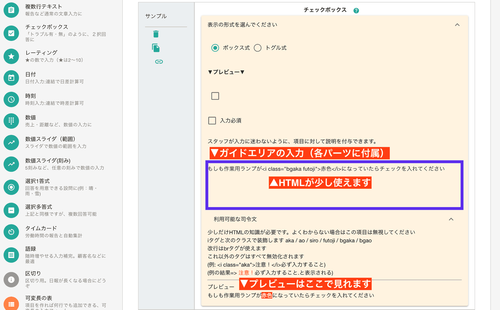
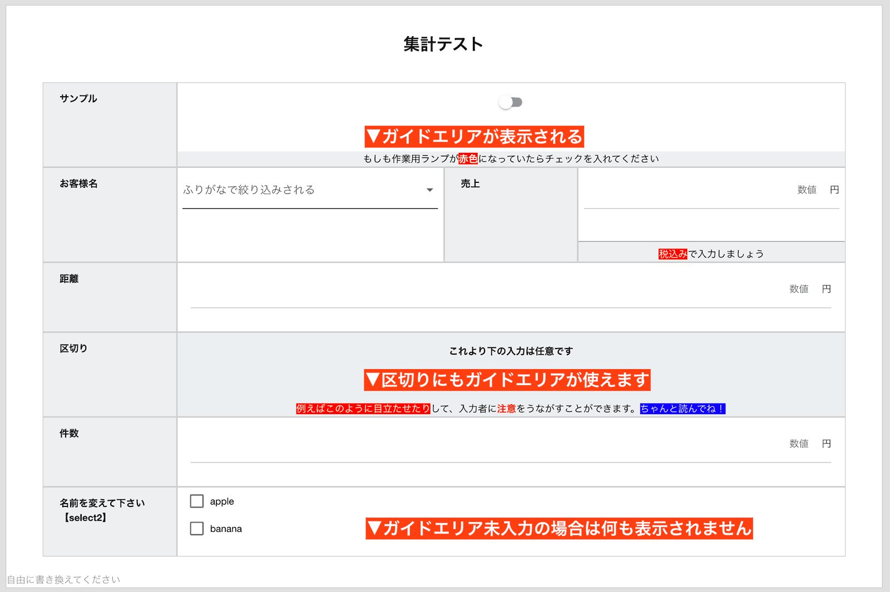

# ガイドエリアについて
ガイドエリアはほとんどすべてのパーツで利用可能な、説明を書く領域のことです。  
ガイドエリアに書いた内容は、日報作成時に表示されるので、日報作成者が迷わずに入力できる一助になることでしょう  

## ガイドエリアを編集する
ガイドエリアはテンプレート編集画面から操作します。  
各パーツごとにガイドエリアが設定できます（一部のパーツはガイドエリアに対応していません）

ここで入力した結果は、次のように日報作成時に表示されます

<Alice label="ガイドエリアはチェックシートモードでは表示されないよ" icon="ok" />

::: tip ガイドエリアは完成日報には表示されません
ガイドエリアの目的はあくまでも**日報作成者が迷わないようにガイド**することであり、出来上がった日報にガイドは不要だからです  
PDF出力やCSV出力にもガイドエリアは一切表示されません
:::

### ガイドエリアの装飾
::: warning HTMLの知識が必要です
個々より先は最低限のHTML知識が必要です。ガイドエリアは装飾なしでも使えるので、HTMLがわからない場合は読み飛ばしてください
:::

ガイドエリアにはスタッフに注意をうながすため、ごく限られたHTMLを使うことができます。  
HTMLを一部に制限するのは安全性のためです。利用可能なタグは次のとおりです
- iタグ
- brタグ

また、利用できるクラスは次のとおりです
- aka -文字を赤くします
- ao -文字を青くします
- bgaka -背景が赤で、文字が白になります
- bgao -背景が青で、文字が白になります
- futoji -文字が太字になります

これ以外のタグやクラス、スタイルはすべて無効化されます。  
またガイドエリアは標準で中央揃えが有効になっています。

