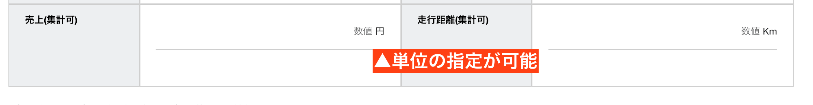

# 数値(集計可能なパーツです)

数値項目は、数値のみの入力が可能です。（整数・負数・小数点が指定可能です）
Nipoを初めて使うと、サンプルのテンプレートで「売上」と「走行距離」の項目として使われているのがこの「数値パーツ」です  
この項目の特徴は、集計され、グラフ化の対象となることです。数値パーツには類似の「スライダーパーツ」もあります。

## 入力された値を集計する
このパーツの最大の目的は「集計」です。売上高や仕入高など数値として入力したデータが集計できます。
グラフ化したりランキング形式で表示することも可能です。詳しくは「日報を簡単に集計する」を御覧ください

## 補助科目について
内訳が必要な場合は補助科目を利用して下さい。例えば、「店舗売上」という大きな枠の中に、「物販」と「サービス」の内訳がある状態です。  
なお、補助科目の合計が一致する必要はありません。
**基本的に補助科目は集計の対象になりません。**あくまでもおまけ程度の機能として認識してください。  
なお、CSV出力の際はきちんと１つのフィールドとしてエクセルに出力可能ですので、集計や並べ替えはエクセル上から行うことが可能です
