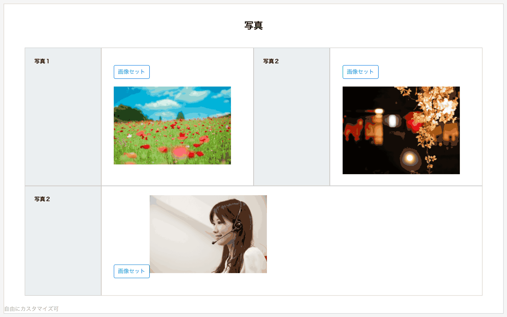

# 写真・画像<Badge text="GOLD限定" type="warning" />

タブレットやスマートフォンで撮影した画像を添付したり、PCに保存されている画像データを添付したりできます。対応ファイルはJpeg・Pngになります。

画像をNipoのサーバにアップする前に、画像の圧縮処理が行われ通信量を削減しています。圧縮されると、画像の容量はおおよそ１００KB程度になります。

写真データはCSV出力されません。（PDF出力時は写真が出力可能です）

::: danger
- 検索の対象
- 入力必須の指定
- 無料プランでの利用
:::