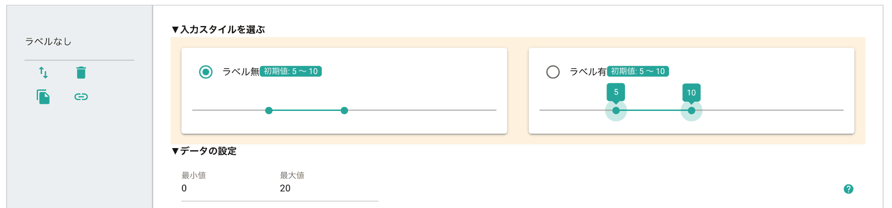

# スライダー（範囲）

数値の範囲入力パーツです。最小値と最大値を設定します。スライダーの左端が最小値、スライダーの右端が最大値になります。1つのスライダーには2つのハンドルが用意され、特定の範囲をスライダーで入力することが可能です。

スライダー（刻み）と異なり、本パーツで入力されたデータは「集計」されません。CSV出力でエクセルに書き出した場合、「1〜5」のように文字として入力されます。

最小値・最大値を計算式などで利用したい場合、LEFT関数、FIND関数あたりを利用して分割すれば数値データとして加工できます

## スライダー（範囲）の種類
スライダー（範囲）は常時入力ラベルを表示する種類と、常時ラベルを表示しない種類から選ぶことができます
