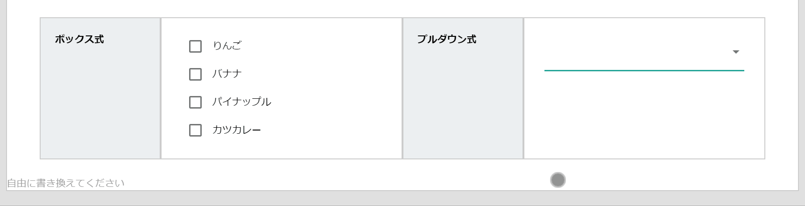

# 選択肢(複数答式)

回答をいくつか用意しておき、その中から複数選択することで回答できます。入力時の表示方式は、選択肢をすべて画面に表示する「チェックボックス式」と、選択肢をプルダウンから選ぶ「セレクト式」が選べます。  
上図のケースでは、左列が「チェックボックス式」で右列が「セレクト式」になります。  
選択肢は無料プランで5こまで、有料プランでは50こまで作成できます。足りない場合は2つに分けるなどして対応してください。  

::: tip
- 初期値の設定
- 検索の対象
- 入力必須の指定
:::
---
<SampleSelect2 />