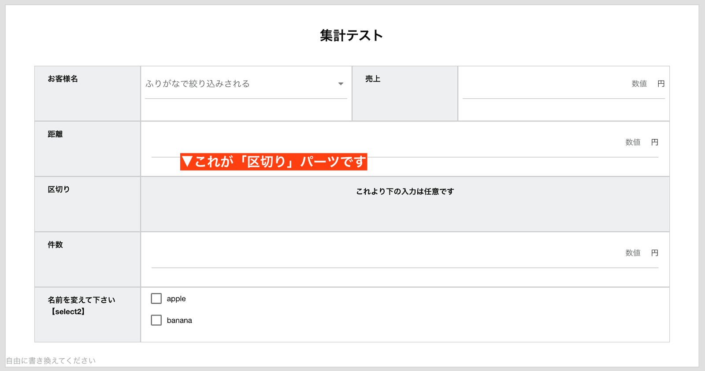
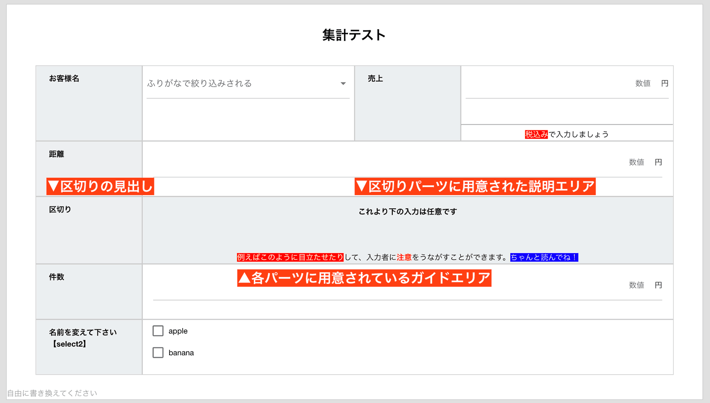

# 区切り
区切りパーツはその名の通り、セクションの区切りとして使うものです。  
  

区切りパーツは他のパーツと違い、背景が見出しと同じ色をしています。（上図参照）

テンプレートの編集時に、説明文を入力することが出来ます。  
しかし日報作成時に入力は出来ません。  
<Alice label="編集ロックされた1行テキストのようなイメージです" icon="here" />
少し不思議に思うかもしれませんが、このパーツに書かれた内容は[CSVとして出力](/manual/utility/analyze)の対象となります。  
CSVのデータは非常に視認性が悪いため、区切りを一つの目印としてご活用ください。

## 項目の説明（ガイドエリア）と組み合わせて使う
区切り単体でも機能しますが、区切りに項目の説明を追加することでより親切な説明ができます。  
  
区切りは入力が不可能なパーツであり、ガイドエリアもまた、入力不可の機能です。  
同じような機能がなぜ用意されているのでしょう？  
これはガイドエリアはそもそも区切りパーツ専用ではなく、その他多くのパーツで使える機能だからです。  
ガイドエリアと区切りパーツの主な違いは次のとおりです
- 受信日報として受け取ったとき、ガイドエリアは表示されないが、区切りの説明文は表示される
- 日報をPDFに変換するとき、ガイドエリアは表示されないが、区切りの説明文は表示される
- CSV出力したとき、ガイドエリアは表示されないが、区切りの説明文は表示される

このような点が違います。ガイドエリアはあくまでも、**日報入力者が迷わないようにするための説明文**であり、区切りパーツはデザイン、体裁も含めて利用できる点が異なります