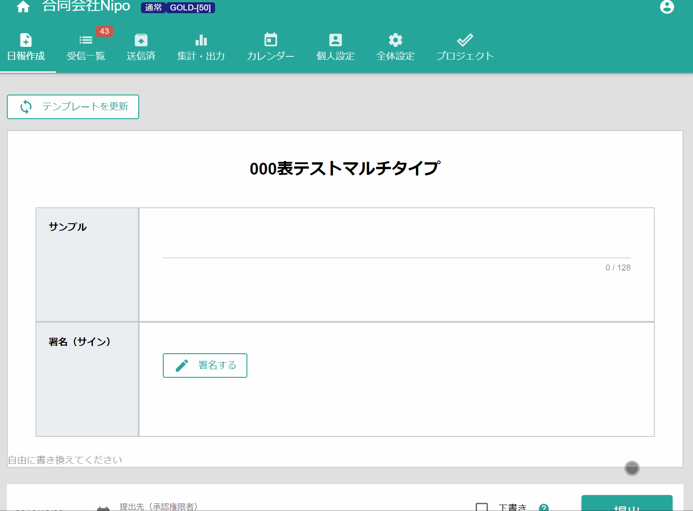

# 【パーツ】署名 <Badge text="GOLD限定" type="error" />

署名（サイン）に特化したパーツです。手描きメモを署名代わりに使うのであればこちらのパーツを使う方が良いでしょう。
手描きメモと非常に似ていますが以下の点により手描きメモとは分けて考えられます。

- 描画エリアがどの端末を使っても固定なので同じ大きさの署名を得られる
- 日報のコピー機能を使っても署名はコピーされない（手描きメモは上書きしない限り同じ画像がセットされます）
- PDF出力の際、手書きメモは画面サイズ最大に表示するが署名は適切なサイズで表示されます

::: danger
以下の機能には対応していません
- 検索の対象
- 入力必須の指定
- 無料プランでの利用
:::