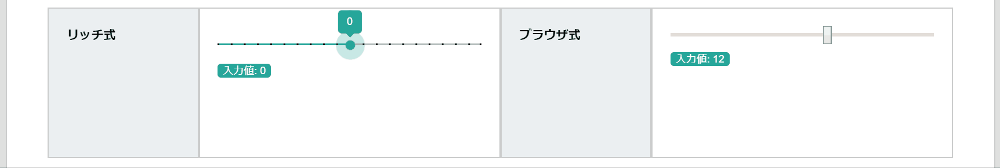
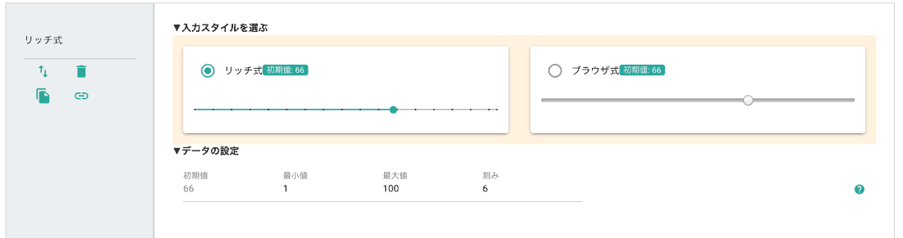

# スライダー入力（集計可能）

スライダーを左右にスワイプして数値の入力ができます。スライダーの最小値と最大値、そして刻みを指定します。

スライダーの左端が最小値、右端が最大値です。スライダー上に表示された・（中黒）が、刻みを表しています。刻みの単位でスライダーが止まります。例えば刻みが5であれば、0, 5, 10, 15 , 20のように、5刻みで入力ができます。6や7など、刻みの倍数以外の数値は入力できません。

スライダーで入力された値は、集計され、グラフ化の対象となります。予め入力される範囲がおおよそ予測できる場合は、数値パーツよりも使い勝手の良い入力方式です。特にスマートフォンやタブレットとの相性が良いです。

類似パーツに「数値」があります。スライダーと数値の役割の違いについて

## スライダー（刻み）の種類
リッチ式とブラウザ式から選ぶことができます。ブラウザ式の場合、ご利用のブラウザによって見た目が変わります

<SampleSlide />